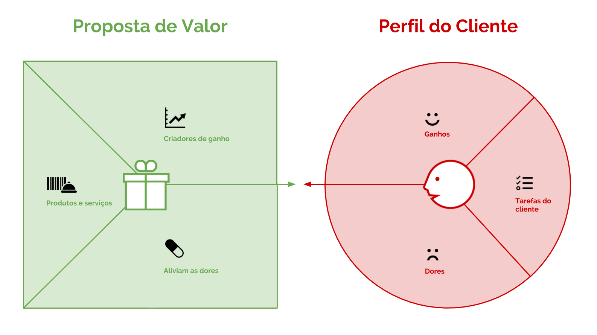
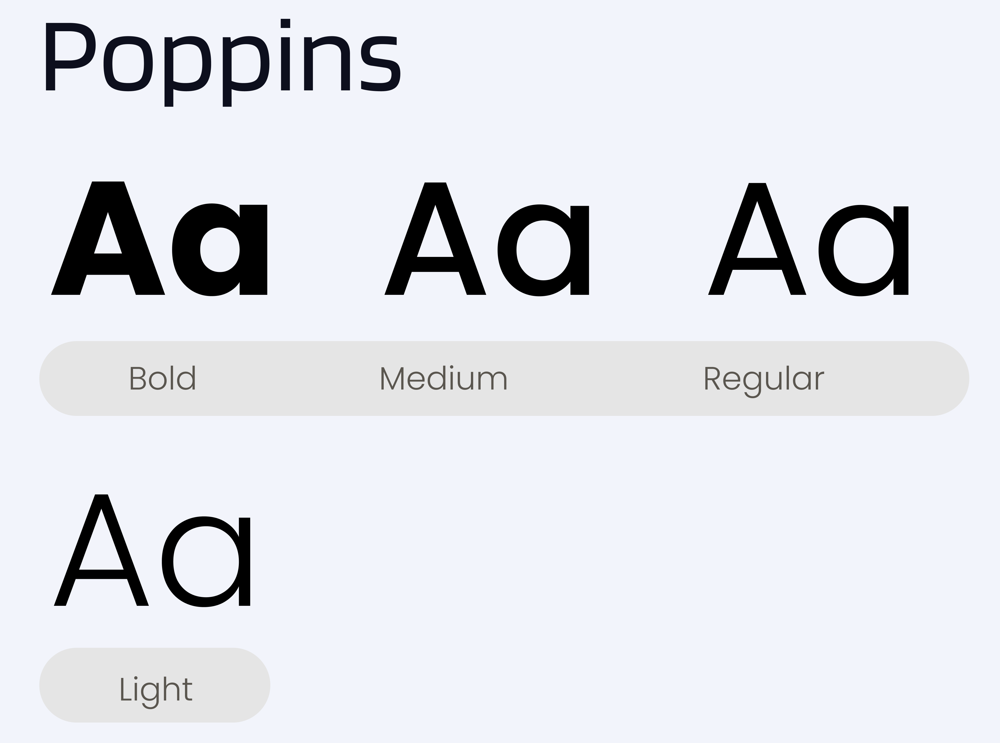
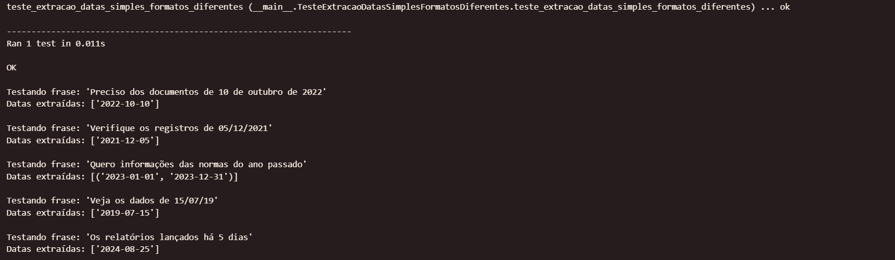

<table>
<tr>
<Table>
  <tr>
    <td><a href= "https://bofabrasil.com.br/"></td>
    <td>
      <a href= "https://www.inteli.edu.br/"></a>
    </td>
  </tr>
</table>

# Claus

## :student: Integrantes

- <a href="https://www.linkedin.com/in/heitorprudente/">Heitor Elias Prudente</a>
- <a href="https://www.linkedin.com/in/raissa-vieira-de-melo/">Raíssa Vieira de Melo</a>
- <a href="https://www.linkedin.com/in/marcelomiguelassis/">Marcelo Miguel Pereira de Assis</a>
- <a href="https://www.linkedin.com/in/victor-gabriel-marques/">Victor Gabriel Marques</a>
- <a href="https://www.linkedin.com/in/raphaela-guiland-ferraz/">Raphaela Guiland Ferraz</a>

## Sumário

- [1. Entendimento de Negócios](#1-entendimento-de-negócios)
  - [1.1. Indústria do Parceiro](#11-indústria-do-parceiro)
    - [1.1.1 Contexto da Indústria](#111-contexto-da-indústria)
    - [1.1.2 Modelo de Negócio](#112-modelo-de-negócio)
    - [1.1.3 Tendências da Área de Domínio](#113-tendências-da-área-de-domínio)
  - [1.2. O Problema](#12-o-problema)
  - [1.3. Partes Interessadas e suas Competências e Habilidades](#13-partes-interessadas-e-suas-competências-e-habilidades)
  - [1.4. Descrição da Solução](#14-descrição-da-solução)
    - [1.4.1. Funcionalidades da Solução](#141-funcionalidades-da-solução)
  - [1.5. Matriz de Riscos e de Oportunidades](#15-matriz-de-riscos-e-de-oportunidades)
  - [1.6. Investimento Estimado](#16-investimento-estimado)
    - [1.6.1. Estimativa de Custos de Desenvolvimento](#161-estimativa-de-custos-de-desenvolvimento)
    - [1.6.2. Estimativa de Custos de Manutenção](#162-estimativa-de-custos-de-manutenção)
    - [1.6.3. Estimativa de Custos de Infraestrutura](#163-estimativa-de-custos-de-infraestrutura)
    - [1.6.4. Estimativa Total de Investimento](#164-estimativa-total-de-investimento)
  - [1.7. Canvas de Proposta de Valor](#17-canvas-de-proposta-de-valor)
- [2. Entendimento do Design](#2-entendimento-do-design)
  - [2.1. Estudo sobre o usuário do sistema](#21-estudo-sobre-o-usuário-do-sistema)
    - [2.1.1. Perfil do Profissional de Compliance](#211-perfil-do-profissional-de-compliance)
    - [2.1.2. Necessidades e Preferências](#212-necessidades-e-preferências)
    - [2.1.3. Habilidades e Limitações](#213-habilidades-e-limitações)
    - [2.1.4. Objetivos e Contexto de Uso](#214-objetivos-e-contexto-de-uso)
  - [2.2. Experiências que o usuário deverá passar ao utilizar o sistema](#22-experiências-que-o-usuário-deverá-passar-ao-utilizar-o-sistema)
  - [2.3. Pilha de Tecnologias para Implementar a Proposta de UX](#23-pilha-de-tecnologias-para-implementar-a-proposta-de-ux)
  - [2.4. Proposta de UX para o Sistema](#24-proposta-de-ux-para-o-sistema)
    - [2.4.1 Design de Interface](#241-design-de-interface)
    - [2.4.2 Paleta de Cores e Tipografia](#242-paleta-de-cores-e-tipografia)
    - [2.4.3 Acessibilidade](#243-acessibilidade)
    - [2.4.4 Usabilidade](#244-usabilidade)
- [3. Entendimento da Arquitetura do Sistema](#3-entendimento-da-arquitetura-do-sistema)
  - [3.1. Requisitos do Sistema](#31-requisitos-do-sistema)
    - [3.1.1. Requisitos Funcionais](#311-requisitos-funcionais)
    - [3.1.2. Requisitos Não Funcionais](#312-requisitos-não-funcionais)
  - [3.2. Padrões de Trabalho](#32-padrões-de-trabalho)
    - [3.2.1. Padrões de Codificação](#321-padrões-de-codificação)
    - [3.2.2. Padrões de Desenvolvimento Ágil](#322-padrões-de-desenvolvimento-ágil)
    - [3.2.3. Padrões de Documentação](#323-padrões-de-documentação)
    - [3.2.4. Padrões de Controle de Versão](#324-padrões-de-controle-de-versão)
  - [3.3. Desenho do Sistema](#33-desenho-do-sistema)
- [4. Sistema de NLP](#4-sistema-de-nlp)
  - [4.1. PLN de Tagueamento](#41-pln-de-tagueamento)
    - [4.1.1. Testes do PLN de Tagueamento](#411-testes-do-pln-de-tagueamento)
    - [4.1.2. Resultados dos Testes do PLN de Tagueamento](#412-resultados-dos-testes-do-pln-de-tagueamento)
  - [4.2. PLN/NLU de Intenção do Usuário](#42-plnnlu-de-intenção-do-usuário)
    - [4.2.1. Testes do PLN/NLU de Intenção do Usuário](#421-testes-do-plnnlu-de-intenção-do-usuário)
    - [4.2.2. Resultados dos Testes do PLN/NLU de Intenção do Usuário](#422-resultados-dos-testes-do-plnnlu-de-intenção-do-usuário)
  - [4.3. Processo de deploy do algoritmo em nuvem comercial](#43-processo-de-deploy-do-algoritmo-em-nuvem-comercial)
- [5. Construção do Sistema de Áudio](#5-construção-do-sistema-de-áudio)
  - [5.1. API para Implementar a Etapa de Speech to Text](#51-api-para-implementar-a-etapa-de-speech-to-text)
  - [5.2. API para receber os áudios enviados pelo usuário](#52-api-para-receber-os-áudios-enviados-pelo-usuário)
- [6. Construção do Backend da Solução](#6-construção-do-backend-da-solução)
  - [6.1 Banco de Dados](#61-banco-de-dados)
    - [6.1.1 Modelo Conceitual](#611-modelo-conceitual)
    - [6.1.2 Modelo Lógico](#612-modelo-lógico)
  - [6.2 Backend da Solução](#62-backend-da-solução)
    - [6.2.1 Arquitetura Geral e Comunicação entre Serviços](#621-arquitetura-geral-e-comunicação-entre-serviços)
    - [6.2.2 Webhooks para Comunicação Externa](#622-webhooks-para-comunicação-externa)
      - [6.2.2.1 Webhook #1: Processamento de Dados do Web Scraping](#6221-webhook-1-processamento-de-dados-do-web-scraping)
      - [6.2.2.2 Webhook #2: Logs de Interação com o Frontend](#6222-webhook-2-logs-de-interação-com-o-frontend)
    - [6.2.3 Sistema de Troca de Mensagens (RabbitMQ)](#623-sistema-de-troca-de-mensagens-rabbitmq)
      - [6.2.3.1 Descrição do Sistema de Mensagen](#6231-descrição-do-sistema-de-mensagens)
      - [6.2.3.2 Detalhes sobre Produtores e Consumidores](#6232-detalhes-sobre-produtores-e-consumidores)
    - [6.2.4 Web Scraping da Solução](#624-web-scraping-da-solução)
    - [6.2.5 Fluxo de Interação com o Usuário](#625-fluxo-de-interação-com-o-usuário)
      - [6.2.5.1 Descrição Detalhada do Fluxo](#6251-descrição-detalhada-do-fluxo)
    - [6.2.6 Orquestração de Serviços](#626-orquestração-de-serviços)
      - [6.2.6.1 Configuração do Docker Compose](#6261-configuração-do-docker-compose)
      - [6.2.6.2 Detalhamento dos Serviços](#6262-detalhamento-dos-serviços)
      - [6.2.6.3 Como Executar a Orquestração](#6263-como-executar-a-orquestração)
  - [6.3 Testes do Backend da Solução](#63-testes-do-backend-da-solução)
    - [6.3.1 Screenshots](#631-screenshots)
- [7. Construção do Frontend da Solução](#7-construção-do-frontend-da-solução)
  - [7.1 Wireframe da Solução](#71-wireframe-da-solução)
  - [7.2 Mockup da Solução](#72-mockup-da-solução)
  - [7.3 Descrição da Interface do Usuário](#73-descrição-da-interface-do-usuário)
  - [7.4 Integração com as APIs do Backend](#74-integração-com-as-apis-do-backend)
  - [7.5 Instruções de Uso](#75-instruções-de-uso)
  - [7.6 Testes do Frontend](#76-testes-do-frontend)
    - [7.6.1 Testes de Integração](#761-testes-de-integração)
      - [7.6.1.1 Testes de Integração da Tela de E-mail](#7611-testes-de-integração-da-tela-de-e-mail)
      - [7.6.1.2 Testes de Integração da Tela de Histórico](#7612-testes-de-integração-da-tela-de-histórico)
      - [7.6.1.3 Testes de Integração da Página Home](#7613-testes-de-integração-da-página-home)
    - [7.6.2 Testes Unitários](#762-testes-unitários)
      - [7.6.2.1 Testes Unitários do Componente de Tabela (Table)](#7621-testes-unitários-do-componente-de-tabela-table)
      - [7.6.2.2 Testes Unitários do Componente Modal de Registro de E-mail (modalRegisterEmail)](#7622-testes-unitários-do-componente-modal-de-registro-de-e-mail-modalregisteremail)
      - [7.6.2.3 Testes Unitários do Componente Filtros (Filters)](#7623-testes-unitários-do-componente-filtros-filters)
      - [7.6.2.4 Testes Unitários do Componente de Filtro por Data (DateFilterButton)](#7624-testes-unitários-do-componente-de-filtro-por-data-datefilterbutton)
      - [7.6.2.5 Testes Unitários do Componente de Contagem de Resultados (ResultsCount)](#7625-testes-unitários-do-componente-de-contagem-de-resultados-resultscount)
      - [7.6.2.6 Testes Unitários do Componente de Cabeçalho (Header)](#7626-testes-unitários-do-componente-de-cabeçalho-header)
      - [7.6.2.7 Testes Unitários do Componente de Botão Primário (PrimaryButton)](#7627-testes-unitários-do-componente-de-botão-primário-primarybutton)
      - [7.6.2.8 Testes Unitários do Componente de Botão Secundário (SecondaryButton)](#7628-testes-unitários-do-componente-de-botão-secundário-secondarybutton)
      - [7.6.2.9 Testes Unitários do Componente Modal de Edição de Tags (ModalEditTags)](#7629-testes-unitários-do-componente-modal-de-edição-de-tags-modaledittags)
      - [7.6.2.10 Testes Unitários do Componente de Filtro de Pesquisa (SearchFilter)](#76210-testes-unitários-do-componente-de-filtro-de-pesquisa-searchfilter)
      - [7.6.2.11 Testes Unitários do Componente de Paginação (Pagination)](#76211-testes-unitários-do-componente-de-paginação-pagination)
  - [7.7 Frontend Implementado](#77-frontend-implementado)
    - [7.7.1 Página Inicial](#771-página-inicial)
    - [7.7.2 Página de Histórico](#772-página-de-histórico)
    - [7.7.3 Página de E-mails](#773-página-de-e-mails)
    - [7.7.4 Modal de Registro de E-mail](#774-modal-de-registro-de-e-mail)
    - [7.7.5 Modal de Edição de Tags](#775-modal-de-edição-de-tags)
    - [7.7.6 Filtros](#776-filtros)
- [8. Deploy da Solução](#8-deploy-da-solução)
  - [8.1. Backend](#81-backend)
    - [8.1.1 Configuração do Servidor](#811-configuração-do-servidor)
      - [8.1.1.1 Criação da Instância EC2](#8111-criação-da-instância-ec2)
      - [8.1.1.2 Conexão com a Instância](#8112-conexão-com-a-instância)
      - [8.1.1.3 Instalação de Dependências](#8113-instalação-de-dependências)
      - [8.1.1.4 Configuração das Variáveis de Ambiente](#8114-configuração-das-variáveis-de-ambiente)
    - [8.1.2 Scripts de Implantação](#812-scripts-de-implantação)
      - [8.1.2.1 Estrutura dos Dockerfiles](#8121-estrutura-dos-dockerfiles)
      - [8.1.2.2 Arquivo docker-compose.yml](#8122-arquivo-docker-composeyml)
      - [8.1.2.3 Iniciando os Serviços](#8123-iniciando-os-serviços)
    - [8.1.3 Testes de Produção](#813-testes-de-produção)
      - [8.1.3.1 Testando o Backend](#8131-testando-o-backend)
    - [8.1.4 Documentação de Monitoramento e Manutenção](#814-documentação-de-monitoramento-e-manutenção)
      - [8.1.4.1 Monitoramento](#8141-monitoramento)
      - [8.1.4.2 Manutenção](#8142-manutenção)
    - [8.1.5 Ambiente de Desenvolvimento](#815-ambiente-de-desenvolvimento)
      - [8.1.5.1 Pré-requisitos](#8151-pré-requisitos)
      - [8.1.5.2 Configuração do Ambiente](#8152-configuração-do-ambiente)
  - [8.2. Frontend](#82-frontend)
    - [8.2.1. Configuração do Servidor](#821-configuração-do-servidor)
      - [8.2.1.1. Criação da Instância EC2](#8211-criação-da-instância-ec2)
      - [8.2.1.2. Conexão com a Instância](#8212-conexão-com-a-instância)
      - [8.2.1.3. Instalação de Dependências](#8213-instalação-de-dependências)
      - [8.2.1.4. Configuração das Variáveis de Ambiente](#8214-configuração-das-variáveis-de-ambiente)
    - [8.2.2. Scripts de Implantação](#822-scripts-de-implantação)
      - [8.2.2.1. Estrutura do Dockerfile do Frontend](#8221-estrutura-do-dockerfile-do-frontend)
      - [8.2.2.2. Atualização do Arquivo docker-compose.yml](#8222-atualização-do-arquivo-docker-composeyml)
      - [8.2.2.3. Iniciando os Serviços com Docker Compose](#8223-iniciando-os-serviços-com-docker-compose)
      - [8.2.2.4. Acessando a Aplicação](#8224-acessando-a-aplicação)
    - [8.2.3. Testes de Produção](#823-testes-de-produção)
      - [8.2.3.1. Verificando a Interface do Usuário](#8231-verificando-a-interface-do-usuário)
      - [8.2.3.2. Testando a Comunicação com o Backend e Serviços](#8232-testando-a-comunicação-com-o-backend-e-serviços)
    - [8.2.4. Documentação de Monitoramento e Manutenção](#824-documentação-de-monitoramento-e-manutenção)
      - [8.2.4.1. Monitoramento](#8241-monitoramento)
      - [8.2.4.2. Manutenção](#8241-monitoramento)
    - [8.2.5. Ambiente de Desenvolvimento](#825-ambiente-de-desenvolvimento)
      - [8.2.5.1. Pré-requisitos](#8251-pré-requisitos)
      - [8.2.5.2. Configuração do Ambiente](#8252-configuração-do-ambiente)
  - [8.3. Considerações Finais](#83-considerações-finais)
- [9. Benefícios Entregues pelo Projeto](#9-benefícios-entregues-pelo-projeto)
- [10. Aperfeiçoamentos Futuros](#10-aperfeiçoamentos-futuros) 
  - [10.1. Visão Geral do Painel Analítico](#101-visão-geral-do-painel-analítico)
  - [10.2. Componentes e Indicadores do Painel](#102-componentes-e-indicadores-do-painel)
  - [10.3. Benefícios Esperados com o Painel Analítico](#103-benefícios-esperados-com-o-painel-analítico)
  - [10.4. Integração com Outras Funcionalidades](#104-integração-com-outras-funcionalidades)
  - [10.5 Potencial para Evolução](#105-potencial-para-evolução)
  - [10.6 Considerações Finais](#106-considerações-finais)
- [Referências](#referências)

# 1. Entendimento de Negócios

## 1.1. Indústria do Parceiro

### 1.1.1 Contexto da Indústria

&emsp;&emsp; O Bank of America (BofA) é uma das instituições financeiras mais importantes do mundo, com uma presença significativa em mais de 30 países, de acordo com o tapi fornecido pelo parceiro. No entanto, a atuação do BofA no Brasil difere substancialmente de sua operação global. Este tópico visa analisar detalhadamente o contexto da indústria do Bank of America no Brasil, destacando suas operações, desafios regulatórios e o ambiente econômico em que atua.

&emsp;&emsp; O Bank of America Brasil opera com um foco específico no mercado de banco de atacado, banco de investimento e serviços de mercados de capitais, de acordo com a página "About-Us" do site dos mesmos. Esta atuação é distinta da sua operação global, pois não inclui serviços de banco de varejo, como cartões de crédito e contas para pessoa física.

- Serviços no Brasil:

  - Banco de atacado
  - Banco de investimento
  - Serviços de mercados de capitais

- Exclusões:

  - Não opera com cartões de crédito
  - Não oferece contas para pessoa física
  - Não realiza financiamentos imobiliários

- Operações Locais:
  - Aproximadamente 1.000 funcionários
  - Faturamento anual em torno de US$ 1 bilhão

#### Ambiente Econômico e Regulatório

&emsp;&emsp; O ambiente regulatório brasileiro é extenso e diversificado, apresentando desafios únicos para instituições financeiras como o Bank of America, de acordo com o Tapi fornecido pelo parceiro. As operações no Brasil exigem um rigoroso acompanhamento das mudanças regulatórias emitidas por vários órgãos reguladores e autorreguladores, tais como:

- Principais Reguladores:

  - Banco Central do Brasil (BACEN)
  - Comissão de Valores Mobiliários (CVM)
  - Brasil, Bolsa, Balcão (B3)
  - Associação Brasileira das Entidades dos Mercados Financeiro e de Capitais (ANBIMA)
  - Federação Brasileira de Bancos (FEBRABAN)
  - Autoridade Nacional de Proteção de Dados (ANPD)
  - Supervisão de Mercados (BSM)

- Desafios Regulatórios:
  - Identificação diária de novas LRRs
  - Análise de impacto e aplicabilidade das novas normas
  - Comunicação e implementação das mudanças dentro da organização
  - Manutenção da conformidade regulatória em um ambiente de constantes mudanças

#### Estrutura e Estratégias

&emsp;&emsp; Para se manter competitivo e garantir a conformidade com as regulamentações brasileiras, o Bank of America Brasil adota várias estratégias:

- Tecnologia e Inovação:

  - Investimento em soluções tecnológicas para monitoramento e implementação de mudanças regulatórias.
  - Uso de Processamento de Linguagem Natural (NLP) para classificação e consulta de LRRs.

- Gestão de Compliance:
  - Desenvolvimento de processos internos robustos para garantir a conformidade com as normas regulatórias.
  - Capacitação contínua dos funcionários em relação às novas regulamentações e práticas de compliance.

#### Conclusão

&emsp;&emsp; A atuação do Bank of America no Brasil é altamente especializada e distinta de sua operação global, concentrando-se em serviços de banco de atacado, banco de investimento e mercados de capitais. Este contexto exige uma abordagem rigorosa e inovadora para a gestão das mudanças regulatórias, enfrentando desafios únicos no ambiente econômico e regulatório brasileiro. Através de investimentos em tecnologia e processos robustos de compliance, o Bank of America Brasil busca garantir sua excelência operacional e conformidade regulatória.

### 1.1.2 Modelo de Negócio

&emsp;&emsp; O Bank of America (BofA) é uma das maiores e mais influentes instituições financeiras do mundo, com uma presença significativa em mais de 30 países. No Brasil, o BofA se destaca por sua atuação específica em áreas diferenciadas das suas operações globais. A seguir, apresentamos uma análise detalhada do modelo de negócio do BofA no Brasil, destacando suas particularidades, estratégias e segmentos de atuação, de acordo com o página "About-Us" do site do mesmo.

#### Estrutura e Segmentos de Atuação

&emsp;&emsp; O BofA no Brasil atua principalmente no mercado de banco de atacado, banco de investimento e serviços de mercados de capitais. Diferentemente de outras operações globais, o BofA Brasil não oferece produtos como cartões de crédito, contas para pessoa física e financiamentos imobiliários. Essa estratégia permite uma concentração em segmentos de alto valor agregado e com grande potencial de retorno.

- Banco de Atacado: Envolve a oferta de serviços bancários para grandes empresas, como linhas de crédito, financiamento corporativo e gerenciamento de tesouraria.
- Banco de Investimento: O BofA Brasil fornece serviços de consultoria em fusões e aquisições (M&A), emissão de títulos, financiamento estruturado e operações no mercado de capitais.
- Serviços de Mercados de Capitais: Incluem a intermediação de ativos financeiros, operações de câmbio, derivativos e outros instrumentos financeiros avançados.

#### Estratégias de Mercado

&emsp;&emsp; O BofA Brasil adota uma abordagem focada em fornecer soluções financeiras complexas e personalizadas para grandes corporações e investidores institucionais. Algumas das principais estratégias incluem:

- Inovação e Tecnologia: Investimento contínuo em tecnologia para oferecer serviços financeiros avançados e soluções personalizadas, alinhadas às necessidades dos clientes corporativos.
- Parcerias Estratégicas: Colaboração com instituições locais e globais para expandir o alcance de seus serviços e melhorar a oferta de produtos.
- Compliance e Regulamentação: Forte ênfase em compliance para garantir a conformidade com as complexas regulamentações financeiras brasileiras, mitigando riscos e assegurando operações transparentes.

#### Conclusão

&emsp;&emsp; O modelo de negócio do Bank of America no Brasil é caracterizado por uma atuação focada em serviços de alto valor agregado para grandes empresas e investidores institucionais. Através de uma combinação de inovação tecnológica, parcerias estratégicas e um forte compromisso com a conformidade regulatória, o BofA Brasil se posiciona como um líder no mercado financeiro brasileiro. Este modelo permite ao banco não apenas mitigar riscos, mas também capturar oportunidades de crescimento no dinâmico mercado brasileiro.

### 1.1.3 Tendências da Área de Domínio

&emsp;&emsp;Existem no mercado financeiro várias tendências que estão moldando as operações das instituições que atuam no setor. De acordo com o Bank of America na matéria BofA Global Research Calls 2024 “The Year of the Landing” (2023) uma tendência significativa é o crescimento da atividade de fusões e aquisições (M&A), especialmente nos setores de tecnologia, saúde e energia. Empresas estão buscando expandir e diversificar suas operações por meio de aquisições estratégicas, o que deve aumentar a demanda por consultoria especializada e serviços financeiros avançados.

&emsp;&emsp;Já na matéria What to watch: Four trends in 2024 (2024) o Bank of America apresenta a sustentabilidade como outra tendência em alta, com uma crescente demanda por investimentos sustentáveis e financiamentos verdes. Nos próximos anos, espera-se que empresas alinhem suas estratégias de crescimento com práticas sustentáveis para atender às expectativas de investidores e reguladores.

&emsp;&emsp;A adoção de soluções de pagamentos instantâneos, como o Pix, também está em ascensão. Segundo a matéria Midyear 2024: What’s ahead for the markets and investors? (2024) essa tendência deverá continuar impulsionando a eficiência nas operações de caixa e transações internacionais, refletindo a digitalização contínua do setor financeiro e oferecendo mais inovação e conveniência para os clientes.

&emsp;&emsp;A inteligência artificial é outra tendência transformadora no setor financeiro, que vem fornecendo ferramentas avançadas para análise de dados, automação de processos e personalização de serviços. No contexto de compliance e gestão de mudanças regulatórias, a IA oferece soluções inovadoras para o monitoramento, análise e classificação de novas regulamentações, o que pode aumentar significativamente a eficiência e reduzir riscos de não conformidade. O Bank of America, embora conservador em relação à aplicação de IA por questões de segurança, especialmente na área de compliance, deve gradualmente adotar essas tecnologias à medida que a confiança e a confiabilidade aumentam. A IA tem o potencial de proporcionar novos níveis de eficiência e experiência ao cliente, redefinindo a forma como os bancos operam e interagem com seus clientes, ao mesmo tempo em que melhora a gestão das mudanças regulatórias.

&emsp;&emsp;As tendências do setor financeiro, como as apresentadas, estão moldando significativamente as operações das instituições financeiras. Essas tendências não apenas refletem mudanças tecnológicas e econômicas, mas também sinalizam um movimento em direção a práticas mais eficientes, sustentáveis e orientadas por dados.

## 1.2. O Problema

&emsp;&emsp; A gestão de mudanças regulatórias ("Reg Change") é uma atividade crítica para instituições financeiras como o Bank of America (BofA). Desde a crise financeira global de 2008, o ambiente regulatório tornou-se mais complexo, com um aumento significativo no volume e na frequência das alterações nas leis, regras e regulamentações (LRRs). No Brasil, o desafio é ainda maior devido à diversidade e quantidade de órgãos reguladores que emitem normas em diferentes formatos e linguagens.

### Complexidade do Ambiente Regulatório

&emsp;&emsp; O Brasil possui um ambiente regulatório extenso e diversificado, onde diversos órgãos reguladores emitem LRRs específicas para disciplinar e fiscalizar o sistema financeiro e o mercado de valores mobiliários. Alguns dos principais reguladores incluem:

- Banco Central do Brasil (BACEN)
- Comissão de Valores Mobiliários (CVM)
- Brasil, Bolsa e Balcão (B3)
- Associação Brasileira das Entidades dos Mercados Financeiro e de Capitais (ANBIMA)
- Federação Brasileira de Bancos (FEBRABAN)
- Autoridade Nacional de Proteção de Dados (ANPD)
- Supervisão de Mercados (BSM)

&emsp;&emsp; Cada um desses reguladores publica LRRs em locais distintos e formatos variados, o que torna o processo de gestão de mudanças regulatórias particularmente desafiador. A identificação, captura, análise e implementação dessas mudanças exige um esforço contínuo e coordenado, além de recursos significativos.

### Desafios Específicos Enfrentados pelo Bank of America

&emsp;&emsp; O Bank of America, operando no Brasil com aproximadamente 1.000 funcionários e um faturamento anual em torno de US$ 1 bilhão, enfrenta vários desafios na gestão de mudanças regulatórias:

1. Volume de LRRs: Em 2023, mais de 1200 LRRs foram analisadas para avaliar sua aplicabilidade ao BofA. O volume elevado requer uma abordagem sistemática e eficiente para garantir a conformidade.
2. Diversidade de Formatos: LRRs são emitidas em diferentes formatos (PDF, Word, etc.), exigindo ferramentas flexíveis para captura e processamento.
3. Complexidade Linguística: A linguagem e a estrutura das LRRs variam significativamente entre os reguladores, complicando a tarefa de interpretação e aplicação.
4. Recursos Necessários: A análise manual de LRRs é intensiva em mão-de-obra, exigindo equipes dedicadas para monitorar e interpretar as mudanças regulatórias.

### Impactos das Mudanças Regulatórias

&emsp;&emsp; A implementação de práticas de compliance regulatório afeta diretamente os processos internos do BofA, envolvendo:

1. Revisão de Políticas Internas: Adequação de políticas e procedimentos internos às novas normas.
2. Capacitação Contínua: Treinamento e conscientização dos funcionários sobre as novas regulamentações.
3. Atualização Tecnológica: Modificações em sistemas e ferramentas para garantir a conformidade.
4. Documentação e Relacionamento com Reguladores: Registro detalhado das atividades de compliance e manutenção de um relacionamento proativo com os órgãos reguladores.

### Conclusão

&emsp;&emsp; O problema da gestão de mudanças regulatórias no Bank of America no Brasil é extremamente complexo devido ao ambiente regulatório diversificado e dinâmico do país, que exige a identificação, captura, interpretação e implementação de um grande volume de leis, regras e regulamentações (LRRs) emitidas por diversos órgãos reguladores. A análise manual dessas LRRs é intensiva em recursos e tempo, afetando políticas internas, capacitação de funcionários, atualização tecnológica e relacionamento com reguladores. Falhas nesse processo podem resultar em multas, disrupções operacionais e danos reputacionais, demandando uma estratégia robusta de compliance para garantir a conformidade e mitigar riscos.

## 1.3. Partes Interessadas e suas Competências e Habilidades

&emsp;&emsp; O projeto Claus envolve várias partes interessadas com competências e responsabilidades específicas, cada uma desempenhando um papel fundamental na gestão das mudanças regulatórias no Bank of America (BofA). Assim, a colaboração eficaz entre essas partes é essencial para garantir o sucesso do projeto e a conformidade com as regulamentações financeiras brasileiras. Desse modo, abaixo estão as partes interessadas e suas competências/responsabilidades:

**1. Bank of America (BofA)**

- Competências/Responsabilidades:
  - Compliance e Tecnologia: Áreas principais de negócio do BofA envolvidas no projeto, responsáveis por garantir que as soluções desenvolvidas estejam em conformidade com as regulamentações financeiras.
  - Gestão do Projeto: Supervisão do desenvolvimento da solução tecnológica e garantia de alinhamento com os objetivos estratégicos do banco.
  - Avaliação e Feedback: Análise contínua do progresso do projeto e fornecimento de feedback para ajustes necessários.

**2. Líder do Projeto - Otávio Braga e Leonardo Meira**

- Competências/Responsabilidades:
  - Coordenação Geral: Responsáveis pela coordenação das atividades do projeto, garantindo que todas as fases sejam executadas conforme o cronograma.
  - Comunicação: Facilitação da comunicação entre as diferentes partes interessadas, tanto do BofA quanto do grupo Claus, assegurando que todos estejam alinhados com os objetivos e requisitos do projeto.
  - Tomada de Decisões: Tomada de decisões críticas para a continuidade e sucesso do projeto.

**3. Ponto Focal Backup - Gabriel Paganini**

- Competências/Responsabilidades:
  - Suporte ao Líder do Projeto: Apoio ao líder do projeto em todas as suas funções, garantindo que haja continuidade no caso de ausência do líder principal.
  - Gestão de Contingências: Identificação e gerenciamento de riscos e contingências que possam impactar o projeto.

**4. Líder Técnico - Otávio Braga**

- Competências/Responsabilidades:
  - Desenvolvimento Técnico: Supervisão técnica do desenvolvimento da solução, assegurando que as melhores práticas de engenharia de software sejam seguidas.
  - Integração de Tecnologias: Garantir que as tecnologias utilizadas sejam integradas de forma eficiente e eficaz, atendendo aos requisitos funcionais e não funcionais.

**5. Líder de Negócio - Gabriel Paganini**

- Competências/Responsabilidades:
  - Alinhamento com os Objetivos de Negócio: Garantir que o desenvolvimento da solução esteja alinhado com os objetivos estratégicos do Bank of America.
  - Análise de Impacto: Avaliação do impacto das novas regulamentações sobre os processos de negócios e garantia de que a solução ofereça suporte adequado.

**6. Líder Executivo (Onboarding Executivo) - Leonardo Meira**

- Competências/Responsabilidades:
  - Gestão de Relacionamento: Manter um relacionamento próximo com os executivos e partes interessadas do Bank of America, assegurando que as expectativas estejam sendo atendidas.
  - Visão Estratégica: Fornecer uma visão estratégica para o projeto, garantindo que ele esteja alinhado com as metas de longo prazo do banco.

**7. Equipe de Desenvolvimento Claus**

- Competências/Responsabilidades:
  - Implementação: Desenvolvimento e implementação da solução tecnológica conforme os requisitos definidos.
  - Testes e Validação: Realização de testes rigorosos para assegurar que a solução atenda a todos os critérios de aceitação.
  - Documentação: Manter uma documentação detalhada do desenvolvimento, garantindo que todas as etapas e decisões sejam registradas e possam ser revisadas.

**8. Docentes do Inteli**

- Competências/Responsabilidades:
  - Orientação: Apoio e orientação aos alunos do Inteli envolvidos no projeto, garantindo que eles tenham as habilidades e conhecimentos necessários para contribuir efetivamente.
  - Supervisão Acadêmica: Acompanhamento do progresso dos alunos e avaliação de seu desempenho, fornecendo feedback e orientação para o desenvolvimento de suas habilidades.

**9. Usuários Finais (Compliance Officers)**

- Competências/Responsabilidades:
  - Utilização da Solução: Uso diário da solução para monitoramento e acompanhamento das mudanças regulatórias.
  - Feedback: Fornecimento de feedback contínuo sobre a usabilidade e eficiência da solução, permitindo ajustes e melhorias contínuas.
  - Aderência às Normas: Garantir que as atividades de compliance estejam em conformidade com as regulamentações, utilizando a solução desenvolvida para facilitar essa tarefa.

&emsp;&emsp;Nesse sentido, a colaboração entre essas partes interessadas, cada uma com suas competências e responsabilidades específicas, é fundamental para o sucesso do projeto Claus, haja vista que o alinhamento e a comunicação eficaz entre todas as partes asseguram que a solução desenvolvida atenda às necessidades do Bank of America, proporcionando uma gestão eficiente das mudanças regulatórias no mercado financeiro brasileiro.

## 1.4. Descrição da Solução

&emsp;&emsp; A solução desenvolvida para o Bank of America centraliza e automatiza o acompanhamento das mudanças regulatórias do mercado financeiro brasileiro, com foco nas normativas da Comissão de Valores Mobiliários (CVM). A plataforma foi criada para otimizar a gestão dessas normativas, tornando o processo mais eficiente e acessível, permitindo que a equipe de compliance monitore as atualizações de maneira rápida e precisa.

&emsp;&emsp; Ao integrar todos os dados e informações relevantes em um único sistema, a solução elimina a fragmentação e a necessidade de processos manuais no acompanhamento das normas. Com uma interface centralizada e funcionalidades automatizadas, o processo de monitoramento torna-se mais ágil e confiável, facilitando a tomada de decisões com base em informações atualizadas.

&emsp;&emsp; Essa abordagem permite que o Bank of America reduza significativamente o risco de não conformidade regulatória, ao mesmo tempo em que otimiza o gerenciamento contínuo das mudanças normativas. Como resultado, a equipe de compliance pode se concentrar em atividades de maior valor estratégico, enquanto o sistema garante que todas as mudanças sejam monitoradas e geridas de forma eficaz no dia a dia.

### 1.4.1. Funcionalidades da Solução

&emsp;&emsp; Para que a solução atenda às necessidades do Bank of America, foram pensadas diversas funcionalidades que visam facilitar o acompanhamento e a gestão das mudanças regulatórias. A seguir, são apresentadas as principais funcionalidades da solução desenvolvida para o BofA:

- Coleta Diária de Normas Regulamentares

  A solução realiza, uma vez ao dia, a coleta automatizada de normas de fontes oficiais, como o site da CVM. Com isso, o banco garante que todas as novas regulamentações publicadas estejam acessíveis sem a necessidade de intervenção manual. Esse processo centraliza a obtenção das normas em uma única plataforma.

- Organização e Classificação Automática
  
  Após a coleta, as normas são organizadas e classificadas automaticamente dentro do sistema, permitindo que as informações sejam facilmente localizadas e gerenciadas. Esse processo de classificação facilita a busca e o entendimento das normas, agilizando a análise e o acompanhamento pela equipe de compliance.

- Interface de Consulta Amigável

  A solução oferece uma interface intuitiva e simples de usar, onde as normas capturadas são listadas de maneira clara e organizada. A equipe de compliance pode acessar as normas de forma rápida, ordenadas por data ou outros critérios importantes, facilitando o acompanhamento das regulamentações mais recentes.

- Busca Inteligente de Normas

  A solução inclui uma funcionalidade de busca avançada que utiliza Processamento de Linguagem Natural (NLP) para identificar o que o usuário está procurando. Isso permite que a equipe de compliance encontre normas específicas com base em palavras-chave ou frases, escritas ou ditas de forma natural, agilizando o processo de consulta.

- Edição de Tags

  Os usuários podem adicionar ou remover tags associadas às normas para garantir que as elas estejam corretamente classificadas e organizadas. Essa funcionalidade não só permite uma personalização da organização das normas, mas também faz com que o modelo de classificação automática seja aprimorado com as correções realizadas pelos usuários.

- Notificações por E-mail
  
  Os usuários podem cadastrar seus e-mails no sistema para receber notificações diárias quando novas normas forem adicionadas. Essas notificações são enviadas com base na coleta diária, garantindo que os usuários fiquem informados sobre atualizações sem precisar acessar a plataforma constantemente.

- Filtragem de Informações Relevantes

  Para facilitar o uso, a solução permite que as normas sejam filtradas de acordo com critérios como data de publicação, tipo de norma e segmento afetado, tornando a análise mais focada e direcionada para as necessidades específicas de cada usuário.

&emsp;&emsp; Essas funcionalidades combinadas proporcionam uma solução abrangente e eficaz para a gestão de mudanças regulatórias no Bank of America, permitindo que a equipe de compliance monitore e acompanhe as normas de forma mais eficiente e precisa, garantindo a conformidade com as regulamentações financeiras brasileiras.

## 1.5. Matriz de Riscos e de Oportunidades

&emsp;&emsp; A matriz de riscos, conforme Nuzzi (2021), é uma ferramenta bastante utilizada para avaliar aspectos que podem impactar o projeto de forma positiva ou negativa. Nesse sentido, esses aspectos podem ser tanto riscos quanto oportunidades e dentro dessa ferramenta elas são avaliadas com base em sua probabilidade de ocorrência e o impacto no projeto.

&emsp;&emsp; Seguindo essa descrição, a imagem abaixo demonstra a matriz de risco do projeto Claus que está sendo desenvolvido para o Bank Of America.

<div align="center">
  <sub>Figura 1 - Matriz de Riscos do projeto Claus desenvolvido para o Bank Of America</sub>
  
  <sup>Fonte: Desenvolvido pelos autores (2024)</sup>
</div>

&emsp;&emsp; Através da imagem acima, é possível observar quais são os riscos que podem impactar o projeto Claus e, tendo em vista que existe esses riscos, é necessário que o grupo tenha um plano de ação para mitigar esses riscos. Sendo assim, abaixo será apresentado um plano de ação para mitigar os riscos do projeto:

**1. O sistema não apresentar versão responsiva:** Este risco possui uma probabilidade alta de ocorrência e um impacto insignificante no projeto, uma vez que essa responsividade não é uma prioridade para o parceiro já que os sistemas internos do Bank Of America são mais acessados por computadores. Sendo assim, o plano de ação para mitigar esse risco é realizar testes de responsividade no sistema e, caso seja necessário, realizar ajustes para que o sistema seja responsivo.

**2. O sistema não contempla um bom plano de contingência contra quedas de internet:** Este risco possui uma probabilidade alta de ocorrência e um impacto insignificante no projeto, uma vez que o sistema não é um sistema crítico para o Bank Of America, além de que é um sistema para se utilizar dentro do banco. Sendo assim, o plano de ação para mitigar esse risco é realizar testes de contingência contra quedas de internet e, caso seja necessário, realizar ajustes para que o sistema funcione mesmo sem internet. Um desses ajustes poderia ser o desenvolvimento de mecanismos de cache local e sincronização de dados assim que a conexão for restabelecida.

**3. Sistema executar com uma performance ruim:** Este risco possui uma probilidade alta de ocorrência e um impacto moderado no projeto, uma vez que o sistema precisa ser rápido para que os usuários possam ter uma boa experiência de uso, bem como para não atrapalhar a rotina dos funcionários do Bank Of America. Sendo assim, o plano de ação para mitigar esse risco é realizar testes de performance no sistema e, caso seja necessário, realizar ajustes para que o sistema possa ser mais rápido. Um desses ajustes poderia ser a otimização do código e a utilização de tecnologias mais rápidas.

**4. Requisitos funcionais não contemplados na versão final do sistema:** Este risco possui uma probabilidade alta de ocorrência e um impacto catastrófico, uma vez que o sistema precisa atender a todos os requisitos funcionais para que possa ser utilizado pelos funcionários do Bank Of America. Sendo assim, o plano de ação para mitigar esse risco é realizar testes de requisitos funcionais no sistema e, caso seja necessário, realizar ajustes para que o sistema possa atender a todos os requisitos funcionais. Um desses ajustes poderia ser a realização de mais reuniões com o Bank Of America para entender melhor os requisitos do sistema.

**5. Falhas na Classificação Automática de LRRs (Leis, Regras e Regulamentações):** Este risco possui uma probabilidade média de ocorrência e um impacto moderado, dado que a classificação automática de LRRs é um dos principais objetivos do projeto. Sendo assim, o plano de ação para mitigar esse risco é realizar testes de classificação automática de LRRs no sistema e, caso seja necessário, realizar ajustes para que o sistema possa classificar corretamente as LRRs. Um desses ajustes poderia ser a utilização de algoritmos de machine learning para classificar as LRRs.

**6. Insuficiência de Recursos para Suporte e Manutenção da Solução:** Este risco possui uma probabilidade média de ocorrência e um impacto moderado, pois a solução precisa de suporte e manutenção para que possa continuar funcionando corretamente, mesmo que o grupo entregue um projeto com uma arquitetura bem documentada e de fácil manutenção. Sendo assim, o plano de ação para mitigar esse risco é realizar um planejamento de suporte e manutenção da solução e, caso seja necessário, contratar mais recursos para suporte e manutenção da solução.

**7. As tecnologias utilizadas dificultam o entendimento e a implementação da aplicação:** Este risco possui uma probabilidade média de ocorrência e um impacto catastrófico, uma vez que as tecnologias utilizadas no projeto precisam ser de fácil entendimento e implementação, bem como atuais, em prol de facilitar a manutenção e a evolução do sistema. Sendo assim, o plano de ação para mitigar esse risco é realizar um estudo de viabilidade das tecnologias utilizadas no projeto e, caso seja necessário, realizar ajustes para que o sistema possa ser mais fácil de entender e implementar.

**8. Saída de um membro da equipe:** Este risco possui uma probabilidade baixa de ocorrência e um impacto insignificante, pois a saída de um membro da equipe não impacta diretamente no projeto, uma vez que o grupo Claus possui um número suficiente de membros para realizar o projeto. Sendo assim, o plano de ação para mitigar esse risco é realizar um planejamento de contingência para a saída de um membro da equipe e, caso seja necessário, contratar mais membros para a equipe.

**9. Falha na atualização diária dos dados de mudanças regulatórias:** Este risco possui uma probabilidade baixa de ocorrência e um impacto moderado, dado que a atualização diária dos dados de mudanças regulatórias é um dos principais objetivos do projeto. Nesse sentido, o plano de ação para mitigar esse risco é realizar testes de atualização diária dos dados de mudanças regulatórias no sistema e, caso seja necessário, realizar ajustes para que o sistema possa atualizar corretamente esses dados. Um desses ajustes poderia ser a utilização de APIs para atualizar esses dados e a comparação dos dados atualizados com os dados antigos para verificar se houve alguma mudança.

**10. Problemas na integração deste sistema com os sistemas internos do banco:** Este risco possui uma probabilidade baixa de ocorrência e um impacto moderado, uma vez que a integração deste sistema com os sistemas internos do banco pode ser um dos principais desafios do projeto devido às tecnologias e arquiteturas diferentes. Sendo assim, o plano de ação para mitigar esse risco é realizar testes de integração deste sistema com os sistemas internos do banco e, caso seja necessário, realizar ajustes para que o sistema possa se integrar corretamente com esses sistemas. Um desses ajustes poderia ser a utilização de APIs para realizar a integração e, de acordo com o resultado obtido nos testes, realizar ajustes no código para que a integração seja bem-sucedida.

**11. Projeto financeiramente inviável para o parceiro:** Este risco possui uma probabilidade baixa de ocorrência e um impacto catastrófico, haja vista que o projeto Claus possa utilizar uma arquitetura e tecnologias que possam exigir recursos financeiros que o banco não possua. Sendo assim, o plano de ação para mitigar esse risco é realizar um estudo de viabilidade financeira do projeto e, caso seja necessário, realizar ajustes para que o projeto possa ser financeiramente viável para o parceiro. Um desses ajustes poderia ser a utilização de tecnologias mais baratas e a redução do escopo do projeto.

&emsp;&emsp;Além da matriz de riscos há, também, a matriz de oportunidades, que é uma ferramenta utilizada para avaliar aspectos que podem impactar o projeto de forma positiva. Nesse sentido, esses aspectos são avaliados justamente como oportunidades, que podem ser exploradas para melhorar o projeto. A imagem abaixo demonstra a matriz de oportunidades do projeto Claus que está sendo desenvolvido para o Bank Of America.

<div align="center">
  <sub>Figura 2 - Matriz de Oportunidades do projeto Claus desenvolvido para o Bank Of America</sub>
  
  <sup>Fonte: Desenvolvido pelos autores (2024)</sup>
</div>

&emsp;&emsp; Através da imagem acima, é possível observar quais são as oportunidades que podem impactar o projeto Claus de forma positiva, e consequentemente o parceiro, o Bank Of America. Sendo assim, é necessário que o grupo tenha um plano de ação para explorar essas oportunidades. Abaixo será apresentado um plano de ação para explorar as oportunidades do projeto:

**1. O grupo Claus ganha conhecimentos elementares da Engenharia de Software:** Esta oportunidade destaca a importância do aprendizado contínuo e do desenvolvimento de habilidades técnicas essenciais para o grupo Claus. Ao adquirir conhecimentos elementares de engenharia de software, os membros do grupo estarão mais bem preparados para lidar com desafios futuros, aumentar a eficiência de seus projetos e melhorar suas competências profissionais. Isso fortalece a base técnica da equipe e promove um ambiente de aprendizado contínuo.

**2. O sistema corresponde às necessidades do Bank Of America:** Desenvolver um sistema que atenda às necessidades específicas do Bank of America representa uma grande oportunidade, pois fortalece a relação de parceria e aumenta a confiança do parceiro de módulo no grupo Claus. Ademais, atender às expectativas e requisitos do Bank of America não apenas garante a satisfação do cliente, mas também abre portas para futuras oportunidades de estágio dentro da instituição.

**3. O sistema contribui para a otimização do cotidiano de trabalho dos analistas de compliance:** Criar um sistema que otimiza as tarefas diárias dos analistas de compliance é uma oportunidade significativa, pois aumenta a eficiência operacional e reduz o tempo gasto em processos repetitivos. Essa melhoria na produtividade não só beneficia os analistas, mas também melhora a conformidade regulatória e reduz o risco de erros, contribuindo para uma operação mais suave e eficaz dentro do Bank of America.

**4. Criação de uma documentação interativa dos componentes e da arquitetura do sistema:** A criação de uma documentação interativa proporciona uma referência clara e acessível para todos os membros da equipe e futuros desenvolvedores. Isso facilita a manutenção, atualização e expansão do sistema, além de acelerar o processo de onboarding de novos membros. Por fim, uma documentação bem estruturada e interativa melhora a comunicação dentro da equipe e garante que o conhecimento seja compartilhado de maneira eficiente.

**5. O sistema poderia responder positivamente mediante à falta de internet no ambiente de trabalho:** Desenvolver um sistema que funcione eficazmente mesmo na ausência de internet é uma oportunidade significativa para garantir a continuidade do trabalho e a produtividade dos usuários. Esta funcionalidade aumenta a resiliência e a confiabilidade do sistema, proporcionando uma experiência de usuário mais robusta e garantindo que os processos críticos possam continuar ininterruptos, independentemente da conectividade.

**6. Integração com ferramentas de geração de relatórios personalizados:** Integrar o sistema com ferramentas de geração de relatórios personalizados oferece aos usuários a capacidade de criar ideias específicas e acionáveis a partir dos dados. Essa flexibilidade permite que as equipes de compliance e gestão tomem decisões mais informadas e rápidas, melhorando a análise de dados e a resposta às necessidades regulatórias e de negócios.

**7. O sistema apresenta-se responsivamente para celulares:** Garantir que o sistema seja responsivo e acessível em dispositivos móveis é uma oportunidade crucial para aumentar a flexibilidade e a conveniência para os usuários. Isso permite que os analistas de compliance e outros usuários acessem informações e realizem tarefas críticas de qualquer lugar e a qualquer momento, melhorando a produtividade e a eficiência. Portanto, a acessibilidade móvel também reflete um compromisso com as melhores práticas de design e usabilidade.

&emsp;&emsp; Portanto, com a matriz de riscos e de oportunidades apresentadas, é possível observar que o projeto Claus possui diversos aspectos que podem impactar o projeto de forma positiva ou negativa e, com isso, é necessário que o grupo tenha um plano de ação para mitigar os riscos e explorar as oportunidades do projeto, a fim de garantir o sucesso do projeto e a satisfação do parceiro, o Bank Of America.

## 1.6. Investimento Estimado

&emsp;&emsp; O investimento estimado para o desenvolvimento do projeto Claus, que visa automatizar o processo de monitoramento de novas normativas do mercado financeiro brasileiro para o Bank of America, é composto por diversos fatores, tais como recursos humanos, tecnológicos e financeiros.

### 1.6.1 Estimativa de Custos de Desenvolvimento

&emsp;&emsp; A estimativa de custos de desenvolvimento foi baseada em três parâmetros principais: tamanho da equipe, tempo de desenvolvimento e salários dos profissionais. Esses parâmetros foram escolhidos por serem os fatores mais relevantes que influenciam diretamente o custo de projetos de desenvolvimento de software.

&emsp;&emsp; A composição da equipe (juniores e seniores) reflete a necessidade de balancear a complexidade técnica com o custo. Equipes com desenvolvedores mais experientes tendem a reduzir o tempo de desenvolvimento, mas aumentam os custos devido aos salários mais altos. Já o tempo de projeto foi estimado com base na complexidade das funcionalidades e no escopo geral do sistema, considerando possíveis variações no andamento. Os salários foram definidos de acordo com as médias de mercado, garantindo uma projeção realista dos custos.

#### Cenário Otimista (O)

- **Equipe**: 4 desenvolvedores juniores e 2 desenvolvedores seniores.
- **Tempo de Projeto**: 6 meses.
- **Custo por Mês**:

  - Desenvolvedores Juniores: R$ 6.000
  - Desenvolvedores Seniores: R$ 11.000

- **Custo Total**: $`(4 \times 6 \times 6000) + (2 \times 6 \times 11000) = 144000 + 132000 = 276000`$

#### Cenário Mais Provável (M)

- **Equipe**: 5 desenvolvedores juniores e 3 desenvolvedores seniores.
- **Tempo de Projeto**: 8 meses.
- **Custo por Mês**:

  - Desenvolvedores Juniores: R$ 6.000
  - Desenvolvedores Seniores: R$ 11.000

- **Custo Total**: $`(5 \times 8 \times 6000) + (3 \times 8 \times 11000) = 240000 + 264000 = 504000`$

#### Cenário Pessimista (P)

- **Equipe**: 6 desenvolvedores juniores e 4 desenvolvedores seniores.
- **Tempo de Projeto**: 10 meses.
- **Custo por Mês**:

  - Desenvolvedores Juniores: R$ 6.000
  - Desenvolvedores Seniores: R$ 11.000

- **Custo Total**: $`(6 \times 10 \times 6000) + (4 \times 10 \times 11000) = 360000 + 440000 = 800000`$

#### Estimativa Ponderada de Desenvolvimento (E)

- $`\text{Custo Estimado (E)} = \frac{276000 + 4 \times 504000 + 800000}{6} = \frac{276000 + 2016000 + 800000}{6} = \frac{3092000}{6} = 515333`$

### 1.6.2. Estimativa de Custos de Manutenção

&emsp;&emsp; Os custos de manutenção foram calculados utilizando parâmetros semelhantes aos do desenvolvimento, com foco no tamanho da equipe de suporte e no período de manutenção contínua. Esses parâmetros são críticos, pois a manutenção de um sistema envolve não apenas a correção de erros, mas também atualizações e ajustes para atender às necessidades de operação a longo prazo. A variação entre esses parâmetros reflete a incerteza sobre a quantidade de suporte que o sistema pode demandar.

#### Cenário Otimista (O)

- **Equipe**: 2 desenvolvedores juniores e 1 desenvolvedor sênior.
- **Tempo de Projeto**: 6 meses.
- **Custo por Mês**:

  - Desenvolvedores Juniores: R$ 6.000
  - Desenvolvedor Sênior: R$ 11.000

- **Custo Total**: $`(2 \times 6 \times 6000) + (1 \times 6 \times 11000) = 72000 + 66000 = 138000`$

#### Cenário Mais Provável (M)

- **Equipe**: 3 desenvolvedores juniores e 2 desenvolvedores seniores.
- **Tempo de Projeto**: 8 meses.
- **Custo por Mês**:

  - Desenvolvedores Juniores: R$ 6.000
  - Desenvolvedores Seniores: R$ 11.000

- **Custo Total**: $`(3 \times 8 \times 6000) + (2 \times 8 \times 11000) = 144000 + 176000 = 320000`$

#### Cenário Pessimista (P)

- **Equipe**: 4 desenvolvedores juniores e 3 desenvolvedores seniores.
- **Tempo de Projeto**: 10 meses.
- **Custo por Mês**:

  - Desenvolvedores Juniores: R$ 6.000
  - Desenvolvedores Seniores: R$ 11.000

- **Custo Total**: $`(4 \times 10 \times 6000) + (3 \times 10 \times 11000) = 240000 + 330000 = 570000`$

#### Estimativa Ponderada de Manutenção (E)

- $`\text{Custo Estimado (E)} = \frac{138000 + 4 \times 320000 + 570000}{6} = \frac{138000 + 1280000 + 570000}{6} = \frac{1988000}{6} = 331333`$

### 1.6.3. Estimativa de Custos de Infraestrutura

&emsp;&emsp; Para os custos de infraestrutura, os principais parâmetros considerados foram o investimento em hardware e licenças de software. Esses parâmetros são relevantes porque o desempenho do sistema e a capacidade de atender às demandas futuras dependem diretamente da infraestrutura utilizada. A escolha desses parâmetros leva em conta a necessidade de garantir uma operação eficiente e segura, bem como a escalabilidade do sistema. A variação reflete o nível de investimento necessário para garantir a estabilidade e a segurança do sistema em diferentes cenários.

#### Hardware

**Justificativa**: Para o projeto, será necessário adquirir servidores e equipamentos de rede para suportar as operações do sistema. Isso inclui servidores para armazenamento e processamento de dados, e equipamentos de rede para garantir a conectividade e segurança.

##### Cenário Otimista (O)

- **Investimento Inicial**: R$ 100.000
  - Servidores básicos e componentes de rede essenciais.

##### Cenário Mais Provável (M)

- **Investimento Inicial**: R$ 150.000
  - Servidores com maior capacidade de armazenamento e redundância, e componentes de rede adicionais para garantir alta disponibilidade.

##### Cenário Pessimista (P)

- **Investimento Inicial**: R$ 200.000
  - Solução completa com servidores de alta capacidade, sistemas de backup, e componentes de rede de última geração para maximizar a segurança e a disponibilidade.

##### Estimativa Ponderada de Hardware (E)

- $`\text{Custo Estimado (E)} = \frac{100000 + 4 \times 150000 + 200000}{6} = \frac{100000 + 600000 + 200000}{6} = \frac{900000}{6} = 150000`$

#### Software

**Justificativa**: O projeto exigirá licenças de software para desenvolvimento, banco de dados, segurança e automação de processos. Isso inclui licenças de IDEs, bancos de dados comerciais, ferramentas de monitoramento e segurança, além de bibliotecas para processamento de linguagem natural (PLN) e transcrição de áudio.

##### Cenário Otimista (O)

- **Licenças e Serviços**: R$ 50.000
  - Ferramentas básicas e licenças de software open-source com suporte limitado.

##### Cenário Mais Provável (M)

- **Licenças e Serviços**: R$ 80.000
  - Licenças comerciais para software essencial, incluindo suporte e atualizações regulares.

##### Cenário Pessimista (P)

- **Licenças e Serviços**: R$ 120.000
  - Licenças completas com todos os módulos necessários e suporte premium.

##### Estimativa Ponderada de Software (E)

- $`\text{Custo Estimado (E)} = \frac{50000 + 4 \times 80000 + 120000}{6} = \frac{50000 + 320000 + 120000}{6} = \frac{490000}{6} = 81667`$

### 1.6.4 Estimativa Total de Investimento

&emsp;&emsp; A estimativa total de investimento para o projeto Claus, considerando os custos de desenvolvimento, manutenção, hardware e software, é apresentada na tabela a seguir:

| Item            | Otimista (R$) | Mais Provável (R$) | Pessimista (R$) | Estimado (R$) |
| --------------- | ------------- | ------------------ | --------------- | ------------- |
| Desenvolvimento | 276.000       | 504.000            | 800.000         | 515.333       |
| Manutenção      | 138.000       | 320.000            | 570.000         | 331.333       |
| Hardware        | 100.000       | 150.000            | 200.000         | 150.000       |
| Software        | 50.000        | 80.000             | 120.000         | 81.667        |
| **Total**       | **564.000**   | **1.054.000**      | **1.6900.000**  | **1.078.333** |

&emsp;&emsp; A estimativa de investimento do projeto Claus foi estruturada com base em parâmetros essenciais que influenciam diretamente os custos, como o tamanho da equipe, tempo de desenvolvimento, infraestrutura de hardware e licenças de software. Esses parâmetros foram escolhidos por refletirem os principais fatores que determinam o sucesso e a viabilidade do projeto.

&emsp;&emsp; A variação entre os cenários (otimista, provável e pessimista) permite uma visão ampla das possíveis flutuações no custo, considerando diferentes níveis de complexidade e riscos associados. Os cenários foram elaborados para abranger desde a melhor execução possível, com menos desafios e otimização de recursos, até situações mais exigentes, que requerem maior investimento devido a potenciais dificuldades e necessidades adicionais.

&emsp;&emsp; Essa abordagem garante uma estimativa ponderada e realista, cobrindo as incertezas e permitindo ao Bank of America um planejamento financeiro adequado para o desenvolvimento, manutenção e operação contínua da solução.

## 1.7. Canvas de Proposta de Valor

&emsp;&emsp;O Canvas Proposta de Valor ou Value Proposition Canvas (VPC) é uma ferramenta estratégica essencial no desenvolvimento e aprimoramento de soluções tecnológicas, focando na criação de valor significativo para o cliente. Para o projeto do Bank of America, o VPC é utilizado para alinhar a solução tecnológica de monitoramento e gestão de mudanças regulatórias com as necessidades específicas dos profissionais de compliance. Através do VPC, é possível detalhar como a solução pode resolver eficientemente os desafios enfrentados por esses profissionais, promovendo uma conformidade regulatória mais eficaz e eficiente.

<div align="center">
  <sub>Figura 3 - Canvas Proposta de Valor</sub>
  
  <sup>Fonte: O Analista de Modelos de Negócios</sup>
</div>

### Perfil do Cliente:

- **Tarefas do Cliente**: Os profissionais de compliance no Bank of America precisam monitorar continuamente as mudanças regulatórias, avaliar o impacto dessas mudanças nas operações do banco, e garantir que todas as áreas estejam em conformidade. A solução deverá automatizar e simplificar estas tarefas, reduzindo a carga de trabalho manual e aumentando a precisão.
- **Ganhos**: A solução promove uma gestão regulatória mais ágil e confiável. Com atualizações diárias das normas de diferentes reguladores centralizadas em um único lugar, o usuário pode acessar informações de forma mais eficiente e intuitiva, facilitadas pela classificação por tags que simplifica a consulta e a navegação entre as normas.
- **Dores**: Desafios incluem a complexidade em manter-se atualizado com todas as mudanças regulatórias relevantes e o tempo necessário para analisar manualmente cada nova regulamentação. A solução precisa endereçar esses pontos, facilitando a identificação e a análise das mudanças aplicáveis de forma mais eficiente.

### Proposta de Valor:

- **Produtos e Serviços**: A oferta central é uma plataforma tecnológica de monitoramento e gestão de mudanças regulatórias, que integra avançadas ferramentas de processamento de linguagem natural para analisar e classificar documentos regulatórios automaticamente.
- **Criadores de Ganhos**: A proposta de valor inclui o uso de tecnologia de ponta para fornecer uma plataforma unificada que simplifica o monitoramento de regulamentações, reduzindo o tempo de resposta a mudanças e aumentando a confiabilidade das análises.
- **Aliviadores de Dor**: Como soluções para as dores dos clientes, a plataforma oferece automação da coleta e análise de regulamentações, um sistema de pesquisa eficiente com base no tagueamento das normas e pesquisa por voz.

&emsp;&emsp;Utilizando o VPC, este projeto garante que a solução desenvolvida para o Bank of America esteja alinhada com as necessidades reais e expectativas dos profissionais de compliance. O VPC ajuda a equipe de desenvolvimento a compreender como a plataforma pode ser crucial, facilitando a gestão regulatória e promovendo a conformidade proativa. A ferramenta visual destaca como a proposta de valor resolve as dores e gera ganhos significativos para os usuários, assegurando que a solução ofereça benefícios tangíveis e relevantes. Ao mapear claramente esses elementos, o VPC direciona o desenvolvimento de um serviço mais eficiente e centrado no cliente.

# 2. Entendimento do Design

## 2.1. Estudo sobre o usuário do sistema

### 2.1.1 Perfil do Profissional de Compliance

&emsp;&emsp;Os profissionais de compliance - ponto focal de uso deste sistema - com formações diversificadas em direito, economia ou finanças, são fundamentais para garantir que a instituição opere em conformidade com regulamentações aplicáveis. De acordo com um relatório da Deloitte sobre tendências em compliance (2020), esses profissionais devem estar constantemente atualizados com as regulamentações para efetivamente gerenciar os riscos e assegurar a aderência do banco às leis vigentes.

&emsp;&emsp;Esses especialistas enfrentam a constante pressão de adaptar-se a um ambiente regulatório em rápida mudança, exigindo decisões rápidas e informadas, o que sublinha a necessidade de sistemas que ofereçam suporte decisivo e eficiente.

### 2.1.2 Necessidades e Preferências

&emsp;&emsp;Conforme o estudo da PwC sobre tecnologia na gestão de compliance (2021), os profissionais de compliance valorizam sistemas que proporcionem acesso rápido e confiável a dados regulatórios atualizados. Eles preferem plataformas que combinem uma interface intuitiva com capacidades avançadas de filtragem e personalização para destacar informações críticas, facilitando uma gestão de riscos mais eficiente e proativa.

&emsp;&emsp;A necessidade de análises aprofundadas sobre as implicações das mudanças regulatórias é crucial para evitar riscos de não conformidade, o que reforça a demanda por soluções que apresentem informações detalhadas de maneira clara e acessível.

### 2.1.3 Habilidades e Limitações

&emsp;&emsp;Segundo a pesquisa da Gartner sobre competências em compliance (2022), enquanto esses profissionais possuem habilidades avançadas em interpretação legal e regulatória, eles frequentemente lidam com a sobrecarga de informações. A complexidade das regulamentações, muitas vezes volumosas e tecnicamente complexas, exige que as ferramentas de TI minimizem essa carga, apresentando dados de forma organizada e simplificada para permitir uma análise rápida e precisa.

&emsp;&emsp;Sistemas intuitivos e de fácil aprendizado são altamente valorizados para reduzir a curva de treinamento e maximizar a eficiência operacional.

### 2.1.4 Objetivos e Contexto de Uso

&emsp;&emsp;Os profissionais de compliance buscam alinhar seus objetivos aos do Bank of America, focando na integridade operacional e na conformidade regulatória. Os principais objetivos incluem:

- **Garantir a conformidade regulatória**: Assegurar a aderência contínua às leis e regulamentos aplicáveis.
- **Mitigação de riscos**: Proativamente identificar e mitigar riscos de não conformidade.
- **Eficiência operacional**: Utilizar tecnologia para melhorar a eficiência e eficácia das operações de compliance.
- **Capacidade de resposta**: Adaptar-se rapidamente a novas regulamentações e mudanças no ambiente regulatório.

&emsp;&emsp;Este contexto demanda um sistema que facilite a gestão diária de regulamentações, melhorando a capacidade de resposta e eficiência dos profissionais de compliance.

## 2.2. Experiências que o usuário deverá passar ao utilizar o sistema

&emsp;&emsp;Experiências do usuário referem-se às interações que os usuários têm com um sistema ou produto, abrangendo todos os aspectos de sua utilização, desde a interface até a eficiência e satisfação geral com a solução. Um bom design de experiência do usuário deve ser intuitivo, eficiente e agradável, atendendo às necessidades e expectativas dos usuários.

&emsp;&emsp;A partir da análise detalhada dos profissionais de compliance na sessão anterior, foi possível identificar interações chave que o sistema deverá oferecer para atender às suas necessidades e expectativas. Essas interações foram projetadas para otimizar a experiência do usuário, garantindo que ele consiga realizar suas tarefas de maneira ágil e eficaz, com o suporte necessário para gerenciar um ambiente regulatório complexo.

- Busca e Consulta de Normas

  - Busca por Texto e Áudio: O usuário poderá utilizar a barra de busca para digitar palavras-chave ou utilizar comandos de voz para encontrar normas específicas. Isso facilita a interação rápida e flexível com o sistema, permitindo que os profissionais de compliance otimizem o tempo.

  - Consulta Padrão: As normas serão apresentadas por padrão em ordem cronológica de publicação, permitindo que os usuários acompanhem facilmente as atualizações mais recentes.

- Aplicação de Filtros

  - Filtros por Data: O sistema permitirá a seleção de intervalos de datas para visualizar normas publicadas em períodos específicos, ajudando os usuários a focarem em períodos desejados.

  - Filtros por Órgão Regulador: Os usuários poderão escolher um ou mais órgãos reguladores para refinar a busca, visualizando apenas normas de interesse específico, o que é crucial para a conformidade com múltiplos reguladores.

  - Filtros por Tags: As normas podem ser filtradas por tags específicas, permitindo a categorização por assunto ou área de interesse, facilitando a identificação de normas relevantes para diferentes setores do mercado financeiro.

- Visualização de Normas

  - Tabela de Normas: As normas serão exibidas em uma tabela organizada com colunas para nome, órgão regulador, tags e data de publicação. Isso facilita a comparação e análise rápida das normas.

  - Acesso Direto: Ao clicar no nome de uma norma, o usuário será direcionado diretamente para a norma, proporcionando um acesso rápido e eficiente.

&emsp;&emsp;Estas experiências foram projetadas para atender diretamente às necessidades identificadas no estudo sobre os usuários, elas foram mapeadas visando otimizar a eficiência operacional, minimizar o tempo gasto na busca de informações e permitir que os analistas de compliance se concentrem mais nas suas funções analíticas.

&emsp;&emsp;Mapear e entender as experiências que o usuário deverá passar ao utilizar o sistema é uma etapa crucial para o desenvolvimento de uma solução eficaz. Isso não apenas assegura que a ferramenta atende aos requisitos técnicos, mas também garante uma experiência de usuário intuitiva e funcional.

## 2.3. Pilha de Tecnologias para Implementar a Proposta de UX

&emsp;&emsp;A escolha adequada de uma pilha tecnológica é crucial para o sucesso na implementação da proposta de UX. Ela deve não só atender aos requisitos técnicos do sistema, mas também garantir uma implementação eficiente e de qualidade, que seja confiável e escalável. Para este projeto, será utilizada uma combinação de tecnologias que suportam tanto o desenvolvimento frontend e backend quanto o processamento avançado de linguagem natural e reconhecimento de fala necessário para o tagueamento de normas e conversão de áudio em texto.

### Plataforma

- **Web**: A aplicação será acessível via navegadores web, assegurando acessibilidade e facilidade de uso.

### Linguagens de Programação

- **JavaScript**: Linguagem utilizada tanto no front-end com Next.js quanto no back-end com Node.js.
  - [JavaScript Documentação](https://developer.mozilla.org/en-US/docs/Web/JavaScript)
- **Python**: Utilizado para scripts de análise de dados, tagueamento de texto e identificação de intenção com bibliotecas de NLP e web scraping.
  - [Python Documentação](https://docs.python.org/3/)

### Banco de Dados

- **PostgreSQL**: Um sistema de gerenciamento de banco de dados relacional para armazenar e manipular os dados da aplicação.
  - [PostgreSQL Documentação](https://www.postgresql.org/docs/)

### Tecnologias de Estilização

- **CSS**: Utilizado para estilização de componentes e páginas da aplicação.
  - [CSS Documentação](https://developer.mozilla.org/en-US/docs/Web/CSS)

### Frameworks e Bibliotecas

- **Next.js** (Front-end): Framework React para desenvolvimento de aplicações web.
  - [Next.js Documentação](https://nextjs.org/docs)
- **Nest.js** (Back-end): Framework Node.js para construção de APIs usado para o speech-to-text.
  - [Nest.js Documentação](https://docs.nestjs.com/)
- **Node.js** (Back-end): Utilizado para o desenvolvimento do servidor e da API.
  - [Node.js Documentação](https://nodejs.org/en/docs/)
- **Express.js** (Back-end): Framework para Node.js que simplifica a configuração de rotas e APIs no servidor.
  - [Express.js Documentação](https://expressjs.com/)

### Bibliotecas de NLP

- **NLTK**: Biblioteca de processamento de linguagem natural para tagueamento de texto e análise de dados.
  - [NLTK Documentação](https://www.nltk.org/)

### Ferramentas de Desenvolvimento e Prototipação

- **Figma**: Usado para design e prototipação da interface do usuário, permitindo uma colaboração eficaz entre equipes.
  - [Figma Documentação](https://help.figma.com/hc/en-us)
- **Jupyter**: Utilizado para desenvolvimento e teste de scripts de análise de dados, proporcionando um ambiente interativo de desenvolvimento.
  - [Jupyter Documentação](https://jupyter.org/documentation)

### Ferramentas de Teste

- **Jest**: Para testes unitários e de integração em aplicações JavaScript.
  - [Jest Documentação](https://jestjs.io/docs/getting-started)
- **SuperTest**: Para testes de API em Node.js.
  - [SuperTest Documentação](https://www.npmjs.com/package/supertest)
- **Cypress:** Para testes end-to-end, garantindo que a aplicação funcione conforme o esperado em todas as interações do usuário.
  - [Cypress Documentação](https://docs.cypress.io/guides/overview/why-cypress)
- **Postman**: Utilizado para o desenvolvimento, teste e documentação de APIs.
  - [Postman Documentação](https://learning.postman.com/docs/getting-started/introduction/)
- **UnitTest**: Para testes unitários em scripts Python.
  - [UnitTest Documentação](https://docs.python.org/3/library/unittest.html)

### Crawler

- **Selenium**: Utilizado para web scraping e extração de dados de sites de órgãos reguladores.
  - [Selenium Documentação](https://www.selenium.dev/documentation/en/)
- **WebDriver**: Para automação de testes e extração de dados de páginas web.
  - [WebDriver Documentação](https://www.selenium.dev/documentation/en/webdriver/)

### Reconhecimento de Fala

- **OpenAI Whisper**: API de reconhecimento de fala para transcrição de áudio em texto.
  - [OpenAI Whisper Documentação](https://openai.com/index/whisper/)

### Infraestrutura

- **Docker**: Para containerização da aplicação, facilitando a implantação e o gerenciamento de configurações da aplicação.
  - [Docker Documentação](https://docs.docker.com/)
- **Amazon EC2**: Para hospedagem na nuvem, proporcionando escalabilidade e flexibilidade para a implantação da aplicação.
  - [Amazon EC2 Documentação](https://aws.amazon.com/ec2/)
- **Amazon CloudFront**: Para hospedagem de conteúdo estático e distribuição de conteúdo, garantindo uma experiência de usuário rápida e confiável.
  - [Amazon CloudFront Documentação](https://aws.amazon.com/cloudfront/)
- **Amazon RDS**: Para hospedagem do banco de dados PostgreSQL, garantindo alta disponibilidade e segurança dos dados.
  - [Amazon RDS Documentação](https://aws.amazon.com/rds/)
- **B2 Cloud Storage**: Para armazenamento de dados e backups, oferecendo uma solução de armazenamento segura e escalável.
  - [B2 Cloud Storage Documentação](https://www.backblaze.com/b2/docs/)

&emsp;&emsp;Esta combinação de tecnologias foi selecionada para fornecer uma base sólida para o desenvolvimento e manutenção do sistema, assegurando que todas as funcionalidades sejam implementadas de forma robusta e que a aplicação possa escalar conforme necessário.

## 2.4. Proposta de UX para o Sistema

&emsp;&emsp; A proposta de UX (User Experience) para o sistema Claus foi desenvolvida com base nas necessidades e preferências do Bank of America, bem como com base no perfil e nas expectativas dos usuários finais, que são os profissionais de compliance. Nesse sentido, esta proposta visa garantir que o sistema seja intuitivo, eficiente e agradável de usar, proporcionando uma experiência de usuário positiva e atendendo às necessidades dos usuários.

### 2.4.1 Design de Interface

&emsp;&emsp;O design de interface do sistema Claus foi elaborado para ser limpo, organizado e de fácil navegação, com foco na usabilidade e na eficiência, uma vez que o sistema será utilizado em um cotidiano de trabalho do banco, o qual exige agilidade e precisão nas informações. Ademais, como há poucas funcionalidades, o sistema contém apenas uma tela principal, onde o usuário pode realizar as pesquisas (tanto por voz quanto por áudio), visualizar os resultados e acessar as normas completas.

&emsp;&emsp;Dessa maneira, o design de interface do sistema Claus possui duas variações de modo de exibição, sendo modo escuro e modo claro, conforme demonstra a imagem abaixo:

<div align="center">
  <sub>Figura 4 - Design de Interface do Sistema Claus</sub>
  
  <sup>Fonte: Desenvolvido pelos autores (2024)</sup>
</div>

&emsp;&emsp;Em ambas as variações, o design de interface do sistema Claus apresenta uma barra de pesquisa no topo da tela, onde o usuário pode inserir palavras-chave ou realizar pesquisas por voz. Abaixo da barra de pesquisa, são exibidos os resultados da pesquisa, os quais são apresentados em uma tabela organizada com colunas para nome, órgão regulador, tags e data de publicação da norma. Ao clicar no nome de uma norma, o usuário é direcionado para a norma completa, no próprio site do órgão regulador, permitindo uma visualização detalhada e aprofundada.

### 2.4.2 Paleta de Cores e Tipografia

&emsp;&emsp;A paleta de cores do sistema Claus foi escolhida com base em critérios de legibilidade, contraste e acessibilidade, visando garantir uma experiência de leitura confortável e agradável para os usuários. Ademais, é válido mencionar que a paleta de cor foi formulada a partir das cores do Bank of America. Nesse sentido, a paleta de cores inclui tons de azul, claros e escuros, proporcionando um contraste adequado entre o texto e o fundo, facilitando a leitura e a compreensão das informações, bem como há a presença de tom vermelho e amarelo. A imagem abaixo demonstra a paleta de cores do sistema Claus:

<div align="center">
  <sub>Figura 5 - Paleta de Cores do Sistema Claus</sub>
  
  <sup>Fonte: Desenvolvido pelos autores (2024)</sup>
</div>

&emsp;&emsp;Em relação à tipografia, foi escolhida a família de fontes "Poppins", por sua legibilidade e clareza, com tamanhos de fonte adequados para garantir uma leitura confortável. A tipografia foi utilizada de forma consistente em todo o sistema, com variações de peso e estilo para destacar informações importantes e facilitar a navegação. A imagem abaixo demonstra a tipografia utilizada no sistema Claus:

<div align="center">
  <sub>Figura 6 - Tipografia do Sistema Claus</sub>
  
  <sup>Fonte: Desenvolvido pelos autores (2024)</sup>
</div>

### 2.4.3 Acessibilidade

&emsp;&emsp; A acessibilidade é um aspecto fundamental do design de interface do sistema Claus, uma vez que garante que ele seja acessível a todos os usuários, independentemente de suas habilidades ou limitações. Nesse sentido, a preocupação com a acessibilidade reflete o compromisso do grupo Claus em oferecer uma experiência inclusiva e equitativa para todos os usuários.

&emsp;&emsp;A princípio, a presença de dois modos de exibição, sendo modo claro e modo escuro, permite que os usuários escolham a opção que melhor se adapte às suas preferências visuais. Essa flexibilidade garante que o usuário realize uma leitura confortável em diferentes ambientes de trabalho e condições de iluminação. Além disso, essas variações foram projetadas com bastante atenção para manter o alto contraste entre o texto e o fundo, facilitando a leitura para pessoas com baixa visão.

&emsp;&emsp;Outro aspecto relevante é a presença de uma barra de pesquisa por voz, que permite que os usuários realizem pesquisas sem a necessidade de digitar, o que é especialmente útil para pessoas com deficiências motoras ou visuais. Essa funcionalidade oferece uma alternativa eficaz para a interação com o sistema, garantindo que todos os usuários possam acessar as informações de forma rápida e eficiente.

&emsp;&emsp;Outrossim, o sistema Claus, como se trata de uma aplicação web, será desenvolvido seguindo as diretrizes de acessibilidade da Web Content Accessibility Guidelines (WCAG), que estabelecem padrões internacionais para tornar o conteúdo da web mais acessível a todos os usuários. Isso inclui a utilização de marcadores semânticos, a adição de descrições alternativas para imagens e a garantia de que o sistema seja compatível com leitores de tela e outros dispositivos assistivos.

&emsp;&emsp;Por fim, é válido destacar que a tipografia utilizada no projeto Claus foi escolhida com base na sua facilidade de leitura, com fontes legíveis e de tamanho adequado para garantir uma experiência de leitura confortável. Além disso, a organização dos elementos na tela foi cuidadosamente planejada para facilitar a navegação e a compreensão das informações, garantindo que os usuários possam interagir com o sistema de forma intuitiva e eficiente.

### 2.4.4 Usabilidade

&emsp;&emsp;A usabilidade é um aspecto fundamental do design de interface do sistema Claus, uma vez que garante que ele seja intuitivo, eficiente e fácil de usar. A usabilidade do sistema foi projetada com base nas melhores práticas de design de interface e experiência do usuário, visando proporcionar uma experiência de usuário positiva e atender às necessidades dos usuários.

&emsp;&emsp;Nesse sentido, a presença da barra de pesquisa no topo da tela é um aspecto que garante uma usabilidade intuitiva, uma vez que permite que o usuário insira palavras-chave de sua preferência para buscar uma norma, ou utilize comandos de voz para realizar a pesquisa. Essa funcionalidade oferece uma maneira rápida e flexível de encontrar informações, garantindo que os usuários possam acessar as normas de forma eficiente.

&emsp;&emsp;Outro item atrelado a uma usabilidade fácil é o resultado da pesquisa apresentado em um formato de tabela organizada com colunas para nome, órgão regulador, tags e data de publicação da norma. Essa organização facilita a comparação e análise rápida das normas, permitindo que os usuários identifiquem as informações relevantes de forma clara e acessível.

&emsp;&emsp;Ademais, há a possibilidade de filtrar resultados por meio de data, órgão regulador e tags, o que permite que os usuários refinem a busca e encontrem as normas desejadas com maior precisão. Dessa forma, os usuários podem personalizar a visualização das normas de acordo com suas necessidades e interesses específicos. As imagens abaixo demonstrarão, respectivamente, a presença de cada um desses filtros ativados:

<div align="center">
  <sub>Figura 7 - Filtro por Data</sub>
  
  <sup>Fonte: Desenvolvido pelos autores (2024)</sup>
</div>

<div align="center">
  <sub>Figura 8 - Filtro por Órgão Regulador</sub>
  
  <sup>Fonte: Desenvolvido pelos autores (2024)</sup>
</div>

<div align="center">
  <sub>Figura 9 - Filtro por Tags</sub>
  
  <sup>Fonte: Desenvolvido pelos autores (2024)</sup>
</div>

&emsp;&emsp;Outrossim, é possível notar que, ao longo da interface, é utilizado ícones universais, como o microfone, dentro da barra de pesquisa, indicando a possibilidade de pesquisa por voz. Além desse ícone, há o botão toogle, que permite a mudança entre os modos claro e escuro. Portanto, esses itens permitem que o usuário compreenda facilmente as funcionalidades do sistema e interaja com ele de forma intuitiva e eficiente.

&emsp;&emsp;Por fim, a presença de uma resposta visual para o usuário, assim que ele clica no ícone de microfone para realizar a pesquisa por voz, é um aspecto que garante uma usabilidade eficiente, uma vez que o usuário recebe um feedback imediato sobre a ação realizada. Essa resposta visual ajuda a orientar o usuário durante a interação com o sistema, garantindo que ele saiba que a ação foi realizada com sucesso. A imagem abaixo demonstra a resposta visual para o usuário após a realização da pesquisa por voz:

<div align="center">
  <sub>Figura 10 - Resposta Visual para o Usuário quando o microfone é ativado</sub>
  
  <sup>Fonte: Desenvolvido pelos autores (2024)</sup>
</div>

&emsp;&emsp;Sendo assim, a usabilidade do sistema Claus foi projetada para garantir que os usuários possam interagir com o sistema de forma intuitiva e eficiente, encontrando as informações desejadas de maneira rápida e fácil. A presença de funcionalidades como a barra de pesquisa, a tabela de resultados, os filtros e os ícones universais contribuem para uma experiência de usuário positiva, atendendo às necessidades e expectativas dos usuários.

# 3. Entendimento da Arquitetura do Sistema

## 3.1. Requisitos do Sistema

&emsp;&emsp;Consoante ao autor Ian Sommerville (2016), requisitos do sistema são descrições de serviços que o sistema deve fornecer e das restrições sob as quais ele se estabelece. Os requisitos funcionais descrevem as funcionalidades ou serviços oferecidos, enquanto que os requisitos não funcionais são restrições ou normativas sobre essas funcionalidades. Cabe, portanto, a análise e a compreensão dos requisitos do sistema para a construção de uma solução que atenda às necessidades do cliente.

### 3.1.1. Requisitos Funcionais

&emsp;&emsp;Os requisitos funcionais são descrições de serviços que o sistema deve fornecer: como o sistema deve reagir a entradas específicas e como ele deve se comportar em determinadas situações. Os requisitos funcionais são, em geral, descritos em termos de funcionalidades do sistema, ou seja, as funções que o sistema deve executar.

&emsp;&emsp;Os requisitos funcionais do sistema `Claus` são:

#### RF-001

**Captura e Armazenamento de Normas de Sites de Regulamentações**

> O sistema deve capturar documentos regulatórios novos do site da CVM e armazená-los na nuvem.

**Critérios de Aceitação**

- Verificar se o sistema consegue capturar documentos novos do site da CVM dentro de um período definido.
- Assegurar que os documentos são armazenados corretamente na nuvem e podem ser acessados posteriormente.
- Validar que os dados capturados estão completos e sem erros.
- Assegurar que a captura de dados ocorre diariamente conforme programado.

#### RF-002

**Classificação dos Dados para Tagueamento**

> O sistema deve classificar os dados capturados, atribuindo tags relevantes baseadas em categorias pré-definidas.

**Critérios de Aceitação**

- Verificar se os dados capturados são corretamente classificados e tagueados de acordo com critérios predefinidos.
- Assegurar que cada item capturado tenha pelo menos uma tag atribuída.
- Validar que as tags aplicadas correspondem adequadamente às categorias definidas.

#### RF-003

**Processamento de Informações para Seleção de Dados**

> O sistema deve processar as informações e armazenar os dados relevantes no banco de dados.

**Critérios de Aceitação**

- Verificar se o sistema processa e seleciona corretamente os dados relevantes para armazenamento.
- Assegurar que dados irrelevantes são descartados de forma eficiente.
- Validar que o processamento de dados é concluído dentro de um tempo aceitável.

#### RF-004

**Listagem de Regulamentações Capturadas**

> O sistema deve listar regulamentações capturadas em uma interface amigável ordenada por data de publicação.

**Critérios de Aceitação**

- Verificar se a listagem de regulamentações recentes está correta e atualizada.
- Assegurar que a interface apresenta as informações de forma clara e acessível.
- Validar que a listagem pode ser filtrada por diferentes critérios como data e órgão regulador.

#### RF-005

**Busca por Linguagem Natural**

> O sistema deve oferecer uma função de busca inteligente que permita aos usuários pesquisar por regulamentações utilizando linguagem natural.

**Critérios de Aceitação**

- Verificar se a busca inteligente retorna resultados relevantes e precisos.
- Assegurar que a busca responde rapidamente, dentro de um tempo aceitável.
- Validar que a busca pode ser refinada por diferentes critérios de filtragem.

#### RF-006

**Transcrição de Busca de Áudio para Texto**

> O sistema deve transcrever buscas de áudio para texto com alta precisão.

**Critérios de Aceitação**

- Verificar se a transcrição de áudio para texto é precisa e eficiente.
- Assegurar que os termos falados são corretamente traduzidos para texto.
- Validar que a transcrição ocorre em tempo real ou dentro de um tempo aceitável.

#### RF-007

**Filtro de Regulamentações por Órgão, Data, etc.**

> O sistema deve permitir o filtro de regulamentações por órgão, data, tipo de regulamentação e outros critérios relevantes.

**Critérios de Aceitação**

- Verificar se os filtros funcionam corretamente e retornam resultados precisos.
- Assegurar que os filtros podem ser combinados para refinar os resultados.
- Validar que a aplicação dos filtros é rápida e não impacta negativamente a usabilidade.

#### RF-008

**Encontrar Palavras-Chave Cruciais**

> O sistema deve identificar palavras-chave específicas nas regulamentações, tais como disposição, segmentos enquadrados, aplicabilidade a terceiros, penalidades, motivos e revogação.

**Critérios de Aceitação**

- Verificar se o sistema consegue identificar e marcar corretamente as palavras-chave especificadas nas regulamentações.
- Assegurar que todas as instâncias das palavras-chave são identificadas.
- Validar que a identificação das palavras-chave não impacta negativamente o desempenho do sistema.

#### RF-009

**Envio de Alertas sobre Lançamento de Normas**

> O sistema deve enviar alertas em tempo real quando novas normas são lançadas, utilizando notificações via e-mail, SMS ou outras plataformas.

**Critérios de Aceitação**

- Verificar se o sistema envia corretamente as notificações via e-mail para os usuários cadastrados.
- Assegurar que os alertas contêm informações completas e precisas.

#### RF-010

**Cadastro de E-mails para Recebimento de Alertas**

> O sistema deve permitir que os usuários cadastrem seus e-mails para receber alertas sobre o lançamento de novas normas.

**Critérios de Aceitação**

- Verificar se o cadastro de e-mails é bem-sucedido e os dados são armazenados no banco de dados.
- Assegurar que o sistema valida o formato do e-mail antes de cadastrar.
- Validar que os usuários cadastrados recebem corretamente os alertas.

#### RF-011

**Visualização de E-mails Cadastrados**

> O sistema deve permitir a visualização dos e-mails cadastrados para recebimento de alertas.

**Critérios de Aceitação**

- Verificar se a lista de e-mails cadastrados é exibida corretamente na interface.
- Assegurar que a listagem exibe informações adicionais, como data de cadastro e ip de origem.

#### RF-012

**Armazenamento de Logs de Interações**

> O sistema deve armazenar todos os logs de interações dos usuários, incluindo buscas, cadastros de e-mails e acessos a páginas.

**Critérios de Aceitação**

- Verificar se os logs são armazenados de forma segura e eficiente.
- Assegurar que os logs armazenados estão completos (incluindo IP, data/hora e tipo de ação).

#### RF-013

**Visualização do Histórico de Interações na Plataforma**

> O sistema deve exibir o histórico de interações dos usuários, incluindo ações como acesso a páginas, buscas realizadas, aplicação de filtros e cadastro de e-mails.

**Critérios de Aceitação**

- Assegurar que o frontend exibe o histórico com detalhes sobre cada ação (data/hora, tipo de ação, IP do usuário).
- Validar que o histórico pode ser filtrado por data e tipo de ação.

#### RF-014

**Edição de Tags associadas às Normas e Retreinamento do Modelo de Tagueamento**

> O sistema deve permitir a edição das tags associadas às normas, incluindo a adição remoção de tags a normas específicas. Essa edição deve refletir no retreinamento do modelo de tagueamento.

**Critérios de Aceitação**

- Verificar se o usuário consegue visualizar todas as tags associadas a um documento específico.
- Assegurar que o usuário pode excluir tags incorretas ou desnecessárias.
- Validar que o usuário pode adicionar novas tags relevantes ao documento.
- Assegurar que as alterações nas tags são salvas corretamente no banco de dados.
- Validar que as tags editadas são refletidas corretamente na interface.
- Assegurar que o modelo de tagueamento é retreinado após a edição das tags.

#### 3.1.2. Requisitos Não Funcionais

&emsp;&emsp;Os requisitos não funcionais são restrições ou normativas sobre as funcionalidades do sistema. Eles descrevem as qualidades do sistema, tais como desempenho, segurança, usabilidade, confiabilidade, entre outros. Os requisitos não funcionais são, em geral, descritos em termos de atributos do sistema.

&emsp;&emsp;Os requisitos não funcionais do sistema `Claus` são:

#### RNF-001

**Execução Diária**

> O sistema deve executar a captura de dados diariamente, considerando as regulamentações do dia anterior.

**Norma**: ISO/IEC 25010 - Manutenibilidade

**Critérios de Aceitação**

- Verificar se o sistema executa a captura de dados diariamente conforme esperado.
- Assegurar que a execução diária ocorre sem falhas.
- Validar que a captura de dados considera corretamente as regulamentações do dia anterior.

#### RNF-002

**Desempenho e Eficiência**

> O sistema deve responder às solicitações de busca e filtragem em menos de 2 segundos.

**Norma**: ISO/IEC 25010 - Desempenho e Eficiência

**Critérios de Aceitação**

- Medir o tempo de resposta do sistema para várias operações e verificar se está dentro dos limites aceitáveis.
- Assegurar que o desempenho do sistema não degrada com o aumento de dados.
- Validar que o sistema mantém eficiência mesmo sob carga alta.

#### RNF-003

**Segurança da Informação**

> O sistema deve garantir a segurança dos dados capturados e armazenados, protegendo contra acessos não autorizados.

**Norma**: ISO/IEC 25010 - Segurança

**Critérios de Aceitação**

- Realizar testes de vulnerabilidade e verificação de conformidade com normas de segurança da informação.
- Assegurar que os dados estão criptografados durante a transmissão e armazenamento.
- Validar que apenas usuários autorizados têm acesso aos dados.

#### RNF-004

**Usabilidade**

> O sistema deve possuir uma interface amigável e intuitiva, facilitando a navegação e utilização por parte dos usuários.

**Norma**: ISO/IEC 25010 - Usabilidade

**Critérios de Aceitação**

- Realizar testes de usabilidade com usuários finais e avaliar a facilidade de uso da interface do sistema.
- Assegurar que os usuários conseguem realizar tarefas comuns sem dificuldades.
- Validar que a interface é consistente e visualmente agradável.

#### RNF-005

**Flexibilidade**

> O sistema deve ser flexível para implantação em diferentes ambientes.

**Norma**: ISO/IEC 25010 - Portabilidade

**Critérios de Aceitação**

- Verificar se o sistema pode ser implantado em diferentes ambientes de nuvem.
- Assegurar que o sistema é compatível com diferentes sistemas operacionais e navegadores.
- Validar que o sistema pode ser facilmente configurado e personalizado.

#### RNF-006

**Não-Repúdio**

> O sistema deve garantir que as ações dos usuários sejam registradas e não possam ser negadas posteriormente.

**Norma**: ISO/IEC 25010 - Segurança

**Critérios de Aceitação**

- Assegurar que todas as ações dos usuários são registradas e armazenadas de forma segura.
- Verificar se os logs de interações podem ser rastreados até o usuário responsável.
- Validar que os logs de interações são imutáveis e não podem ser alterados.

#### RNF-007

**Manutenibilidade**

> O sistema deve ser facilmente mantido e atualizado, permitindo a adição de novas funcionalidades e correção de bugs de forma eficiente. Além disso, o sistema deve ser facilmente testado.

**Norma**: ISO/IEC 25010 - Manutenibilidade

**Critérios de Aceitação**

- Verificar se o sistema é modular.
- Assegurar que o código segue padrões de codificação.
- Validar que o sistema possui testes para garantir a qualidade do código.

#### RNF-008

**Tolerância a Falhas no Web Scraping**

> O sistema deve ser capaz de lidar com falhas no web scraping, sendo capaz de retentar a captura de dados em caso de falha em um documento e continuar a execução mesmo em caso de falhas individuais.

**Norma**: ISO/IEC 25010 - Confiabilidade

**Critérios de Aceitação**

- Verificar se o sistema retenta a captura de dados em caso de falha individual.
- Assegurar que o sistema não interrompe a execução em caso de falhas individuais.

## 3.2. Padrões de Trabalho

&emsp;&emsp;Os padrões de trabalho são diretrizes e práticas recomendadas para o desenvolvimento de sistemas de software, visando garantir a qualidade, eficiência e segurança do produto final. A adoção de padrões de trabalho estabelecidos é fundamental para a construção de sistemas robustos e confiáveis. No Inteli (Instuto de Tecnologia e Liderança), os padrões de trabalho seguidos pelo grupo Claus para a concretização da proposta de solução podem ser qualificados em: Codificação, Desenvolvimento Ágil, Documentação e Controle de Versão.

### 3.2.1. Padrões de Codificação

&emsp;&emsp;Os padrões de codificação são regras e práticas recomendadas para a escrita de código, visando garantir a legibilidade, manutenibilidade e eficiência do software. A adoção de padrões de codificação consistentes e bem definidos é essencial para facilitar a colaboração entre desenvolvedores, reduzir erros e melhorar a qualidade do código.

#### Padrões de Codificação Adotados

- **Convenções de Nomenclatura**: Utilizar nomes de variáveis, funções e classes descritivos e significativos, seguindo padrões de nomenclatura estabelecidos.

- **Indentação e Formatação**: Manter uma formatação consistente e clara do código, utilizando indentação adequada e espaçamento uniforme.

- **Comentários e Documentação**: Incluir comentários relevantes e documentação clara no código para facilitar a compreensão e manutenção.

- **Testes Unitários**: Implementar testes unitários para validar o funcionamento correto das funcionalidades e prevenir regressões.

### 3.2.2. Padrões de Desenvolvimento Ágil

&emsp;&emsp;Os padrões de desenvolvimento ágil são práticas e princípios recomendados para o desenvolvimento de software de forma iterativa e incremental, visando a entrega de valor de maneira eficiente e flexível. A adoção de metodologias ágeis permite uma abordagem adaptativa e colaborativa, promovendo a entrega contínua de funcionalidades e a melhoria contínua do produto.

#### Padrões de Desenvolvimento Ágil Adotados

- **Scrum**: Utilizar o framework Scrum para organizar o trabalho em sprints, definir papéis e responsabilidades, e promover a colaboração entre os membros da equipe.

- **Kanban**: Implementar o método Kanban para visualizar o fluxo de trabalho, limitar o trabalho em progresso e identificar gargalos e oportunidades de melhoria.

- **Reuniões Diárias**: Realizar reuniões diárias de stand-up para alinhar as atividades da equipe, identificar impedimentos e promover a transparência. Aqui, as reuniões são mapeadas numa planilha de controle de atividades, disponível apenas para os membros da equipe e para o Product Owner.

- **Feedback Contínuo**: Promover o feedback contínuo dos stakeholders e usuários finais para validar as funcionalidades desenvolvidas e orientar o planejamento das próximas iterações.

### 3.2.3. Padrões de Documentação

&emsp;&emsp;Os padrões de documentação são diretrizes e práticas recomendadas para a criação de documentação técnica e funcional do sistema, visando garantir a compreensão, manutenção e evolução do software. A documentação clara e abrangente é essencial para facilitar a comunicação entre os membros da equipe, usuários e stakeholders, além de servir como referência para futuras implementações e melhorias.

#### Padrões de Documentação Adotados

- **Documentação de Requisitos**: Elaborar documentação detalhada dos requisitos do sistema, incluindo requisitos funcionais e não funcionais, critérios de aceitação e casos de uso.

- **Diagramas de Arquitetura**: Criar diagramas de arquitetura do sistema, incluindo diagramas de componentes, fluxos de dados e interações, para ilustrar a estrutura e o funcionamento do software.

- **Manual do Usuário**: Desenvolver um manual do usuário completo e acessível, contendo instruções detalhadas sobre o uso do sistema, funcionalidades disponíveis e

- **Documentação de Código**: Incluir documentação clara e concisa no código-fonte, explicando a lógica, funcionalidades e dependências de cada componente.

### 3.2.4. Padrões de Controle de Versão

&emsp;&emsp;Os padrões de controle de versão são práticas e diretrizes recomendadas para o gerenciamento de versões do código-fonte e artefatos do sistema, visando controlar alterações, rastrear histórico e facilitar a colaboração entre os membros da equipe. A adoção de um sistema de controle de versão eficiente é essencial para garantir a integridade e rastreabilidade do código, além de facilitar a colaboração e o desenvolvimento em equipe.

#### Padrões de Controle de Versão Adotados

- **GitHub Flow com Pull Requests (PRs)**: Adotar o fluxo de trabalho GitHub Flow, que envolve o uso de branches separados para cada nova funcionalidade ou correção de bug. Todo código novo deve ser submetido via Pull Request (PR), permitindo revisões antes de ser integrado à branch principal.

- **Padrão de Nomenclatura de Branches**: As branches devem seguir um padrão de nomenclatura que reflete a natureza do trabalho, como `feature/nome-da-funcionalidade`, `bugfix/nome-do-bug`, ou `hotfix/nome-do-hotfix`. Isso facilita a identificação do propósito de cada branch e promove a organização do repositório.

- **Padrão de Commits**: Seguir um padrão de formatação de mensagens de commit, utilizando convenções como [tipo]: [descrição breve] para categorizar as alterações, por exemplo:

  - `feat`: quando se adiciona uma nova funcionalidade.
  - `fix`: para correção de bugs.
  - `docs`: para mudanças na documentação.
  - `style`: para formatação e ajustes de estilo que não afetam o código.
  - `refactor`: para alterações de código que não alteram funcionalidade.
  - `test`: para adição ou correção de testes.
  - `chore`: para tarefas de build, configuração e outras tarefas que não afetam o código.
  - `build`: para alterações que afetam o sistema de build ou dependências externas.

- **Divisão de Tarefas em Issues**: Todas as tarefas devem ser divididas em issues no repositório, onde cada issue deve ter um único responsável (`assignee`) e um único revisor (`reviewer`). Isso garante a clareza das responsabilidades e a qualidade da revisão do código antes da integração.

## 3.3. Desenho do Sistema

&emsp;&emsp;O desenho do sistema é uma etapa crucial no desenvolvimento de software, pois define, em uma visão de alto nível, os componentes que compõem o sistema, bem como as interações entre eles. O desenho do sistema é baseado nos requisitos levantados, visando traduzir as necessidades identificadas em um diagrama que represente como o sistema deve ser estruturado. Nele é possível observar a divisão de responsabilidades entre os componentes, bem como a sequência de operações que ocorrem ao longo do fluxo de dados.

<div align="center">
  <sub>Figura 11 - Desenho do Sistema</sub>
  
  <sup>Fonte: Desenvolvido pelos autores (2024)</sup>
</div>

&emsp;&emsp;O sistema é organizado em quatro grupos principais, cada um composto por componentes específicos que desempenham funções distintas e interagem entre si para garantir o funcionamento adequado do sistema. Os grupos e seus respectivos componentes são:

### Coleta

Este grupo é responsável pela captura das novas normas regulatórias de fontes externas, através de processos automatizados de web scraping.

- Web Scraping CVM: Responsável por coletar as novas normas regulatórias publicadas no site da CVM diariamente, através de um processo automatizado.

- Web Scraping ABBC: Responsável por coletar as novas normas regulatórias publicadas no site da ABBC diariamente, através de um processo automatizado.

### Análise e Processamento

Após a coleta, os dados são analisados e processados para que possam ser adequadamente classificados e armazenados.

- Classificação PLN: Componente que classifica os dados coletados através de técnicas de Processamento de Linguagem Natural (PLN) para tagueamento.

- Processamento dos Dados: Componente que realiza o processamento dos dados classificados para seleção e armazenamento das informações relevantes.

### Armazenamento e Busca

Este grupo é responsável por armazenar os dados processados de forma segura e eficiente, além de disponibilizá-los para consultas posteriores.

- Banco de Dados: Responsável por armazenar os dados processados de forma estruturada e segura para recuperação posterior.

- Serviço de Busca: Componente que permite a consulta aos dados armazenados, acessando o Banco de Dados para recuperar as informações solicitadas. As buscas podem ser realizadas diretamente por meio de filtros ou, quando realizadas por texto e áudio, a etapa adicional de identificação de intenções do usuário é necessária.

- Intenção PLN: Componente que identifica as intenções do usuário ao realizar buscas por texto ou áudio por meio de técnicas de Processamento de Linguagem Natural (PLN), garantindo a precisão e eficiência das buscas.

### Interação com o Usuário

Responsável por capturar as entradas do usuário, seja por voz ou por interface gráfica, e garantir que as interações sejam processadas adequadamente.

- Reconhecimento de Áudio: Componente que transcreve buscas de áudio para texto, permitindo que o usuário realize buscas por voz.

- Interface do Usuário: Componente através do qual os usuários interagem diretamente com o sistema, realizando buscas, consultas e visualizando as normas regulatórias.

&emsp;&emsp;Os componentes apresentados contemplam as funcionalidades essenciais do sistema, desde a captura e classificação de dados até a interação com o usuário final. O fluxo de dados e interações entre os componentes foi projetado para garantir a eficiência e a integridade das operações, permitindo que o sistema atenda aos requisitos funcionais e não funcionais estabelecidos.

&emsp;&emsp;A partir do desenho do sistema, é possível compreender claramente a estrutura e os componentes que compõem a solução proposta, bem como as interações entre eles. Com essa etapa concluída, a continuidade do desenvolvimento do sistema pode ser realizada de forma mais eficiente e organizada, garantindo a implementação de uma solução eficaz e alinhada com as necessidades do cliente.

# 4. Sistema de NLP

&emsp;&emsp;Nesta seção serão apresentados os sistemas NLP (Processamento de Linguagem Natural) que serão utilizados no projeto Claus. Tendo isso em vista, de acordo com Wendler (2022), o sistema NLP pode ser definido como um conjunto de técnicas e algoritmos que permitem que os computadores entendam, interpretem e gerem linguagem humana de forma natural. O NLP é uma área interdisciplinar que combina conhecimentos de linguística, ciência da computação, inteligência artificial e estatística para processar e analisar textos e fala. Dessa forma, abaixo serão descritos os modelos NLP que serão utilizados ao longo do projeto Claus, bem como foi pensada a sua estruturação e lógica.

## 4.1 PLN de Tagueamento

&emsp;&emsp;O grupo Claus estruturou o algoritmo de Tagueamento para processar documentos em formato PDF, os quais contém normativas lançadas especificamente pela CVM, além de ser responsável por extrair e limpar todo o texto em questão. Assim, o termo "tagueamento" refere-se à classificação de um texto em categorias específicas, com base em palavras-chave e padrões identificados.

&emsp;&emsp;A partir do processamento dos arquivos PDFs, é possível identificar automaticamente os principais assuntos abordados na normativa, isto é, as tags que melhor representam o conteúdo desse documento. Para isso, a estratégia principal deste algoritmo é utilizar técnicas de Processamento de Linguagem Natural para vetorizar todos os textos e medir a similaridade entre os conteúdos dos documentos PDF e uma lista de tags fornecidas pela própria CVM, associando, então, as tags mais relevantes a cada um dos documentos.

&emsp;&emsp;Nesse sentido, o PLN de tagueamento desenvolvido pelo grupo é dividido, de forma geral, em sete etapas principais:

**1. Extração de Texto:** O algoritmo em questão começa a extrair o texto dos arquivos PDF que estão na pasta `data/raw` utilizando a biblioteca `PyPDF2`, a qual é responsável por realizar a leitura de arquivos PDF. Portanto, o texto extraído passa por um processo de remover múltiplos espaços em branco e quebras de linha desnecessárias;

**2. Preparação e Armazenamento dos Dados do PDF:** Após a extração e processamento do texto do PDF normativo da CVM, tal conteúdo é armazenado em um DataFrame do Pandas, que é convertido em um arquivo CSV na pasta `data/processed`. Esse arquivo conterá, inicialmente, 2 campos de dados, sendo o `filename` (nome do arquivo) e `text` (conteúdo do arquivo). Com isso, este CSV passa a servir como uma fonte de dados para as próximas etapas de processamento;

**3. Vetorização de Textos e Tags:** Depois de concluir o armazenamento dos dados e do PDF, tanto o texto do documento quanto as tags são transformados em vetores numéricos usando o `TfidVectorizer`. A vetorização, por trás dos panos, utiliza o `TF-IDF` (Term Frequency-Inverse Document Frequency) o qual transforma todas as palavras em vetores, de modo a atribuir um peso maior às palavras que aparecem frequentemente em um documento, ajudando a destacar os termos mais importantes;

**4. Cálculo da Similaridade de Cosseno:** Com os textos vetorizados, é possível realizar o cálculo de similaridade do cosseno, uma vez que ele realiza a medição de similaridade entre os textos do documento e as tags por meio do ângulo entre dois vetores, sendo 1 para vetores muito similares e 0 para vetores que não possuem similaridade. Dessa forma, quanto mais próximo o valor deste cálculo, mais próximos esses vetores são. Sendo assim, esses valores de similaridade são armazenados em uma matriz, onde cada linha representa um documento e cada coluna uma tag;

**5. Associação de Tags Relevantes:** Com o cálculo de similaridade, as tags mais relevantes são identificadas com base em um limiar (threshold) de similaridade. Com isso, caso a similaridade entre os dois exceder o limiar, essa tag é associada ao documento em questão. Essa associação ocorre por meio da função `get_relevant_tags`, a qual mapeia os índices dos vetores de similaridade de volta para as tags reais, criando uma lista de tags relevantes para cada documento.

**6. Nova Coluna do CSV:** A partir da associação de tags com os documentos, essas tags associadas a cada um dos documentos são passadas para o CSV já criado, especificamente para a linha do arquivo em questão. Sendo assim, o CSV terá o nome do arquivo, o conteúdo do arquivo e, agora, terá as tags associadas a ele.

**7. Pré-processamento Avançado e Treinamento de Modelo:** Com todas as etapas acima para a extração de textos, eles são pré-processados para remover `stopwords`, aplicar `tokenização` e `stemming`. Em seguida, o modelo de classificação multiclasse é treinado utilizando `LogisticRegression` com `OneVsRestClassifier` para prever as tags mais relevantes com base no conteúdo do documento. Ademais, para avaliar o desempenho do modelo, em termos de acurácia e pontuação F1, é utilizada a validação cruzada.

&emsp;&emsp;Em relação ao modelo utilizado para prever as tags mais relevantes das normativas em PDF da CVM, o grupo optou por utilizar o algoritmo de regressão logística multiclasse, o qual é bastante utilizado para resolver problemas de classificação multilabel (que, no nosso caso, trata-se de associar várias tags a um único documento). Nesse sentido, a regressão logística estima a probabilidade de um determinado rótulo pertencer a uma amostra, além de que, por utilizar o `OneVsRestClassifier`, ele é adaptado para suportar múltiplas classes, de modo a treinar um modelo de regressão logística separado para cada tag da CVM. Desse modo, cada documento é avaliado contra cada tag de forma independente, permitindo uma atribuição mais flexível de múltiplas tags para cada documento, baseada na probabilidade calculada para cada classe.

&emsp;&emsp;Por fim, é válido mencionar o desempenho que tal modelo obteve ao longo de seu treinamento, por meio de métricas específicas. Nesse sentido, as métricas utilizadas para avaliar o desempenho do modelo são a precisão (precision), recall, f1-score e acurácia (accuracy). De acordo com a Escola DNC, a precisão é responsável por medir a proporção de previsões corretas em relação ao total de previsões feitas para cada tag, enquanto o recall indica a proporção de casos verdadeiros positivos em relação ao total de casos reais da classe. Já o f1-score é a média harmônica da precisão do recall, proporcionando uma métrica equilibrada que considera tanto a exatidão quanto a abrangência das previsões. Dessa forma, para previsões individuais para cada tag, o modelo apresenta um desempenho satisfatório, com f1-scores elevados para a maioria das tags, incluindo uma boa capacidade de identificação de assuntos específicos, conforme mostra a figura abaixo.

<div align="center">
  <sub>Figura 12 - Desempenho do modelo de PNL de Tagueamento para cada uma das tags</sub>
  
  <sup>Fonte: Desenvolvido pelos autores (2024)</sup>
</div>

&emsp;&emsp;No entanto, ao avaliar o modelo como um todo, é possível observar uma acurácia média baixa (cerca de 18,85%) e variação significativa nos scores de acurácia, conforme demonstra a figura abaixo, algo que sugere que o modelo não generaliza bem para o conjunto completo e dados. Essa diferença de desempenho deve-se, em grande parte, à quantidade limitada de dados utilizados para treinamento, algo que impede o modelo de aprender padrões maiores para todas as tags e situações, resultando em previsões menos confiáveis em um cenário mais amplo.

<div align="center">
  <sub>Figura 13 - Desempenho do modelo de PNL de Tagueamento como um todo</sub>
  
  <sup>Fonte: Desenvolvido pelos autores (2024)</sup>
</div>

### 4.1.1 Testes do PLN de Tagueamento

&emsp;&emsp;A partir do entendimento acerca do funcionamento deste algoritmo, é possível compreender a importância de realizar testes para garantir o seu funcionamento conforme o esperado e a sua eficiência para a problemática do projeto. Nesse sentido, os testes realizados para este algoritmo permitem identificar potenciais problemas, verificar a precisão de extração de textos, averiguar a vetorização e a classificação de tags.

&emsp;&emsp;Nesse viés, a estratégia dos testes formulados para o PLN de Tagueamento consiste em realizar testes que cubram as principais funcionalidades do algoritmo, utilizando:

- **Testes unitários**, os quais validam individualmente cada componente do algoritmo, como a extração de texto, pré-processamento, vetorização, previsão e mapeamento de tags.

- **Testes de Integração**, os quais verificam se o fluxo completo do algoritmo funciona como o esperado, desde a extração do texto do PDF até a previsão das tags associadas.

- **Testes de Robustez e Limite**, os quais avaliam como o algoritmo lida com entradas inesperadas, como PDF’s corrompidos, documentos sem texto ou documentos com formatos não suportados.

&emsp;&emsp;Por meio disso, é possível formular os seguintes casos de testes para o PLN de Tagueamento:

**Teste 1 - Extração de Texto de PDF:**

- Descrição: Verificar se o texto pode ser extraído corretamente de um arquivo de normas da CVM.
- Pré-condição: Um arquivo de normas da CVM, em PDF, não corrompido e com conteúdo textual legível.
- Critério de Aceite: O texto extraído deve corresponder ao conteúdo visível do PDF em questão.
- Resultado esperado: A função `extract_text_from_pdf` retorna uma string contendo o texto completo do PDF.
- Justificativa: Este teste é importante para garantir que o algoritmo seja capaz de extrair o texto dos documentos PDF de forma correta e precisa.

**Teste 2 - Extração de Texto de PDF Inválido:**

- Descrição: Verificar se a função lida corretamente com arquivos PDF corrompidos ou ilegíveis.
- Pré-condição: Um arquivo de normas da CMV, em PDF, corrompido ou sem texto.
- Critério de Aceite: O sistema deve gerar uma exceção ou erro controlado informando a impossibilidade de extração.
- Resultado Esperado: A função `extract_text_from_pdf` deve lançar uma exceção ou retornar `None`.
- Justificativa: Este teste é importante para garantir que o algoritmo seja robusto o suficiente para lidar com situações inesperadas, como arquivos PDF corrompidos ou vazios.

**Teste 3 - Pré-processamento de Texto:**

- Descrição: Verificar se o texto é corretamente convertido para minúsculas, tem suas pontuações removidas e se é tokenizado corretamente sem stopwords.
- Pré-condição: Um texto extraído de um PDF.
- Critério de Aceite: O texto pré-processado deve estar com letras minúsculas, sem pontuações ou stopwords e devidamente tokenizado.
- Resultado Esperado: A função preprocess_text retorna uma string limpa e normalizada do texto em questão.
- Justificativa: Este teste é importante para garantir que o texto extraído seja pré-processado corretamente antes da vetorização.

**Teste 4 - Vetorização do Texto:**

- Descrição: Verificar se o texto pré-processado é corretamente vetorizado utilizando o `TfidfVectorizer`.
- Pré-condição: Um texto previamente pré-processado.
- Critério de Aceite: A vetorização deve gerar um vetor numérico correspondente ao texto processado.
- Resultado Esperado: A função vectorizer.transform retorna um vetor `TF-IDF` não vazio.
- Justificativa: Este teste é importante para garantir que o texto seja corretamente transformado em um vetor numérico para cálculo de similaridade.

**Teste 5 - Previsão de Tags:**

- Descrição: Verificar se o modelo consegue prever as tags corretas para um texto específico.
- Pré-condições:
  - Anexar um PDF de normas da CVM para que o seu conteúdo seja devidamente processado e vetorizado;
  - Um modelo treinado carregado corretamente, de modo a utilizar o conteúdo vetorizado.
- Critério de Aceite: As tags previstas devem corresponder às tags reais associadas ao documento.
- Resultado Esperado: A função model.predict retorna um array binário indicando as tags corretas.
- Justificativa: Este teste é importante para verificar se o modelo é capaz de prever as tags corretas com base no conteúdo do documento.

**Teste 6 - Carregamento de Modelo Treinado:**

- Descrição: Verificar se o modelo de PLN, o vetor `TF-IDF` e o binarizador de tags são carregados corretamente.
- Pré-condição: Arquivos `model.pkl`, `vectorizer.pkl` e `mlb.pkl` disponíveis e não corrompidos.
- Critério de Aceite: O algoritmo deve carregar os arquivos corretamente sem erros.
- Resultado Esperado: O modelo e os vetores são carregados e prontos para uso.
- Justificativa: Este teste é importante para garantir que o algoritmo seja capaz de carregar os arquivos de modelo e vetores necessários para a classificação de tags.

**Teste 7 - Robustez de Arquivo de Modelo:**

- Descrição: Verificar o comportamento do algoritmo ao tentar carregar arquivos de modelo corrompidos.
- Pré-condição: Arquivo de modelo (`model.pkl`, `vectorizer.pkl` ou `mlb.pkl`) corrompido ou ausente.
- Critério de Aceite: O algoritmo deve falhar de forma controlada, com uma mensagem de erro clara.
- Resultado Esperado: O sistema gera uma exceção ou mensagem de erro indicando a falha no carregamento.
- Justificativa: Este teste é importante para garantir que o algoritmo seja robusto o suficiente para lidar com arquivos de modelo corrompidos ou ausentes.

**Teste 8 - Verificação de Desempenho em Processamento em Massa:**

- Descrição: Verificar se o algoritmo de PLN de tagueamento consegue processar eficientemente um grande volume de arquivos PDF em um tempo aceitável.
- Pré-condição: Uma pasta contendo um grande número de arquivos PDF de normas da CVM.
- Critério de Aceite: O algoritmo deve processar todos os arquivos PDF em um tempo de 10 minutos.
- Resultado Esperado: O processamento em massa é completado dentro do tempo limite, sem erros ou falhas, e todas as tags relevantes são associadas corretamente aos documentos.
- Justificativa: Este teste é importante para avaliar a escalabilidade e eficiência do algoritmo ao lidar com um grande volume de dados.

### 4.1.2 Resultados dos Testes do PLN de Tagueamento

&emsp;&emsp;Após o grupo elaborar todos os testes que foram descritos no tópico anterior, foi possível executá-los para de fato ter conhecimento sólido acerca do comportamento do modelo diante tais testes. Com isso, abaixo serão demonstrados os resultados de cada um desses testes, bem como uma breve conclusão sobre tal resultado.

**Resultado Teste 1 - Extração de Texto de PDF:**

&emsp;&emsp;A extração de texto de PDF foi bem-sucedida, com a função `extract_text_from_pdf` retornando o texto completo do arquivo PDF fornecido. O teste foi aprovado com sucesso, conforme demonstra a figura abaixo.

<div align="center">
  <sub>Figura 14 - Resultado do Teste 1 - Extração de Texto de PDF</sub>
  
  <sup>Fonte: Desenvolvido pelos autores (2024)</sup>
</div>

&emsp;&emsp;A aprovação do teste de extração de texto de PDF indica que a função `extract_text_from_pdf` está operando de acordo com as expectativas, extraindo corretamente o conteúdo textual de arquivos PDF de normas da CVM. Isso é crucial porque a precisão na extração de texto impacta diretamente as etapas de pré-processamento, vetorização e previsão de tags. Sendo assim, com a função de extração validada, o algoritmo está pronto para ser aplicado em cenários reais, onde a confiabilidade e a exatidão dos dados extraídos são essenciais para garantir a qualidade das previsões do modelo de PLN.

**Resultado Teste 2 - Extração de Texto de PDF Inválido:**

&emsp;&emsp;O teste de extração de texto de PDF inválido foi aprovado, com a função `extract_text_from_pdf` gerando uma exceção controlada ao tentar extrair texto de um arquivo PDF corrompido. O resultado do teste é demonstrado na figura abaixo.

<div align="center">
  <sub>Figura 15 - Resultado do Teste 2 - Extração de Texto de PDF Inválido</sub>
  
  <sup>Fonte: Desenvolvido pelos autores (2024)</sup>
</div>

&emsp;&emsp;A aprovação do teste de extração de texto de PDF inválido é um indicativo de que o algoritmo consegue lidar com situações inesperadas, como arquivos PDF corrompidos ou vazios. A capacidade de gerar exceções controladas em cenários de erro é importante para garantir a estabilidade e a confiabilidade do algoritmo em ambientes de produção, onde a integridade dos dados é essencial. Portanto, com a validação do tratamento de arquivos PDF inválidos, o algoritmo está preparado para lidar com uma variedade de cenários e garantir a consistência dos resultados.

**Resultado Teste 3 - Pré-processamento de Texto:**

&emsp;&emsp;O teste de pré-processamento de texto foi aprovado, com a função `preprocess_text` convertendo corretamente o texto para minúsculas, removendo pontuações e stopwords e tokenizando o texto de forma adequada. O resultado do teste é demonstrado na figura abaixo.

<div align="center">
  <sub>Figura 16 - Resultado do Teste 3 - Pré-processamento de Texto</sub>
  
  <sup>Fonte: Desenvolvido pelos autores (2024)</sup>
</div>

&emsp;&emsp;Para uma visualização melhor, abaixo há a saída do teste em questão:

```python
OK
Texto processado: comissão valores mobiliários rua sete setembro 11125º 2334º andares centro rio janeirorj cep 20050901 brasil tel 21 35548686 rua cincinato braga 3402º 3º 4º andares bela vista paulo sp cep 01333010 brasil tel 11 2146 2000 scn q02 bl ed corporate financial center s4044º andar brasíliadf cep 70712900 brasil tel 61 332720302031 wwwcvmgovbr ofício circular nº 52022cvmsep rio janeiro 23 novembro 2022 assunto relato integrado resolução cvm n 1420 senhor diretor relações investidoresrepresentante legal 1 presente ofício circular objetivo informar companhias abertas estrangeiras sobre criação categoria específica sistema empresasnet enet envio relato integrado previsto resolução cvm n 1420 2 resolução cvm n 1420 tornou obrigatória companhias abertas decisão elaboração divulgação relato integrado orientação cpc 09 relato integrado emitida comitê pronunciamentos contábeis cpc correlação estrutura conceitual básica relato integrado elaborada internacional integrated reporting council iirc determinou relato integrado deve objeto asseguração limitada auditor independente registrado cvm 3 companhias vêm utilizando outras categorias existentes enet envio relato integrado exemplo categoria relatório sustentabilidade 4
Texto esperado: comissão valores mobiliários rua sete setembro 11125º 2334º andares centro rio janeirorj cep 20050901 brasil tel 21 35548686 rua cincinato braga 3402º 3º 4º andares bela vista paulo sp cep 01333010 brasil tel 11 2146 2000 scn q02 bl ed corporate financial center s4044º andar brasíliadf cep 70712900 brasil tel 61 332720302031 wwwcvmgovbr ofício circular nº 52022cvmsep rio janeiro 23 novembro 2022 assunto relato integrado resolução cvm n 1420 senhor diretor relações investidoresrepresentante legal 1 presente ofício circular objetivo informar companhias abertas estrangeiras sobre criação categoria específica sistema empresasnet enet envio relato integrado previsto resolução cvm n 1420 2 resolução cvm n 1420 tornou obrigatória companhias abertas decisão elaboração divulgação relato integrado orientação cpc 09 relato integrado emitida comitê pronunciamentos contábeis cpc correlação estrutura conceitual básica relato integrado elaborada internacional integrated reporting council iirc determinou relato integrado deve objeto asseguração limitada auditor independente registrado cvm 3 companhias vêm utilizando outras categorias existentes enet envio relato integrado exemplo categoria relatório sustentabilidade 4
```

&emsp;&emsp;A aprovação do teste de pré-processamento de texto é um indicativo de que o algoritmo é capaz de normalizar e limpar o texto extraído de forma eficaz, preparando-o para a vetorização e a previsão de tags. O pré-processamento é uma etapa crítica no processamento de texto, pois ajuda a remover ruídos e a padronizar o conteúdo textual, facilitando a extração de informações relevantes e a identificação de padrões. Portanto, com a validação do pré-processamento de texto, o algoritmo está pronto para transformar o texto extraído em vetores numéricos para análise e classificação.

**Resultado Teste 4 - Vetorização do Texto:**

&emsp;&emsp;O teste de vetorização do texto foi aprovado, com a função `vectorizer.transform` gerando corretamente um vetor `TF-IDF` não vazio para o texto pré-processado. O resultado do teste é demonstrado na figura abaixo.

<div align="center">
  <sub>Figura 17 - Resultado do Teste 4 - Vetorização do Texto</sub>
  
  <sup>Fonte: Desenvolvido pelos autores (2024)</sup>
</div>

&emsp;&emsp;Para uma visualização melhor, abaixo há a saída do teste em questão:

```python
OK
(0, 14158)	0.0288215545803746
(0, 14145)	0.06675408215581298
(0, 14082)	0.027264960447531565
(0, 13891)	0.021971976269815407
(0, 13854)	0.07932903259309272
(0, 13542)	0.09025749913463893
(0, 13377)	0.065042701784314
(0, 13288)	0.07542849405210107
(0, 13001)	0.029644491887052985
(0, 12929)	0.027643620458171377
(0, 12891)	0.03139188980052903
(0, 12806)	0.021680900594771332
(0, 12805)	0.021680900594771332
(0, 12738)	0.045770483887025336
(0, 12645)	0.029644491887052985
(0, 12596)	0.029644491887052985
(0, 12577)	0.043361801189542665
(0, 12457)	0.043361801189542665
(0, 12224)	0.07336557961546043
(0, 12126)	0.09025749913463893
(0, 12031)	0.04763198197546234
(0, 12025)	0.05444489578331342
(0, 12020)	0.42419642278694236
(0, 11917)	0.05314790886587893
(0, 11468)	0.029644491887052985
```

&emsp;&emsp;A aprovação do teste de vetorização do texto é um indicativo de que o algoritmo é capaz de transformar o texto pré-processado em vetores numéricos para cálculo de similaridade. A vetorização é uma etapa essencial no processamento de texto, pois permite representar o conteúdo textual de forma numérica, facilitando a comparação e a análise dos dados. Portanto, com a validação da vetorização do texto, o algoritmo está pronto para calcular a similaridade entre os documentos e as tags associadas.

**Resultado Teste 5 - Previsão de Tags:**

&emsp;&emsp;O teste de previsão de tags foi aprovado, com o modelo de PLN conseguindo prever corretamente as tags associadas a um texto específico. O resultado do teste é demonstrado na figura abaixo.

<div align="center">
  <sub>Figura 18 - Resultado do Teste 5 - Previsão de Tags</sub>
  
  <sup>Fonte: Desenvolvido pelos autores (2024)</sup>
</div>

&emsp;&emsp;A figura acima se trata de um gráfico de barras horizontais, onde o eixo y representa as tags, o eixo x é a contagem de tags previstas corretamente, a cor azul indica as tags oficiais do documento, enquanto a barra verde indica as tags previstas. A aprovação do teste de previsão de tags é um indicativo de que o modelo de PLN é capaz de prever corretamente as tags associadas a um texto específico. A precisão na previsão de tags é crucial para garantir a relevância e a precisão das informações associadas a cada documento, permitindo uma classificação eficaz e uma recuperação de informações precisa. Portanto, com a validação da previsão de tags, o algoritmo está pronto para classificar e associar tags aos documentos de forma automatizada e eficiente.

**Resultado Teste 6 - Carregamento de Modelo Treinado:**

&emsp;&emsp;O teste de carregamento de modelo treinado foi aprovado, com o algoritmo carregando corretamente os arquivos de modelo, vetor e binarizador de tags. O resultado do teste é demonstrado na figura abaixo.

<div align="center">
  <sub>Figura 19 - Resultado do Teste 6 - Carregamento de Modelo Treinado</sub>
  
  <sup>Fonte: Desenvolvido pelos autores (2024)</sup>
</div>

&emsp;&emsp;A aprovação do teste de carregamento de modelo treinado é um indicativo de que o algoritmo é capaz de carregar os arquivos de modelo e vetores necessários para a classificação de tags. O carregamento de arquivos de modelo é uma etapa crítica no processo de classificação de tags, pois permite que o algoritmo utilize os parâmetros e pesos treinados para fazer previsões precisas. Portanto, com a validação do carregamento de modelo treinado, o algoritmo está pronto para aplicar o modelo de PLN em cenários reais e classificar tags com base no conteúdo dos documentos.

**Resultado Teste 7 - Robustez de Arquivo de Modelo:**

&emsp;&emsp;O teste de robustez de arquivo de modelo foi aprovado, com o algoritmo gerando uma exceção controlada ao tentar carregar arquivos de modelo corrompidos. O resultado do teste é demonstrado na figura abaixo.

<div align="center">
  <sub>Figura 20 - Resultado do Teste 7 - Robustez de Arquivo de Modelo</sub>
  
  <sup>Fonte: Desenvolvido pelos autores (2024)</sup>
</div>

&emsp;&emsp;A aprovação do teste de robustez de arquivo de modelo é um indicativo de que o algoritmo é capaz de lidar com arquivos de modelo corrompidos ou ausentes de forma controlada. A capacidade de gerar exceções controladas em cenários de erro é importante para garantir a estabilidade e a confiabilidade do algoritmo em ambientes de produção, onde a integridade dos dados é essencial. Portanto, com a validação da robustez de arquivo de modelo, o algoritmo está preparado para lidar com uma variedade de cenários e garantir a consistência dos resultados.

**Resultado Teste 8 - Verificação de Desempenho em Processamento em Massa:**

&emsp;&emsp;O teste de verificação de desempenho em processamento em massa foi aprovado, com o algoritmo de PLN de tagueamento processando eficientemente um grande volume de arquivos PDF em um tempo aceitável. O resultado do teste é demonstrado na figura abaixo.

<div align="center">
  <sub>Figura 21 - Resultado do Teste 8 - Verificação de Desempenho em Processamento em Massa</sub>
  
  <sup>Fonte: Desenvolvido pelos autores (2024)</sup>
</div>

&emsp;&emsp;Para uma visualização melhor, abaixo há a saída do teste em questão:

```python
Ran 1 test in 278.030s
OK
Tempo total de processamento: 278.01 segundos
```

&emsp;&emsp;A aprovação do teste de verificação de desempenho em processamento em massa é um indicativo de que o algoritmo de PLN de tagueamento é capaz de processar um grande volume de arquivos PDF em um tempo aceitável. A eficiência e a escalabilidade do algoritmo são essenciais para lidar com grandes quantidades de dados e garantir a precisão e a consistência das previsões. Portanto, com a validação do desempenho em processamento em massa, o algoritmo está pronto para ser aplicado em cenários de produção, onde a capacidade de processar grandes volumes de dados é essencial para a eficácia e a eficiência do sistema.

## 4.2 PLN/NLU de Intenção do Usuário

&emsp;&emsp;O modelo de PLN de Intenção do Usuário foi projetado para identificar e classificar as intenções do usuário ao realizar consultas relacionadas às normas da CVM. Nesse sentido, a estratégia principal deste algoritmo é simplificar a classificação das intenções e permitir uma busca eficiente e precisa das informações normativas, utilizando técnicas de vetorização de texto e modelos de classificação.

&emsp;&emsp;É válido destacar que o modelo de intenção do usuário se trata, especificamente de um NLU (Natural Language Understanding), que é uma subárea da PLN que se concentra na interpretação do significado do texto e na extração de informações relevantes. Nesse contexto, o modelo de intenção do usuário foi treinado com um conjunto de dados rotulados, contendo exemplos de consultas de usuários e suas respectivas intenções, para que o algoritmo possa aprender a identificar padrões e realizar a classificação correta das intenções. Por esse motivo, este algoritmo do projeto é tratado como a junção de um PLN com um NLU, uma vez que ele é capaz de compreender e interpretar a linguagem natural dos usuários, identificando suas intenções e respondendo adequadamente às consultas realizadas.

&emsp;&emsp;Em relação aos aspectos internos deste modelo, o grupo optou por fazer com que a estratégia central do modelo seja focar em uma única intenção principal, denominada como `consulta_normativa`, a qual lida com a maior parte das consultas esperadas. Dado o contexto do sistema, onde os usuários sempre têm a intenção de consultar normas, fragmentar essa intenção em várias subcategorias poderia complicar o modelo e diminuir sua eficácia. Em vez disso, o sistema captura a diversidade das consultas através da extração de parâmetros variáveis, como "tags", "entity" (órgão regulador), "document_type" (tipo de documento) e "dates" (datas específicas). Esta abordagem simplifica o modelo, evita a complexidade desnecessária e melhora a manutenção e a implementação, mantendo o foco no que realmente importa: buscar normas regulatórias baseadas nos metadados armazenados no banco de dados.

&emsp;&emsp;Além da intenção `consulta_normativa`, o modelo inclui a intenção `outros`, o qual serve para capturar consultas que não estão relacionadas ao contexto da CVM. Assim, essa intenção é utilizada para filtrar consultas irrelavantes ou fora do escopo esperado (como perguntas sobre o clima, notícias, etc). Essa separação entre `consulta_normativa` e `outros` é fundamental para garantir que o sistema possa diferenciar facilmente entre consultas válidas e irrelevantes, minimizando a possibilidade de o usuário receber respostas imprecisas ou fora do contexto.

&emsp;&emsp; A inclusão da intenção outros traz vários benefícios ao modelo. Primeiramente, ela ajuda a minimizar falsos negativos, garantindo que consultas válidas não sejam erroneamente classificadas como irrelevantes. Em segundo lugar, ao manter as consultas categorizadas como outros bem distintas do contexto das normas da CVM, o modelo consegue diferenciar com maior precisão entre uma consulta normativa válida e uma consulta fora do escopo. Por fim, ao reduzir a ambiguidade, o modelo se torna mais confiável e robusto, aumentando a precisão geral na classificação das intenções do usuário.

&emsp;&emsp; Em relação ao funcionamento deste modelo, ele é dividido em várias etapas sequenciais, desde o pré-processamento do texto até a previsão da intenção do usuário. Para isso, o seu funcionamento é divido em sete etapas:

**1. Pré-processamento:** A função `preprocess_text` é responsável por realizar o pré-processamento de todas as consultas do usuário, de modo a converter o texto para minúsculas, removendo pontuações, caracteres especiais e stopwords, além de realizar a lematização das palavras. Isso faz com que o texto esteja limpo e o prepara para vetorização.

**2. Vetorização do Texto:** Após o pré-processamento do texto, ele pode ser transformado em vetores numéricos usando o `TfidfVectorizer`. A técnica `TF-IDF` (Term Frequency-Inverse Document Frequency) calcula a importância de uma palavra em relação a um documento em uma coleção de documentos específicos, ajudando o modelo a identificar palavras-chave que são mais relevantes para a intenção.

**3. Treinamento do Modelo:** Com todas as etapas acima concluídas, é possível realizar o treinamento do modelo de classificação. Assim, o modelo escolhido pelo grupo é o `MultinomialNB` (Naive Bayes Multinomial), o qual se trata de um algoritmo de aprendizado supervisionado que é eficaz para problemas de classificação de texto, onde as características são representadas como frequências.

**4. Classificação da Intenção:** Durante a previsão realizada pelo modelo, ele classifica cada consulta do usuário como `consulta_normativa` ou `outros`. A intenção `consulta_normativa` cobre consultas sobre normas regulamentares, enquanto a intenção `outros` é usada para capturar consultas irrelevantes ou fora do escopo.

**5. Extração de Parâmetros:** Com o resultado da previsão da intenção, caso ela seja `consulta_normativa`, o modelo invoca a função `extract_parameters` para extrair os parâmetros relevantes da consulta. Essa extração ocorre utilizando expressões regulares (regex), o algoritmo identifica e extrai informações específicas como "tag" (ex.: "administradores de carteiras"), "entity" (ex.: "CVM"), e "document_type" (ex.: "instrucoes").

**6. Resposta ao Usuário:** Após a classificação da intenção e extração dos parâmetros, o modelo retorna a resposta ao usuário, indicando se a consulta foi classificada como `consulta_normativa` ou `outros`, e, se for o caso, os parâmetros extraídos.

&emsp;&emsp; Por fim, é válido mencionar o desempenho que tal modelo obteve ao longo do seu treinamento. Igual apresentado no tópico de descrição do modelo PLN de Tagueamento, este modelo tem seu desempenho medido utilizando as métricas de precisão, recall e f1-score. Assim, a figura abaixo apresenta os resultados obtidos pelo modelo de PLN/NLU de Intenção do Usuário.

<div align="center">
  <sub>Figura 22 - Resultados do Modelo de PLN/NLU de Intenção do Usuário</sub>
  
  <sup>Fonte: Desenvolvido pelos autores (2024)</sup>
</div>

&emsp;&emsp;Como pode ser observado, o modelo obteve resultados excelentes, marcando as notas máximas em todas as métricas. A precisão, recall e f1-score de 1.0 indicam que o modelo é capaz de classificar corretamente todas as intenções do usuário, sem erros de classificação. Entretanto, vale destacar que a base de dados utilizada foi propositalmente desenhada para ser polarizada, garantindo que o modelo possa diferenciar claramente entre consultas normativas e irrelevantes. Esse enfoque foi adotado para minimizar o risco de falsos negativos e garantir que, na prática, o modelo prefira classificar algo como consulta_normativa caso tenha dúvidas, evitando assim que informações normativas relevantes sejam perdidas. Portanto, o desempenho aparentemente "perfeito" reflete um modelo ajustado para ser sensível a consultas normativas, mesmo em casos de ambiguidade.

### 4.2.1 Testes do PLN/NLU de Intenção do Usuário

&emsp;&emsp;A partir do entendimento sobre o funcionamento deste algoritmo, é possível realizar testes para averiguar o seu funcionamento e eficácia, bem como identificar possíveis melhorias e ajustes necessários, conforme também foi mencionado no tópico 4.1.1. Para isso, o grupo realizou testes de unidade e integração, com o objetivo de validar o comportamento do modelo em diferentes cenários e situações.

&emsp;&emsp;Nesse sentido, abaixo são apresentados os testes realizados para o modelo de PLN/NLU de Intenção do Usuário:

**Teste 1 - Verificação da Previsão de Intenção:**

- Descrição: Verificar se o modelo de NLU prevê corretamente a intenção `consulta_normativa` ou `outros` para uma variedade de frases de entrada.
- Pré-condição: Modelo treinado utilizando os dados de teste e os dados de treino.
- Critérios de aceite:
  - A intenção prevista deve coincidir com a intenção esperada (`consulta_normativa` ou `outros`)
  - A precisão, revocação e F1-score, especialmente para a classe `consulta_normativa`, devem estar dentro de um limite aceitável (acima de 80%).
- Resultados esperados: A previsão deve ser precisa, com a maioria das frases sendo corretamente classificadas como `consulta_normativa` ou "outros" conforme o esperado.
- Justificativa: Este teste é importante para garantir que o modelo seja capaz de identificar corretamente as intenções do usuário e classificar as consultas de acordo com o contexto esperado.

**Teste 2 - Extração de Parâmetros para "Consulta Normativa":**

- Descrição: Verificar se os parâmetros document_type, tags e entity são corretamente extraídos das frases classificadas como "consulta_normativa".
- Pré-condição: A função extract_parameters deve estar implementada e funcionando.
- Critérios de Aceite:
  - Os parâmetros extraídos devem corresponder exatamente aos termos relevantes presentes na frase.
  - Se o parâmetro não estiver presente, o valor deve ser `None`.
- Resultados Esperados: Para uma frase como "Quero ver as instruções sobre ESG", document_type deve ser "instruções", tags deve ser "esg" e entity deve ser "cvm" (se aplicável) ou `None`.
- Justificativa: Este teste é importante para garantir que o modelo seja capaz de extrair corretamente os parâmetros relevantes das consultas classificadas como `consulta_normativa"`, permitindo que o sistema realize buscas precisas e eficientes na base de dados.

**Teste 3 - Preprocessamento de Texto:**

- Descrição: Verificar se a função `preprocess_text` transforma corretamente as frases de entrada, removendo pontuações, acentos e palavras irrelevantes.
- Pré-condição: A função `preprocess_text` deve estar implementada e funcional.
- Critérios de Aceite:
  - O texto deve ser convertido para minúsculas;
  - Pontuações e acentos devem ser removidos;
  - Palavras na lista de stop words devem ser removidas;
- Resultados Esperados: Uma frase como "Instruções da CVM sobre ESG!" deve ser transformada em "instrucoes cvm esg".
- Justificativa: Este teste é importante para garantir que o texto de entrada seja pré-processado corretamente, removendo informações irrelevantes e preparando-o para a vetorização e classificação.

**Teste 4 - Validação do Modelo com Dados de Teste:**

- Descrição: Avaliar o desempenho geral do modelo de NLU utilizando o conjunto de dados de teste.
- Pré-condição: O modelo foi treinado e está pronto para fazer previsões.
- Critérios de Aceite:
  - A acurácia geral do modelo deve estar acima de 80%;
  - O classification_report deve indicar boas métricas de precisão, revocação e F1-score.
- Resultados Esperados: O modelo deve demonstrar um bom desempenho no conjunto de teste, com uma acurácia geral acima do limite estabelecido.
- Justificativa: Este teste é importante para avaliar o desempenho do modelo em um conjunto de dados não visto, garantindo que ele seja capaz de generalizar bem para novas consultas.

**Teste 5 - Teste de Robustez para Frases Fora do Escopo:**

- Descrição: Verificar como o modelo lida com frases que estão claramente fora do escopo do projeto, classificando-as corretamente como "outros".
- Pré-condição: O modelo foi treinado e está preparado para previsões.
- Critérios de Aceite:
  - Frases como "Qual é a previsão do tempo para amanhã?" devem ser classificadas como "outros";
  - O sistema não deve tentar extrair parâmetros de frases classificadas como "outros".
- Resultados Esperados: Frases irrelevantes devem ser corretamente classificadas como "outros" e não devem passar pelo processo de extração de parâmetros.
- Justificativa: Este teste é importante para garantir que o modelo seja capaz de identificar e filtrar consultas fora do escopo do projeto, evitando respostas imprecisas ou irrelevantes.

**Teste 6 - Integração Completa com Previsão e Extração:**

- Descrição: Verificar o funcionamento completo do fluxo desde a previsão de intenção até a extração de parâmetros para uma frase.
- Pré-condição: O modelo, a função de preprocessamento, e a função de extração de parâmetros estão todos funcionando corretamente.
- Critérios de Aceite:
  - A intenção deve ser corretamente prevista;
  - Se a intenção for "consulta_normativa", os parâmetros devem ser extraídos corretamente.
- Resultados Esperados: Para a frase "Quais são as instruções sobre ESG?", a intenção deve ser "consulta_normativa" e os parâmetros extraídos devem ser "instruções" e "esg".
- Justificativa: Este teste é importante para validar o funcionamento completo do modelo, desde a previsão da intenção até a extração de parâmetros, garantindo que o sistema seja capaz de responder adequadamente às consultas dos usuários.

**Teste 7 - Extração de Intervalo de Datas Explícitas:**

- Descrição: Verificar se o modelo é capaz de extrair corretamente um intervalo de datas explícito mencionado na frase.
- Pré-condição: A função `extract_dates` deve estar implementada e funcionando corretamente.
- Critérios de Aceite:
  - O intervalo de datas deve ser corretamente identificado e convertido para o formato YYYY-MM-DD;
  - Para uma frase como "Quero ver os relatórios de 1 de janeiro de 2022 até 31 de janeiro de 2022", as datas extraídas devem ser ('2022-01-01', '2022-01-31').
- Resultados Esperados: A função `extract_dates` deve retornar uma tupla contendo o intervalo de datas no formato correto.
- Justificativa: Este teste é importante para garantir que o modelo seja capaz de extrair intervalos de datas explícitos fornecidos pelos usuários, permitindo uma busca precisa de informações entre essas datas.

**Teste 8 - Extração de Referências Temporais Relativas:**

- Descrição: Verificar se o modelo consegue interpretar e extrair corretamente referências temporais relativas como "semana passada", "mês passado" ou "ano passado".
- Pré-condição: A função `extract_dates` deve estar implementada e funcional.
- Critérios de Aceite:
  - As referências temporais relativas devem ser convertidas para o intervalo de datas correspondente;
  - Para a frase "Quero os dados da semana passada", as datas extraídas devem corresponder ao início e ao fim da semana anterior à data atual.
- Resultados Esperados: A função `extract_dates` deve retornar uma tupla contendo o intervalo de datas para referências relativas.
- Justificativa: Este teste garante que o modelo consiga lidar com referências de tempo relativas e converter essas referências em intervalos de datas específicos, essencial para consultas que dependem de períodos temporais.

**Teste 9 - Extração de Datas Simples e Padrões Diferentes:**

- Descrição: Verificar se o modelo é capaz de extrair corretamente datas mencionadas de forma simples e em diferentes formatos.
- Pré-condição: A função `extract_dates` deve estar implementada e funcionando.
- Critérios de Aceite:
  - Datas em formatos diferentes devem ser corretamente interpretadas e convertidas para YYYY-MM-DD.
  - Para a frase "Preciso dos documentos de 10 de outubro de 2022", a data extraída deve ser "2022-10-10".
- Resultados Esperados: A função `extract_dates` deve retornar a data no formato correto.
  Justificativa: Este teste é fundamental para garantir que o modelo consiga lidar com diferentes formatos de data, mantendo a flexibilidade e a precisão na extração.

**Teste 10 - Extração de Datas Inexistentes ou Mal Formadas:**

- Descrição: Verificar como o modelo lida com datas inexistentes ou mal formadas, como "32/13/2022" ou "31 de Fevereiro de 2021".
- Pré-condição: A função `extract_dates` deve estar implementada e funcionando.
- Critérios de Aceite:
  - Datas inexistentes ou mal formadas devem ser ignoradas, e o resultado deve ser `None`.
  - Para a frase "Relatórios de 32/13/2022", a extração deve retornar `None`.
- Resultados Esperados: A função `extract_dates` deve ignorar entradas inválidas e retornar `None`.
- Justificativa: Este teste é importante para garantir a robustez e a segurança do modelo ao lidar com entradas inválidas, evitando que erros sejam propagados para o sistema.

**Teste 11 - Extração de Datas Semânticas e Múltiplas:**

- Descrição: Verificar se o modelo pode extrair múltiplas referências de data de uma única frase, incluindo referências semânticas como "hoje", "ontem" e "anteontem".
- Pré-condição: A função `extract_dates` deve estar implementada e funcionando.
- Critérios de Aceite:
  - Todas as datas referenciadas na frase devem ser extraídas corretamente.
  - Para a frase "Preciso dos dados de hoje e de ontem", as datas extraídas devem ser ('2024-08-30', '2024-08-29') (considerando que a data atual é 30 de agosto de 2024).
- Resultados Esperados: A função `extract_dates` deve retornar todas as datas mencionadas, cada uma no formato YYYY-MM-DD.
- Justificativa: Este teste assegura que o modelo seja capaz de lidar com frases que contenham múltiplas datas e interpretar corretamente termos semânticos comuns usados para indicar tempo.

### 4.2.2 Resultados dos Testes do PLN/NLU de Intenção do Usuário

&emsp;&emsp;A partir da execução dos testes propostos, foi possível avaliar o desempenho e a eficácia do modelo de PLN/NLU de Intenção do Usuário, bem como identificar possíveis melhorias e ajustes necessários. A seguir, são apresentados os resultados obtidos para cada um dos testes realizados:

**Resultado do Teste 1 - Verificação da Previsão de Intenção:**

&emsp;&emsp;O modelo de NLU previu corretamente a intenção consulta_normativa ou outros para todas as frases de entrada, atingindo uma precisão de 100%, recall de 100% e F1-score de 100%. Esses resultados indicam que o modelo é altamente eficaz na identificação das intenções dos usuários e na classificação das consultas de acordo com o contexto esperado. A figura abaixo apresenta os resultados obtidos para este teste, demonstrando o desempenho robusto do modelo em cenários de teste.

<div align="center">
  <sub>Figura 23 - Resultados do Teste 1 - Verificação da Previsão de Intenção</sub>
  
  <sup>Fonte: Desenvolvido pelos autores (2024)</sup>
</div>

&emsp;&emsp;A aprovação deste teste valida que o modelo é capaz de classificar corretamente as intenções dos usuários, garantindo que as consultas sejam tratadas de maneira adequada e que os resultados fornecidos sejam precisos e relevantes. Essa capacidade de classificação precisa é crucial para o funcionamento eficaz do sistema, pois permite que as consultas sejam direcionadas ao módulo de processamento correto, facilitando a busca de informações normativas pertinentes.

&emsp;&emsp;Embora o desempenho do modelo seja excelente nos dados de teste, é importante considerar a generalização para dados não vistos. Futuras melhorias poderiam incluir o aumento da diversidade do conjunto de dados de treinamento e a implementação de técnicas de regularização para garantir que o modelo mantenha um alto desempenho em situações do mundo real. Além disso, seria interessante realizar testes de estresse e verificar como o modelo lida com consultas mais complexas ou ambíguas que possam surgir.

**Resultado do Teste 2 - Extração de Parâmetros para "Consulta Normativa":**

&emsp;&emsp;A extração de parâmetros para as consultas classificadas como `consulta_normativa` foi realizada com sucesso, com os parâmetros `document_type`, `tags` e `entity` sendo extraídos de forma precisa e consistente de cada frase de entrada. Para cada frase, os termos relevantes foram identificados e extraídos corretamente, enquanto os termos ausentes foram adequadamente marcados como None. A figura abaixo apresenta os resultados detalhados obtidos para este teste, demonstrando a robustez da função de extração de parâmetros.

<div align="center">
  <sub>Figura 24 - Resultados do Teste 2 - Extração de Parâmetros para "Consulta Normativa"</sub>
  
  <sup>Fonte: Desenvolvido pelos autores (2024)</sup>
</div>

&emsp;&emsp;A aprovação deste teste valida que o modelo é capaz de extrair corretamente os parâmetros relevantes das consultas classificadas como `consulta_normativa`, permitindo que o sistema realize buscas precisas e eficientes na base de dados. A capacidade de extrair parâmetros de forma precisa é crucial para que as consultas sejam processadas adequadamente, assegurando que os resultados retornados sejam relevantes e atendam às necessidades dos usuários.

&emsp;&emsp;Embora o teste tenha apresentado resultados satisfatórios, é importante considerar cenários mais complexos que possam envolver múltiplos parâmetros ou variações na estrutura das frases. Futuras melhorias poderiam incluir o refinamento das expressões regulares e a adição de novos padrões de extração para cobrir uma gama mais ampla de consultas possíveis, garantindo assim uma extração de parâmetros ainda mais robusta e flexível.

**Resultado do Teste 3 - Pré-processamento de Texto:**

&emsp;&emsp;A função `preprocess_text` executou o pré-processamento das frases de entrada de forma precisa, convertendo o texto para minúsculas, removendo pontuações, acentos e eliminando palavras irrelevantes (stop words). Os resultados do teste demonstram que todas as transformações necessárias foram aplicadas corretamente, conforme os critérios de aceite. Para cada frase de entrada, os elementos irrelevantes foram removidos e o texto foi normalizado, garantindo que ele seja adequado para as próximas etapas de vetorização e classificação. A figura abaixo apresenta os resultados detalhados obtidos para este teste, confirmando o bom funcionamento da função de pré-processamento.

<div align="center">
  <sub>Figura 25 - Resultados do Teste 3 - Pré-processamento de Texto</sub>
  
  <sup>Fonte: Desenvolvido pelos autores (2024)</sup>
</div>

&emsp;&emsp;A aprovação deste teste valida que o texto de entrada está sendo pré-processado de maneira eficaz, removendo informações irrelevantes e preparando-o adequadamente para as etapas de vetorização e classificação. Essa preparação é importante para garantir que o modelo de PLN opere com dados limpos e consistentes, facilitando a identificação de padrões e a realização de previsões precisas.

**Resultado do Teste 4 - Validação do Modelo com Dados de Teste:**

&emsp;&emsp;O modelo de NLU apresentou um desempenho geral excelente no conjunto de dados de teste, com uma acurácia de 100% e métricas de precisão, recall e F1-score acima de 90% para ambas as classes `consulta_normativa` e `outros`. Esses resultados indicam que o modelo é capaz de generalizar bem para novos dados e situações, mantendo um alto nível de precisão e eficácia na classificação das intenções dos usuários. A figura abaixo apresenta os resultados detalhados obtidos para este teste, demonstrando a capacidade robusta do modelo em cenários de teste.

<div align="center">
  <sub>Figura 26 - Resultados do Teste 4 - Validação do Modelo com Dados de Teste</sub>
  
  <sup>Fonte: Desenvolvido pelos autores (2024)</sup>
</div>

&emsp;&emsp;A aprovação deste teste valida que o modelo é capaz de generalizar extremamente bem para novos dados, mantendo um nível superior de precisão e eficácia na classificação das intenções dos usuários. No entanto, apesar do desempenho perfeito, é importante considerar que o conjunto de dados de teste deve ser suficientemente diverso para refletir os casos de uso do mundo real. Testes adicionais com dados mais desafiadores ou ambiguidades linguísticas poderiam fornecer uma avaliação mais abrangente da robustez do modelo.

**Resultado do Teste 5 - Teste de Robustez para Frases Fora do Escopo:**

&emsp;&emsp;O modelo de NLU foi capaz de classificar corretamente frases claramente fora do escopo do projeto como `outros`, garantindo que consultas irrelevantes fossem filtradas adequadamente. Frases como "Qual é a previsão do tempo para amanhã?" foram corretamente classificadas como `outros`, evitando que fossem processadas como consultas normativas. A figura abaixo apresenta os resultados detalhados obtidos para este teste, confirmando a capacidade do modelo de identificar e filtrar consultas fora do escopo.

<div align="center">
  <sub>Figura 27 - Resultados do Teste 5 - Teste de Robustez para Frases Fora do Escopo</sub>
  
  <sup>Fonte: Desenvolvido pelos autores (2024)</sup>
</div>

&emsp;&emsp;A aprovação deste teste reforça que o modelo é eficaz na filtragem de consultas irrelevantes, garantindo que apenas consultas pertinentes sejam processadas de maneira detalhada. Para fortalecer ainda mais a robustez do sistema, recomenda-se testar frases fora do escopo com construções gramaticais mais complexas ou frases compostas para garantir que o modelo continue a classificar corretamente em diferentes contextos.

**Resultado do Teste 6 - Integração Completa com Previsão e Extração:**

&emsp;&emsp;O fluxo completo do modelo, desde a previsão da intenção até a extração de parâmetros, foi executado com sucesso para todas as frases de entrada, garantindo que o sistema fosse capaz de responder adequadamente às consultas dos usuários. Para cada frase, a intenção foi prevista corretamente e os parâmetros relevantes foram extraídos de forma precisa, permitindo que o sistema realizasse buscas eficientes na base de dados. A figura abaixo apresenta os resultados detalhados obtidos para este teste, demonstrando a eficácia do modelo em cenários de teste.

<div align="center">
  <sub>Figura 28 - Resultados do Teste 6 - Integração Completa com Previsão e Extração</sub>
  
  <sup>Fonte: Desenvolvido pelos autores (2024)</sup>
</div>

&emsp;&emsp;A aprovação deste teste valida que o modelo é capaz de prever corretamente as intenções dos usuários e extrair os parâmetros relevantes para realizar buscas eficientes na base de dados. O funcionamento completo do modelo, desde a previsão da intenção até a extração de parâmetros, é essencial para garantir que o sistema seja capaz de responder de forma precisa e relevante às consultas dos usuários. No entanto, é importante continuar a testar o modelo em cenários mais desafiadores e aprimorar sua capacidade de generalização para garantir um desempenho consistente em diferentes contextos.

**Resultado do Teste 7 - Extração de Intervalo de Datas Explícitas:**

&emsp;&emsp;A extração de intervalos de datas explícitas foi realizada com sucesso, com o modelo sendo capaz de identificar e converter corretamente os intervalos de datas mencionados nas frases de entrada. Para cada frase, os intervalos de datas foram extraídos de forma precisa e convertidos para o formato YYYY-MM-DD, permitindo que o sistema realizasse buscas precisas de informações entre essas datas. A figura abaixo apresenta os resultados detalhados obtidos para este teste, confirmando a eficácia da função de extração de datas.

<div align="center">
  <sub>Figura 29 - Resultados do Teste 7 - Extração de Intervalo de Datas Explícitas</sub>
  
  <sup>Fonte: Desenvolvido pelos autores (2024)</sup>
</div>

&emsp;&emsp;A aprovação deste teste valida que o modelo é capaz de extrair corretamente intervalos de datas explícitas fornecidos pelos usuários, permitindo uma busca precisa de informações entre essas datas. A capacidade de interpretar e extrair intervalos de datas é fundamental para consultas que dependem de períodos temporais específicos, garantindo que o sistema seja capaz de fornecer resultados relevantes e atualizados.

**Resultado do Teste 8 - Extração de Referências Temporais Relativas:**

&emsp;&emsp;A extração de referências temporais relativas foi realizada com sucesso, com o modelo sendo capaz de interpretar e extrair corretamente termos semânticos como "semana passada", "mês passado" e "ano passado" mencionados nas frases de entrada. Para cada frase, as referências temporais relativas foram convertidas para o intervalo de datas correspondente, permitindo que o sistema realizasse buscas precisas de informações com base nessas referências. A figura abaixo apresenta os resultados detalhados obtidos para este teste, confirmando a eficácia da função de extração de datas.

<div align="center">
  <sub>Figura 30 - Resultados do Teste 8 - Extração de Referências Temporais Relativas</sub>
  
  <sup>Fonte: Desenvolvido pelos autores (2024)</sup>
</div>

&emsp;&emsp;A aprovação deste teste valida que o modelo é capaz de lidar com referências temporais relativas e converter essas referências em intervalos de datas específicos, essencial para consultas que dependem de períodos temporais específicos. A capacidade de interpretar e extrair referências temporais é crucial para garantir que o sistema seja capaz de fornecer resultados relevantes e atualizados com base no contexto temporal fornecido.

**Resultado do Teste 9 - Extração de Datas Simples e Padrões Diferentes:**

&emsp;&emsp;A extração de datas simples e em diferentes formatos foi realizada com sucesso, com o modelo sendo capaz de identificar e converter corretamente datas mencionadas de forma simples e em diferentes padrões. Para cada frase, as datas foram interpretadas e convertidas para o formato YYYY-MM-DD, permitindo que o sistema realizasse buscas precisas de informações com base nessas datas. A figura abaixo apresenta os resultados detalhados obtidos para este teste, confirmando a eficácia da função de extração de datas.

<div align="center">
  <sub>Figura 31 - Resultados do Teste 9 - Extração de Datas Simples e Padrões Diferentes</sub>
  
  <sup>Fonte: Desenvolvido pelos autores (2024)</sup>
</div>

&emsp;&emsp;A aprovação deste teste valida que o modelo é capaz de lidar com diferentes formatos de data e converter essas datas para o formato correto, mantendo a flexibilidade e a precisão na extração. A capacidade de interpretar e extrair datas em diferentes padrões é essencial para garantir que o sistema seja capaz de fornecer resultados relevantes e atualizados, independentemente do formato em que as datas são fornecidas.

**Resultado do Teste 10 - Extração de Datas Inexistentes ou Mal Formadas:**

&emsp;&emsp;A extração de datas inexistentes ou mal formadas foi realizada com sucesso, com o modelo sendo capaz de identificar e ignorar datas inválidas mencionadas nas frases de entrada. Para cada frase, datas inexistentes ou mal formadas foram corretamente marcadas como `None`, evitando que erros fossem propagados para o sistema. A figura abaixo apresenta os resultados detalhados obtidos para este teste, confirmando a eficácia da função de extração de datas.

<div align="center">
  <sub>Figura 32 - Resultados do Teste 10 - Extração de Datas Inexistentes ou Mal Formadas</sub>
  
  <sup>Fonte: Desenvolvido pelos autores (2024)</sup>
</div>

&emsp;&emsp;A aprovação deste teste valida que o modelo é capaz de lidar com datas inválidas e mal formadas, garantindo que entradas inválidas sejam corretamente ignoradas e não afetem o funcionamento do sistema. A capacidade de identificar e filtrar datas inválidas é crucial para garantir a robustez e a segurança do modelo ao lidar com entradas imprecisas ou incorretas.

**Resultado do Teste 11 - Extração de Datas Semânticas e Múltiplas:**

&emsp;&emsp;A extração de datas semânticas e múltiplas foi realizada com sucesso, com o modelo sendo capaz de interpretar e extrair corretamente referências temporais semânticas e múltiplas mencionadas nas frases de entrada. Para cada frase, todas as datas referenciadas foram extraídas de forma precisa, permitindo que o sistema realizasse buscas precisas de informações com base nessas datas. A figura abaixo apresenta os resultados detalhados obtidos para este teste, confirmando a eficácia da função de extração de datas.

<div align="center">
  <sub>Figura 33 - Resultados do Teste 11 - Extração de Datas Semânticas e Múltiplas</sub>
  
  <sup>Fonte: Desenvolvido pelos autores (2024)</sup>
</div>

&emsp;&emsp;A aprovação deste teste valida que o modelo é capaz de lidar com frases que contenham múltiplas datas e interpretar corretamente termos semânticos comuns usados para indicar tempo. A capacidade de interpretar e extrair referências temporais é essencial para garantir que o sistema seja capaz de fornecer resultados relevantes e atualizados com base no contexto temporal fornecido.

## 4.3 Processo de deploy do algoritmo em nuvem comercial

1. Configuração do Ambiente na AWS EC2
   &emsp;&emsp;O primeiro passo para o deploy do algoritmo foi a criação de uma instância EC2 na AWS, utilizando a imagem Amazon Linux. A instância foi configurada com os seguintes recursos:

- **Tipo de instância**: `t2.micro` (para fins de teste e desenvolvimento).
- **Sistema Operacional**: Amazon Linux 2.
- **Acesso SSH**: Configurado para permitir acesso seguro via chave privada.

2. Preparação do Ambiente de Desenvolvimento
   &emsp;&emsp;Após a criação da instância, o ambiente de desenvolvimento foi configurado da seguinte forma:

- **Git**: Instalado para clonar o repositório do projeto.
- **Python 3**: Instalado como a versão principal para rodar o algoritmo.
- **Pip**: Instalado para gerenciar os pacotes Python.

&emsp;&emsp;Comandos utilizados:

```bash
sudo yum update -y
sudo yum install git -y
sudo yum install python3 -y
sudo yum install python3-pip -y
```

3. Clonagem do Repositório e Instalação de Dependências
   &emsp;&emsp;Com o ambiente configurado, o próximo passo foi clonar o repositório contendo o código do algoritmo:

```bash
git clone <URL do Repositório>
```

&emsp;&emsp;Em seguida, navegamos para o diretório `notebooks/tagging/tests/`, onde os arquivos `test.py` e `requirements.txt` estão localizados, e instalamos as dependências necessárias para rodar o algoritmo:

```bash
cd notebooks/tagging/tests/
pip3 install -r requirements.txt
```

4. Execução e Teste do Algoritmo
   &emsp;&emsp;Após a instalação das dependências, o arquivo `test.py` foi executado para validar a funcionalidade do algoritmo. A execução do script gerou a saída mostrada no print fornecido, indicando que o teste foi bem-sucedido:

```bash
python3 test.py
```

&emsp;&emsp;Saída esperada:

```bash
Ran 1 test in 0.158s
OK
```

&emsp;&emsp;A saída OK confirma que o ambiente está corretamente configurado e que o algoritmo funciona conforme o esperado.

### 5. Considerações Finais

&emsp;&emsp;Este processo de deploy em uma instância EC2 permite uma forma flexível e escalável de testar e rodar algoritmos em um ambiente de nuvem. Para produção, recomenda-se revisar as necessidades de recursos da instância, além de considerar práticas de segurança e automação, como o uso de IAM roles, backups automatizados e integrações com outras ferramentas da AWS.

6. Screenshot

<div align="center">
  <sub>Figura 34 - Resultado do test.py em cloud</sub>
  
  <sup>Fonte: Desenvolvido pelos autores (2024)</sup>
</div>

# 5. Construção do Sistema de Áudio

&emsp;&emsp;Esta seção descreve a construção e implementação do sistema de áudio, focando na funcionalidade de conversão de áudio em texto (Speech to Text). O sistema é composto por duas partes principais: uma API no backend para implementar a etapa de Speech to Text e uma funcionalidade no frontend para capturar e enviar áudio para o backend.

## 5.1 API para Implementar a Etapa de Speech to Text

&emsp;&emsp;A API de Speech to Text do nosso sistema utiliza o modelo Whisper, desenvolvido pela OpenAI, para realizar a conversão eficaz de áudio em texto. Esta escolha foi baseada em uma série de considerações técnicas e estratégicas, que são detalhadas abaixo.

### Decisão de Escolha

&emsp;&emsp;O modelo Whisper foi escolhido como a solução de Speech to Text devido à sua excepcional capacidade de reconhecer e transcrever áudio em uma ampla variedade de idiomas com alta precisão. O modelo é treinado em diversos conjuntos de dados, incluindo podcasts, audiobooks e vídeos, o que o torna robusto em ambientes com diferentes sotaques e níveis variados de ruído de fundo. Além disso, durante o processo de seleção, foi considerada a solução de Speech to Text da IBM. A IBM Watson Speech to Text também oferece suporte a múltiplos idiomas e é conhecida por sua precisão em ambientes controlados.

&emsp;&emsp;No entanto, optamos pelo Whisper principalmente por suas vantagens em termos de:

- **Robustez a Ruídos de Fundo**: Demonstrou uma performance superior em comparações diretas em nossos testes internos, especialmente em ambientes ruidosos ou com áudios de qualidade inferior.

- **Custo-Efetividade**: Enquanto o modelo da IBM oferece uma infraestrutura robusta, o custo associado ao seu uso em escala poderia ser proibitivo para nosso projeto. Whisper, por outro lado, oferece uma solução mais acessível sem comprometer significativamente a qualidade.

- **Flexibilidade e Facilidade de Integração**: O modelo é facilmente integrável com nossa stack tecnológica atual e oferece flexibilidade para ajustes e melhorias contínuas, algo que alinhamos como essencial para a escalabilidade futura de nossa aplicação.

&emsp;&emsp;Essas considerações levaram a escolher o Whisper como a ferramenta ideal para nossa implementação de Speech to Text, equilibrando custo, eficiência e capacidade de lidar com desafios práticos de transcrição de áudio em um ambiente dinâmico e multilíngue.

### Endpoint e Método HTTP

&emsp;&emsp;A API de Speech to Text é acessada através do endpoint `/transcript`, que é configurado para aceitar requisições HTTP do tipo POST. Este método foi escolhido porque permite o envio de dados binários (como arquivos de áudio) de forma segura e eficiente, o que é ideal para o processamento de mídia.

#### Detalhes do Endpoint:

- **URL Completa**: `https://<domínio_da_api>/transcript`
- **Método**: POST

&emsp;&emsp;Este endpoint é projetado para receber arquivos de áudio e retornar a transcrição correspondente. O uso do método POST é adequado para operações que resultam em criação ou alteração de dados no servidor, o que se alinha com o processamento e análise de arquivos de áudio enviados pelos usuários.

### Parâmetros de Entrada

&emsp;&emsp;Os dados são enviados para o endpoint `/transcript` em uma requisição `multipart/form-data`, o que é ideal para transferência de arquivos. O arquivo de áudio deve ser incluído no corpo da requisição sob a chave `audio`. É importante que o tipo de conteúdo (`Content-Type`) seja definido corretamente para `multipart/form-data` para que o servidor possa interpretar o arquivo de áudio recebido corretamente.

#### Estrutura da Requisição

&emsp;&emsp;A requisição deve ser composta da seguinte maneira:

```plaintext
POST /transcript HTTP/1.1
Host: <domínio_da_api>
Content-Type: multipart/form-data; boundary=----WebKitFormBoundary7MA4YWxkTrZu0gW

------WebKitFormBoundary7MA4YWxkTrZu0gW
Content-Disposition: form-data; name="audio"; filename="nome_do_arquivo.wav"
Content-Type: audio/wav

(Binary data not shown)
------WebKitFormBoundary7MA4YWxkTrZu0gW–
```

**Chave**: áudio
**Nome do Arquivo**: Incluir o nome do arquivo que está sendo enviado.
**Tipo de Arquivo Esperado**: audio/wav ou outro formato compatível, conforme necessário.

### Respostas Esperadas

&emsp;&emsp;Dependendo do resultado do processamento, a API retorna diferentes códigos de status HTTP:
200 OK: A operação foi bem-sucedida e o texto transcrito é incluído no corpo da resposta em formato JSON.
400 Bad Request: Indica que houve um problema com a entrada fornecida, como um formato de arquivo não suportado ou dados corrompidos.
500 Internal Server Error: Representa um erro no servidor ao processar o áudio, possivelmente devido a problemas com a infraestrutura ou com o próprio serviço de transcrição.

#### Estrutura da Resposta

```plaintext
{
  "text": "Texto transcrito do áudio"
}
```

&emsp;&emsp; A resposta é estruturada em JSON, proporcionando uma integração fácil com outros sistemas ou com a aplicação front-end que consumirá esta API.

### Exemplos de Chamadas à API

&emsp;&emsp;A seguir, são fornecidos exemplos de como fazer chamadas à API de Speech to Text utilizando o modelo Whisper da OpenAI. Esses exemplos incluem detalhes completos das requisições e respostas esperadas.

#### Casos Gerais

**Requisição HTTP:**

```plaintext
POST /v1/audio/transcriptions HTTP/1.1
Host: api.openai.com
Authorization: Bearer seu_token_openai
Content-Type: multipart/form-data; boundary=----WebKitFormBoundary7MA4YWxkTrZu0gW

------WebKitFormBoundary7MA4YWxkTrZu0gW
Content-Disposition: form-data; name="file"; filename="exemplo_audio.wav"
Content-Type: audio/wav

(Binary data not shown)
------WebKitFormBoundary7MA4YWxkTrZu0gW
Content-Disposition: form-data; name="model"
Whisper-1
------WebKitFormBoundary7MA4YWxkTrZu0gW–
```

- **Resposta HTTP (Sucesso)**:

```plaintext
HTTP/1.1 200 OK
Content-Type: application/json

{
  "text": "Olá, bem-vindo ao exemplo de transcrição de áudio usando Whisper."
}
```

- **Resposta HTTP (Erro de Formato de Arquivo)**:

```plaintext
HTTP/1.1 400 Bad Request
Content-Type: application/json

{
  "error": "O formato do arquivo não é suportado."
}
```

- **Resposta HTTP (Erro Interno do Servidor)**:

```plaintext
HTTP/1.1 500 Internal Server Error
Content-Type: application/json

{
  "error": "Erro interno ao processar o arquivo."
}
```

#### Exemplo Real

&emsp;&emsp;Neste exemplo, demonstra-se como uma requisição de transcrição de áudio é enviada para a API.

##### Enviando um Áudio para Transcrição

- **Requisição HTTP**:

```plaintext
POST /transcript HTTP/1.1
Host: localhost:6464
Content-Type: multipart/form-data; boundary=----WebKitFormBoundary7MA4YWxkTrZu0gW

------WebKitFormBoundary7MA4YWxkTrZu0gW
Content-Disposition: form-data; name="audio"; filename="Gravando (2).wav"
Content-Type: audio/wav

(Binary data not shown)
------WebKitFormBoundary7MA4YWxkTrZu0gW–
```

&emsp;&emsp;A requisição envia um arquivo de áudio denominado Gravando (2).wav para o servidor, onde o áudio é processado para extrair o texto falado.

- **Resposta HTTP**:

```plaintext

HTTP/1.1 201 Created
Content-Type: application/json

{
  "text": "Testando, testando, testando..."
}
```

&emsp;&emsp;A resposta da API é uma representação JSON contendo o texto transcrito do áudio enviado. O status 201 Created indica que a transcrição foi processada com sucesso e o texto está disponível.

##### Visualização no Postman

&emsp;&emsp;A imagem abaixo mostra a interface do Postman durante a operação. Você pode observar como a configuração da requisição é feita e a resposta que é retornada pelo servidor.

<div align="center">
  <sub>Figura X - Resposta da API de STTd</sub>
  
  <sup>Fonte: Desenvolvido pelos autores (2024)</sup>
</div>

&emsp;&emsp;Este exemplo demonstra claramente o processo de envio de um arquivo de áudio e a recepção do texto transcrito, facilitando o entendimento de como a API funciona na prática e o tipo de resposta que os desenvolvedores podem esperar ao utilizar essa funcionalidade.

## 5.2 API para receber os áudios enviados pelo usuário

&emsp;&emsp;Esta seção descreve a interface da API projetada para receber áudios enviados pelos usuários. A API aceita gravações de áudio para posterior processamento, como transcrição ou análise de dados.

### Endpoint e Método HTTP

- **Endpoint**: `/upload-audio`
- **Método HTTP**: POST

### Parâmetros de Entrada

&emsp;&emsp;Os áudios devem ser enviados através de uma requisição HTTP POST utilizando o formato `multipart/form-data`. Os parâmetros e configurações importantes incluem:

- **audio**: A chave sob a qual o arquivo de áudio é enviado.
- **Content-Type**: Deve ser `multipart/form-data`.

#### Formatos de Áudio Suportados

- **Formatos Aceitos**: `audio/wav`, `audio/mpeg`
- **Limites de Tamanho de Arquivo**: O tamanho máximo do arquivo é de 10 MB por áudio.

### Requisitos Adicionais

- Os arquivos de áudio devem estar em um formato suportado e não exceder o limite de tamanho especificado para garantir o processamento adequado.
- A taxa de amostragem e outros parâmetros específicos do `MediaRecorder` não são detalhados neste documento e devem ser configurados de acordo com as necessidades específicas do projeto.

### Exemplos de Chamada à API

&emsp;&emsp;A seguir, é fornecido um exemplo de como fazer chamadas à API para enviar um arquivo de áudio.

#### Enviando um Arquivo de Áudio

**Requisição HTTP:**

```plaintext
POST /upload-audio HTTP/1.1
Host: api.example.com
Content-Type: multipart/form-data; boundary=----WebKitFormBoundary7MA4YWxkTrZu0gW

------WebKitFormBoundary7MA4YWxkTrZu0gW
Content-Disposition: form-data; name="audio"; filename="sample_audio.wav"
Content-Type: audio/wav

(Binary data not shown)
------WebKitFormBoundary7MA4YWxkTrZu0gW--
```

- **Respostas Esperadas**:

```plaintext
200 OK:

{
  "message": "Áudio recebido com sucesso."
}

400 Bad Request:

{
  "error": "Formato de arquivo não suportado ou tamanho de arquivo excedido."
}

500 Internal Server Error:

{
  "error": "Erro interno do servidor."
}
```

&emsp;&emsp;As diretrizes fornecidas asseguram que o processo de recebimento e tratamento dos arquivos de áudio ocorra de forma eficiente, apoiando a funcionalidade central de transcrição de áudio do projeto. A implementação correta dessas interfaces é crucial para a operacionalização eficaz do sistema, contribuindo significativamente para a robustez e a funcionalidade geral da solução proposta.

# 6. Construção do Backend da Solução

&emsp;&emsp;Esta seção aborda a construção do backend da solução, detalhando sua arquitetura e os componentes que formam a base do sistema de gestão de riscos do projeto Claus. Inicialmente, descreve-se a estrutura do banco de dados, incluindo o modelo conceitual e o modelo lógico, que representam a organização e os relacionamentos das entidades que armazenam informações como documentos normativos, tags, órgãos reguladores, logs de ações e registros de e-mails.

&emsp;&emsp;A priori, o modelo conceitual oferece uma visão abstrata da estrutura de dados, destacando as principais entidades e seus atributos. Já o modelo lógico descreve de forma detalhada as relações entre as entidades, utilizando chaves primárias e estrangeiras para definir as dependências entre as tabelas.

&emsp;&emsp;Além disso, é apresentada a construção do backend em termos de funcionalidades e rotas de API, que permitem o acesso aos dados armazenados no sistema e a integração eficiente entre diferentes serviços através de chamadas HTTP e mensagens assíncronas utilizando RabbitMQ. Cada componente do backend é projetado para atender às necessidades de armazenamento, processamento e recuperação de dados, garantindo a escalabilidade e a resiliência da solução.

## 6.1 Banco de Dados

&emsp;&emsp;Nesta seção, será descrita a estrutura do banco de dados projetada para armazenar e gerenciar as informações normativas e os dados relacionados ao sistema de gestão de riscos.

### 6.1.1 Modelo Conceitual

&emsp;&emsp;O modelo conceitual de banco de dados é uma forma de representar a estrutura e as relações entre os dados de forma abstrata, sem se preocupar com detalhes de implementação. Dessa forma, este modelo fornece uma visão geral dos principais conceitos e entidades envolvidas no sistema, ajudando a definir os requisitos de dados e a estrutura do banco de dados. Portanto, a imagem abaixo apresenta o modelo conceitual do banco de dados do projeto Claus.

<div align="center">
  <sub>Figura 35 - Modelo Conceitual do Banco de Dados</sub>
  
  <sup>Fonte: Desenvolvido pelos autores (2024)</sup>
</div>

&emsp;&emsp;Com base na figura acima, é possível fornecer uma descrição de cada uma das entidades presentes no banco de dados:

**1. Tags:** Esta é uma entidade que representa as diferentes tags que podem estar associadas a um documento normativo. Essas tags são utilizadas para categorizar e classificar os documentos.

- Atributos:
  - `id`: Identificador único da tag.
  - `nome`: Nome da tag.
  - `descricao`: Descrição detalhada da tag.
  - `criado_em`: Data de criação da tag, algo que auxilia no registro de logs.
  - `atualizado_em`: Data da última atualização da tag.

**2. Documentos:** Esta é uma entidade que representa documentos que são categorizados por tipo, vinculados a órgãos e possuem tags associadas.

- Atributos:
  - `id`: Identificador único do documento.
  - `nome`: Nome do documento.
  - `link`: Link que redireciona para o documento oficial no site da CVM.
  - `data_publicacao`: Data de publicação do documento.
  - `criado_em`: Data de criação do registro do documento.
  - `atualizado_em`: Data da última atualização do registro do documento.

**3. Tipos_Documentos:** Esta é uma entidade que representa os tipos de documentos, como normativas, relatórios, etc, os quais são disponibilizados pelo site da CVM.

- Atributos:
  - `id`: Identificador único do tipo de documento.
  - `nome`: Nome do tipo de documento.
  - `criado_em`: Data de criação do tipo de documento.
  - `atualizado_em`: Data da última atualização do tipo de documento.

**4. Orgaos**: Esta é uma entidade que representa os órgãos reguladores, como a CVM, que emitem os documentos normativos.

- Atributos:
  - `id`: Identificador único do órgão.
  - `nome`: Nome do órgão.
  - `link`: Link que redireciona para o site oficial do órgão.
  - `criado_em`: Data de criação do registro do órgão.
  - `atualizado_em`: Data da última atualização do registro do órgão.

**5. Logs:** Esta é uma entidade que representa o registro de atividades realizadas no sistema, como consultas, atualizações, etc.

- Atributos:
  - `id`: Identificador único do log.
  - `ip`: Endereço IP do usuário que realizou a ação.
  - `descricao`: Descrição da ação realizada.
  - `criado_em`: Data de criação do log.
  - `atualizado_em`: Data da última atualização do log.

**6. Tipos_Logs:** Está é uma entidade que representa os tipos de logs, como consulta, atualização, exclusão, etc.

- Atributos:
  - `id`: Identificador único do tipo de log.
  - `nome`: Nome do tipo de log.
  - `criado_em`: Data de criação do tipo de log.
  - `atualizado_em`: Data da última atualização do tipo de log.

**7. Logs_Internos:** Esta é uma entidade que representa os logs internos do sistema, como erros, alertas, etc.

- Atributos:
- `id:` Identificador único do log interno.
- `inicio_execucao:` Data e hora de início da execução.
- `fim_execucao:` Data e hora de término da execução.
- `retorno_documentos:` Armazena se o processo de captura (scraping) dos documentos do site da CVM funcionou corretamente ou apresentou alguma falha.
- `total_documentos_sucessos:` Número de documentos processados com sucesso.
- `total_documentos_falhos:` Número de documentos processados com falhas.
- `retorno_emails:` Armazena se o processo de disparo de e-mails com os alertas de novas normas funcionou corretamente ou apresentou alguma falha.
- `total_emails_sucessos:` Número de emails processados com sucesso.
- `total_emails_falhos:` Número de emails processados com falhas.
- `criado_em:` Data de criação do log interno.
- `atualizado_em:` Data de última atualização do log interno.

**8. Emails:** Esta é uma entidade que representa os emails cadastrados no sistema.

- Atributos:
  - `id:` Identificador único do email.
  - `email:` Endereço de email envolvido na transação.
  - `ip:` Endereço IP de onde a ação de envio/recebimento ocorreu.
  - `criado_em:` Data de criação do registro de email.
  - `atualizado_em:` Data de última atualização do registro de email.

&emsp;&emsp;Dada a explicação de cada uma das entidades, é importante destacar que as entidades **Logs** -> **Tipos_Logs**, **Logs_Internos** e **Emails** não possuem links com outras entidades além dos que foram mencionados no relacionamento entre **Logs** e **Tipos_Logs**. Nesse sentido, essa ausência de relacionamento indica que **Logs_Internos** e **Emails** registram informações e eventos que são independentes dos dados armazenados nas outras entidades, como **Documentos**, **Tags** e **Órgãos**. Portanto, essas entidades focam mais em registrar o estado e as ações internas do sistema (como logs de processos e comunicação por email), ao invés de se relacionarem diretamente com os dados de documentos e tags.

### 6.1.2 Modelo Lógico

&emsp;&emsp;O modelo lógico de banco de dados, diferente do modelo conceitual, detalha a estrutura dos dados, mostrando como as entidades se relacionam umas com as outras por meio de chaves primárias (PK) e estrangeiras (FK). Ao contrário do modelo conceitual, o modelo lógico fornece uma visão mais detalhada sobre a implementação das relações e dependências entre as tabelas. Dessa forma, este modelo é fundamental para a construção do banco de dados físico. Portanto, a imagem abaixo apresenta o modelo lógico do banco de dados do projeto Claus.

<div align="center">
  <sub>Figura 36 - Modelo Lógico do Banco de Dados</sub>
  
  <sup>Fonte: Desenvolvido pelos autores (2024)</sup>
</div>

&emsp;&emsp;Com base na figura acima, é possível fornecer uma descrição detalhada dos relacionamentos entre as entidades presentes no banco de dados:

**1. Relacionamento entre Entidades:**

- Relacionamento entre `Tags` e `Documentos` (Tabela Intermediária: `Tags_Documentos`): A relação entre `Tags` e `Documentos` é estabelecida pela tabela intermediária `Tags_Documentos`, a qual define a associação de tags e documentos. Já em relação à cardinalidade, uma `Tag` pode estar associada a muitos `Documentos` e um `Documento` pode ter várias `Tags`. Portanto, como chave estrangeira nesta tabela há o `id_tag` e o `id_documento`.
- Relacionamento entre `Documentos` e `Tipos_Documentos`: Este relacionamento não possui tabela uma tabela intermediária. Sendo assim, este relacionamento define que cada `Documento` possui um tipo definido pela tabela `Tipos_Documentos`. Já em relação à cardinalidade, ela é (N:1). Logo, um `Tipos_Documentos` pode ter muitos `Documentos` associados, mas cada `Documento` tem apenas um tipo associado. Portanto, como chave estrangeira nesta tabela há o `id_tipo`.
- Relacionamento entre `Documentos` e `Órgãos`: Este relacionamento não possui uma tabela intermediária. Sendo assim, este relacionamento define que cada `Documento` pertence a um `Órgão`, que é responsável pela sua emissão. Já em relação à cardinalidade, ela é (N:1). Logo, muitos `Documentos` podem pertencer a um mesmo `Órgão`, mas cada `Documento` pertence a apenas um `Órgão`. Portanto, como chave estrangeira nesta tabela há o `id_orgao`.
- Relacionamento entre `Logs` e `Tipos_Logs`: Este relacionamento não possui uma tabela intermediária. Sendo assim, este relacionamento define que cada `Log` tem um tipo associado, o qual é definido pela tabela `Tipos_Logs`. Já em relação à cardinalidade, ela é (N:1). Logo, muitos `Logs` podem ter um mesmo tipo, mas cada `Log` tem apenas um tipo associado. Portanto, como chave estrangeira nesta tabela há o `id_log`.

**2. Tabelas Sem Relacionamentos:**

&emsp;&emsp;No modelo lógico, existem algumas tabelas que não possuem relacionamentos diretos com outras entidades. Essas tabelas são isoladas no sentido de que não utilizam chaves estrangeiras para referenciar ou serem referenciadas por outras tabelas. As tabelas sem relacionamentos diretos são:

- Emails: A tabela `Emails` armazena somente os e-mails que irão receber os alertas de novas normas. Esta tabela não possui chaves estrangeiras e, portanto, não se relaciona diretamente com outras tabelas.

- Logs_Internos: A tabela `Logs_Internos` registra logs específicos de execução de processos internos. Assim como a tabela `Emails`, `Logs_Internos` também não possui relacionamentos diretos com outras entidades do sistema. Sua função é armazenar informações de auditoria e monitoramento de processos internos do sistema, independentemente dos dados principais como documentos e tags.

&emsp;&emsp;Portanto, a presença dessas tabelas isoladas permite que o banco de dados mantenha informações específicas, como logs de processos e comunicações, de maneira modular e independente, sem interferir na lógica relacional das tabelas principais.

## 6.2 Backend da Solução

### 6.2.1 Arquitetura Geral e Comunicação entre Serviços

&emsp;&emsp;O backend da solução adota uma arquitetura distribuída que integra diversos serviços especializados para lidar com tarefas específicas, como web scraping, processamento de intenções (_intent_), classificação de documentos (_tagging_), registro de atividades de usuários, armazenamento de documentos e interações de conversão de fala para texto (STT - Speech-to-Text). A arquitetura foi projetada para garantir escalabilidade, resiliência e eficiência na comunicação entre os componentes, utilizando o sistema de mensageria RabbitMQ para a comunicação assíncrona entre os serviços.

&emsp;&emsp;Dessa forma, a imagem a seguir apresenta os dois principais fluxos do sistema Claus: o Fluxo de Web Scraping e o Fluxo de Interação com o Usuário (os quais serão melhor abordados nos tópicos subsequentes).

<div align="center">
  <sub>Figura 37 - Arquitetura Geral do Backend</sub>
  
  <sup>Fonte: Desenvolvido pelos autores (2024)</sup>
</div>

&emsp;&emsp;Os componentes principais da arquitetura são:

- **Crawler (Web Scraping)**: O componente responsável pelo processo de web scraping, desenvolvido para automatizar a captura de documentos regulatórios no site da CVM (Comissão de Valores Mobiliários). Utiliza bibliotecas como Selenium para navegar no site, baixar documentos em PDF e convertê-los para CSV para facilitar o processamento posterior. Após a extração, os documentos são armazenados no B2 Cloud Storage.
- **B2 Cloud Storage**: Um serviço de armazenamento em nuvem onde os documentos extraídos pelo Crawler são armazenados. O armazenamento inclui tanto os arquivos PDF originais quanto os arquivos CSV processados. Este repositório serve como uma base segura e organizada de documentos acessíveis para processamento adicional e consultas.
- **Main API (Core)**: Desenvolvida em Node.js com Express, a Main API gerencia o fluxo de dados principal e coordena as operações entre diferentes serviços. Ela serve como a interface principal entre o backend e o frontend, manipulando solicitações de busca de documentos, registros de ações e cadastros de e-mail. Utiliza o Sequelize para comunicação com o banco de dados PostgreSQL hospedado na Amazon RDS.
- **Log Service**: Também desenvolvido em Node.js com Express, o Log Service é responsável por registrar todas as atividades e interações dos usuários com o sistema. Ele recebe dados através de webhooks internos e armazena as informações no banco de dados PostgreSQL, facilitando o monitoramento e a análise do comportamento dos usuários.
- **Intent Service**: Um serviço de processamento de intenções de busca, desenvolvido em Python, que utiliza bibliotecas como pika, sklearn, e outras ferramentas de NLP para analisar as consultas e determinar as intenções de busca dos usuários. Ele consome mensagens da fila core.documents.search, processa a intenção e envia a resposta de volta na fila core.documents.search.response.
- **Tagging Service**: Serviço de classificação e marcação de documentos, também desenvolvido em Python, que aplica técnicas de NLP para atribuir tags relevantes aos documentos extraídos pelo Crawler. Ele consome mensagens da fila scraping.documents.extracted e processa os dados, adicionando metadados e categorizando os documentos conforme necessário.
- **STT API (Speech-to-Text API)**: Um serviço especializado que transforma o áudio gravado pelo usuário em texto. Este serviço é integrado ao sistema para facilitar a busca por voz. O frontend envia o áudio gravado para a STT API, que processa o áudio e retorna o texto correspondente. Este texto é então usado para consultas de normas na Main API.
- **OpenAI**: O serviço STT API se comunica com a API da OpenAI para realizar a conversão de fala para texto. Este componente é crucial para a funcionalidade de busca por voz, fornecendo um processamento robusto e preciso de áudio em texto que é utilizado no sistema de consulta.
- **PostgreSQL (RDS Instance)**: O banco de dados relacional utilizado para armazenar todos os dados do sistema, incluindo documentos normativos, registros de ações dos usuários, logs de interações e registros de e-mails. Está hospedado na Amazon RDS e é acessado pelos diferentes serviços do backend para armazenamento e recuperação de informações.
- **Frontend (Vercel Instance)**: A interface do usuário do sistema, hospedada na Vercel, interage com a Main API para obter dados de documentos, registrar logs de interações e gerenciar o cadastro de e-mails. As ações dos usuários, como buscas e visualizações de documentos, são enviadas para a Main API, que processa as requisições e retorna as informações relevantes.
- **Sistema de Mensageria (RabbitMQ)**: Responsável pela comunicação entre os serviços. O RabbitMQ gerencia as filas de mensagens para garantir a entrega, resiliência e execução paralela das operações. O sistema utiliza filas como scraping.documents.extracted, core.documents.search, e core.documents.search.response para coordenar o fluxo de dados entre os componentes do backend.

### 6.2.2 Webhooks para Comunicação Externa

&emsp;&emsp;O sistema de backend utiliza webhooks para comunicação eficiente com serviços externos e para monitoramento de interações com o sistema. Dois webhooks principais são implementados:

#### 6.2.2.1 Webhook #1: Processamento de Dados do Web Scraping

&emsp;&emsp;O Webhook #1 está dedicado a receber os dados extraídos pelo serviço de web scraping, processá-los e armazená-los no banco de dados. Ele é uma parte crucial da arquitetura do backend deste projeto, já que permite que os dados coletados sejam integrados e utilizados por outros serviços do sistema.

- **Endpoint**: `/documents/webhook/save`
- **Método**: `POST`
- **Formato dos Dados**: `application/json`

##### Estrutura dos Dados Recebidos

&emsp;&emsp;O corpo da requisição enviada para o webhook contém as seguintes informações:

```json
{
  "nome": "string",
  "link": "string",
  "data_publicacao": "date",
  "tipo": "string",
  "orgao": "string"
}
```

- **nome** (string): Nome do documento extraído.
- **link** (string): URL do documento, direto para o site da CVM.
- **data_publicacao** (data): Data em que o documento foi publicado.
- **tipo** (string): Tipo do documento (Instrução, Ofício, etc.).
- **orgao** (string): Nome do órgão regulador responsável pela publicação. Por padrão, é a CVM.

##### Descrição do Fluxo

1. **Recebimento de Dados pelo Webhook**: Quando o serviço de web scraping extrai documentos do site da CVM, ele envia uma requisição POST para o endpoint `/documents/webhook/save` da Main API. Esta requisição contém os dados do documento, como nome, link, data de publicação, tipo, e órgão regulador.
2. **Processamento e Armazenamento de Dados pela Main API**:

- Ao receber a requisição, a Main API valida o formato dos dados recebidos para garantir que estejam completos e corretos.
- Após a validação, a Main API utiliza o Sequelize, uma biblioteca ORM para Node.js, para interagir com o banco de dados PostgreSQL. Os dados do documento são então inseridos na tabela `"public"."Documentos"`, armazenando todas as informações relevantes.

3. **Publicação de Mensagem via RabbitMQ para Classificação de Documentos**: Depois de armazenados com sucesso os dados no banco de dados, o serviço de webscraping publica uma mensagem na fila `scraping.documents.extracted` do RabbitMQ. Essa mensagem contém um identificador ou os metadados do documento recém-armazenado, que será utilizado para processamento posterior. O Tagging Service, o serviço especializado em classificação de documentos, é um consumidor da fila `scraping.documents.extracted`. Ele está constantemente monitorando essa fila para novas mensagens. Ao receber uma mensagem, ele consome os dados e inicia o processo de classificação

#### 6.2.2.2 Webhook #2: Logs de Interação com o Frontend

&emsp;&emsp;O segundo webhook, Webhook #2, é utilizado para registrar todas as interações dos usuários no sistema, como acessos a páginas e ações realizadas no frontend. Essas interações são registradas para monitoramento, análise de comportamento dos usuários e melhoria contínua da experiência do usuário.

- **Endpoint**: `/webhook/logs/external`
- **Método**: `POST`
- **Formato dos Dados**: `application/json`

##### Estrutura dos Dados Recebidos

&emsp;&emsp;O corpo da requisição enviada para o webhook contém as seguintes informações:

```json
{
  "ip": "string",
  "descricao": "string",
  "tipo": "string"
}
```

- **ip** (string): Endereço IP do usuário que acessou a página.
- **descricao** (string): Descrição da ação realizada, como "Página X acessada".
- **tipo** (string): Tipo do evento. Os valores aceitos incluem:
  - `'Acesso à página principal'`
  - `'Busca realizada'`
  - `'Filtro realizado'`
  - `'Documento visualizado'`
  - `'Acesso à página de logs'`
  - `'Acesso à página de e-mails'`
  - `'Cadastro de e-mail'`

##### Descrição do Fluxo:

1. **Recebimento de Requisição pelo Frontend**: Quando um usuário realiza uma ação no frontend (como acessar uma página, realizar uma busca, visualizar um documento, etc.), o frontend envia uma requisição para a Main API com os detalhes dessa ação.
2. **Processamento pela Main API**: A Main API recebe a requisição e processa os dados da interação do usuário. Nesse ponto, a API valida os dados e, se necessário, transforma ou enriquece as informações recebidas (por exemplo, adicionando metadados ou verificando informações adicionais sobre o usuário).
3. **Encaminhamento ao Webhook de Logs**: Após o processamento, a Main API encaminha as informações da interação para o **Webhook #2** (`/webhook/logs/external`). Esta é uma requisição interna entre serviços que utiliza o protocolo HTTP para comunicação. A Main API atua como um cliente que envia dados estruturados ao Log Service para registro.
4. **Armazenamento de Logs pelo Log Service**: O Log Service, é responsável por receber os dados de log enviados pela Main API através do webhook. Ele processa os dados recebidos e os armazena no banco de dados PostgreSQL. Cada interação é registrada com informações relevantes, como o endereço IP do usuário, a descrição da ação realizada, e o tipo de evento.

### 6.2.3 Sistema de Troca de Mensagens (RabbitMQ)

#### 6.2.3.1 Descrição do Sistema de Mensagens

&emsp;&emsp;O sistema de mensageria utilizado é o **RabbitMQ**, configurado para lidar com diferentes tipos de mensagens relacionadas ao processamento de documentos e consultas no sistema. Os tópicos e filas são utilizados para coordenar o fluxo de dados entre os serviços. A seguir, são detalhadas as filas e tópicos utilizados no sistema:

- **Fila** `scraping.documents.extracted`: Recebe os documentos extraídos pelo serviço de web scraping. O serviço de tagging escuta essa fila para processar as informações.

- **Fila** `core.documents.search`: Utilizada pela API principal para buscar documentos. O serviço de intenção processa a consulta e envia a resposta para a fila de retorno.

- **Fila** `core.documents.search.response`: Recebe as respostas do serviço de intenção e a API principal retorna os dados processados para o frontend.

#### 6.2.3.2 Detalhes sobre Produtores e Consumidores

- **Produtores**: O serviço de web scraping envia mensagens para a fila `scraping.documents.extracted`, que são consumidas pelo serviço de tagging.
- **Consumidores**: O serviço de tagging consome as mensagens da fila e realiza a classificação dos documentos, enquanto a fila `core.documents.search` é consumida pelo serviço de intenção para processar buscas e retorná-las para a fila de resposta.

&emsp;&emsp;Em caso de falhas, o sistema está configurado para realizar tentativas automáticas de reprocessamento (retry) para garantir a integridade dos dados e a execução das operações.

### 6.2.4 Web Scraping da Solução

&emsp;&emsp;O processo de web scraping foi implementado para automatizar a captura de documentos regulatórios no site da CVM. O processo segue os seguintes passos:

1. **Acesso ao Site da CVM com Selenium**: Utiliza-se o Selenium para automatizar a navegação no site da CVM, acessando a seção de publicações diárias. O scraping é configurado para buscar especificamente os documentos publicados no dia anterior.

2. **Download dos PDFs**: Após acessar o site, o sistema faz o download dos PDFs correspondentes aos documentos lançados no dia anterior. Esses arquivos são armazenados localmente em um diretório de download pré-configurado.

3. **Conversão de PDF para CSV**: Uma vez que os PDFs são baixados, eles são processados e convertidos para o formato CSV. Essa transformação facilita o processamento posterior dos dados, permitindo a análise e categorização das informações.

4. **Upload dos PDFs e CSVs para Backblaze B2**: Após a conversão, tanto os arquivos originais em PDF quanto os arquivos convertidos em CSV são enviados para o Backblaze B2, um serviço de armazenamento em nuvem. Isso garante que os documentos estejam acessíveis e organizados de forma segura.

5. **Envio de Email de Notificação**: Finalmente, um email é enviado para os endereços de email pré-cadastrados no banco de dados, notificando sobre os documentos encontrados e anexando os links para os PDFs e CSVs armazenados.

6. **Envio de Mensagem para a Fila RabbitMQ**: Após o processamento dos documentos, os dados extraídos são enviados para a fila `scraping.documents.extracted` no RabbitMQ, onde serão consumidos pelo serviço de tagging para classificação e indexação.

### 6.2.5 Fluxo de Interação com o Usuário

&emsp;&emsp;O fluxo de interação com o usuário é responsável por lidar com as requisições vindas do frontend, como buscas, visualização de documentos e outras operações realizadas pelos usuários. O sistema utiliza o RabbitMQ para comunicação assíncrona e gerencia o estado de cada requisição utilizando um Correlation ID. A Main API interage com o Intent Service para interpretar a intenção do usuário e buscar os documentos relevantes, retornando o resultado ao frontend.

#### 6.2.5.1 Descrição Detalhada do Fluxo

1. **Interação de busca do Usuário**:
   - O usuário interage com o frontend enviando uma requisição de busca, como um termo de pesquisa ou filtros específicos. Essa requisição é enviada para a Main API.
2. **Recebimento e Processamento da Requisição pela Main API**:
   - A Main API recebe a requisição de busca e gera um **Correlation ID** único. Esse ID único é crucial para correlacionar a mensagem enviada com a resposta que será recebida posteriormente.
   - A API empacota os dados da requisição, incluindo o input de busca e o **Correlation ID**, e publica essa mensagem na fila `core.documents.search` do RabbitMQ para ser consumida pelo Intent Service.
3. **Processamento da Intenção pelo Intent Service**:
   - O Intent Service consome a mensagem da fila core.documents.search. Usando técnicas de processamento de linguagem natural (NLP), ele interpreta a intenção da busca do usuário e extrai parâmetros relevantes, como o tipo de documento, órgão, tags e datas.
   - Após o processamento, o Intent Service publica a resposta contendo os parâmetros interpretados na fila `core.documents.search.response`, incluindo o **Correlation ID** associado à requisição original.
4. **Consumo da Resposta e Montagem da Query pela Main API**:
   - A Main API consome a resposta da fila `core.documents.search.response` utilizando o **Correlation ID** para garantir que a resposta corresponde à requisição de busca original.
   - Com os parâmetros interpretados, a Main API monta dinamicamente a query de busca no banco de dados. Essa montagem de query é otimizada para combinar múltiplos filtros como tipo de documento, órgão regulador, tags e intervalos de datas, utilizando as associações definidas no ORM Sequelize.
5. **Retorno dos Resultados ao Frontend**:
   - Após executar a query de busca no banco de dados PostgreSQL e obter os documentos correspondentes, a Main API envia a resposta de volta ao frontend com os documentos encontrados.
   - O frontend exibe os resultados ao usuário, completando o ciclo de interação.

### 6.2.6 Orquestração de Serviços

&emsp;&emsp;A solução utiliza Docker Compose para orquestrar e gerenciar todos os serviços que compõem o backend. O Docker Compose permite que cada componente seja isolado em seu próprio contêiner, facilitando o gerenciamento, a escalabilidade e a replicação do ambiente de desenvolvimento e produção. Abaixo está o detalhamento da configuração de cada serviço no `docker-compose.yml`:

#### 6.2.6.1 Configuração do Docker Compose

&emsp;&emsp;O arquivo `docker-compose.yml` utiliza a versão 3.8 do Compose e define quatro serviços principais:

1. backend (Main API)
2. log-service (Log Service)
3. service-tagging (Tagging Service)
4. service-intent (Intent Service)

```yaml
version: '3.8'

services:
  backend:
    build:
      context: ./src/backend
      dockerfile: Dockerfile
    env_file:
      - ./src/backend/.env
    ports:
      - '3000:3000'
    restart: always
    depends_on:
      - log-service
    command: ['npm', 'run', 'start:core']

  log-service:
    build:
      context: ./src/backend
      dockerfile: Dockerfile
    env_file:
      - ./src/backend/.env
    ports:
      - '3001:3001'
    restart: always
    command: ['npm', 'run', 'start:logs']

  service-tagging:
    build:
      context: ./src/services
      dockerfile: nlp/pipelines/Dockerfile
    env_file:
      - ./src/services/.env
    command: ['python', './nlp/pipelines/tagging_pipeline.py']
    restart: always

  service-intent:
    build:
      context: ./src/services
      dockerfile: nlp/pipelines/Dockerfile
    env_file:
      - ./src/services/.env
    command: ['python', './nlp/pipelines/intent_pipeline.py']
    restart: always
```

#### 6.2.6.2 Detalhamento dos Serviços

1. **backend (Main API)**:

   - Contexto de Build: O serviço backend é construído a partir do diretório ./src/backend utilizando um Dockerfile específico.
   - Variáveis de Ambiente: Carregadas a partir do arquivo .env localizado em ./src/backend/.env.
   - Portas: Mapeia a porta interna 3000 do contêiner para a porta 3000 do host, permitindo o acesso ao Main API.
   - Dependências: O serviço depende do log-service para garantir que o serviço de logs esteja disponível antes de iniciar o backend.
   - Comando de Inicialização: Utiliza o comando npm run start:core para iniciar o serviço principal.
   - Restart Policy: Configurado para reiniciar sempre (restart: always), garantindo resiliência em caso de falhas.

2. **log-service (Log Service)**:

   - Contexto de Build: Construído a partir do mesmo diretório que o backend (./src/backend), utilizando o mesmo Dockerfile.
   - Variáveis de Ambiente: Também carregadas a partir do arquivo .env em ./src/backend/.env.
   - Portas: Mapeia a porta interna 3001 do contêiner para a porta 3001 do host, expondo o serviço de logs.
   - Comando de Inicialização: Executa npm run start:logs para iniciar o serviço de logs.
   - Restart Policy: Também configurado para reiniciar sempre (restart: always), para garantir que o serviço de logs esteja sempre disponível.

3. **service-tagging (Tagging Service)**:

   - Contexto de Build: O serviço é construído a partir do diretório ./src/services utilizando um Dockerfile específico para pipelines de NLP localizado em nlp/pipelines/Dockerfile.
   - Variáveis de Ambiente: Carregadas a partir do arquivo .env localizado em ./src/services/.env.
   - Comando de Inicialização: Executa python ./nlp/pipelines/tagging_pipeline.py para iniciar o serviço de tagging, responsável por classificar os documentos extraídos no fluxo de web scraping.
   - Restart Policy: Configurado para reiniciar sempre (restart: always), garantindo que o serviço seja resiliente a falhas.

4. **service-intent (Intent Service)**:

   - Contexto de Build: Assim como o service-tagging, o service-intent é construído a partir do diretório ./src/services utilizando o mesmo Dockerfile para pipelines de NLP.
   - Variáveis de Ambiente: Utiliza o mesmo arquivo .env em ./src/services/.env.
   - Comando de Inicialização: Executa python ./nlp/pipelines/intent_pipeline.py para iniciar o serviço de processamento de intenções, que lida com as consultas e buscas dos usuários.
   - Restart Policy: Configurado para reiniciar sempre (restart: always), garantindo alta disponibilidade do serviço.

#### 6.2.6.3 Como Executar a Orquestração

&emsp;&emsp;Para iniciar todos os serviços definidos no docker-compose.yml, basta utilizar os seguintes comandos:

1. Subir os Serviços:

```bash
docker-compose up -d
```

2. Verificar os Logs:

```bash
docker-compose logs -f
```

3. Parar e Remover os Serviços:

```bash
docker-compose down
```

&emsp;&emsp;Com essa configuração, o backend está preparado para ser facilmente gerenciado e escalado conforme necessário, garantindo que todos os serviços operem de maneira coordenada e eficiente.

## 6.3 Testes do Backend da Solução

&emsp;&emsp; Para rodar os testes, atualmente específicos para os webhooks, é necessário seguir esses passos:

1. Rodar o backend da solução usando o comando:

```bash
npm run dev
```

2. Rodar os testes usando o comando:

```bash
npm test
```

### 6.3.1 Screenshots

<div align="center">
  <sub>Figura 38 - Screenshot dos testes funcionando</sub>
  
  <sup>Fonte: Desenvolvido pelos autores (2024)</sup>
</div>

# 7. Construção do Frontend da Solução

&emsp;&emsp;Nesta seção, é apresentada a construção do frontend da solução, que se destina a proporcionar uma interface amigável e eficiente para interação dos usuários com o sistema. A interface é composta por três páginas principais: Home, Histórico e E-mails, cada uma projetada para desempenhar funções específicas dentro da aplicação.

&emsp;&emsp;A página Home permite ao usuário consultar normas e aplicar filtros para refinar os resultados de pesquisa. A página Histórico oferece uma visão detalhada das ações realizadas pelos usuários, possibilitando o monitoramento e análise de comportamentos. A página E-mails permite o gerenciamento de notificações, onde o usuário pode cadastrar seu e-mail para receber alertas sobre novas normas.

&emsp;&emsp;Destarte, a integração entre o frontend e o backend é realizada por meio de chamadas de API, utilizando a biblioteca `fetch` para comunicação síncrona e assíncrona com a Main API e a API de STT (Speech-to-Text). Esta seção também inclui instruções de uso e testes para verificar o correto funcionamento da interface, além de screenshots ilustrativos das páginas desenvolvidas.

## 7.1 Wireframe da Solução

> É válido ressaltar que este tópico da documentação tem muito a ver com que já foi explanado pelo tópico 2.4. Proposta de UX para o Sistema.

&emsp;&emsp;O wireframe é uma representação visual de uma interface de usuário, mostrando a estrutura e o layout dos elementos da página. Desse modo, ele é utilizado para planejar e projetar a interface do usuário antes da implementação, permitindo que os desenvolvedores e designers visualizem e discutam a estrutura da página. Assim, conforme foi descrito no tópico 2.4. Proposta de UX para o Sistema, o wireframe foi o passo inicial para a construção do frontend da solução e para o design da interface como um todo, algo que também foi apresentado no tópico citado.

&emsp;&emsp;A imagem abaixo apresenta o wireframe da solução, mostrando a estrutura básica da página, incluindo a área de pesquisa, a área de filtros e a tabela que contém a listagem de documentos.

<div align="center">
  <sub>Figura 39 - Wireframe da Solução</sub>
  
  <sup>Fonte: Desenvolvido pelos autores (2024)</sup>
</div>

&emsp;&emsp;Após a realização deste wireframe, o grupo conseguiu avançar na construção do frontend da solução, uma vez que este wireframe serviu como base para a construção do mockup de novas páginas, algo que será apresentado a seguir.

## 7.2 Mockup da Solução

&emsp;&emsp;O mockup é uma representação visual mais detalhada da interface do usuário, mostrando o design e a aparência da página com maior fidelidade. Assim, ele é utilizado para apresentar o layout final da página, incluindo cores, fontes, imagens e outros elementos visuais. Portanto, o mockup é uma etapa importante no processo de design de uma interface, pois permite que os desenvolvedores e designers vejam como a página será exibida para os usuários finais. É válido destacar que, como já mencionado no tópico 2.4. Proposta de UX para o Sistema, a nossa solução foi pensada para conter um design no modo escuro e no modo claro.

&emsp;&emsp;Nesse sentido, a figura abaixo representa o mockup da tela inicial, a qual contém a localização do logo do grupo, a barra de pesquisa, os filtros que podem ser utilizados pelo usuário, a tabela de listagem de documentos e um componente de paginação.

<div align="center">
  <sub>Figura 40 - Mockup da Tela Inicial</sub>
  
  <sup>Fonte: Desenvolvido pelos autores (2024)</sup>
</div>

&emsp;&emsp;Já a imagem abaixo demonstra a variação da barra de pesquisa, ainda estando na tela inicial da aplicação, quando o usuário utiliza a funcionalidade de pesquisa por voz.

<div align="center">
  <sub>Figura 41 - Mockup da Tela Inicial com Pesquisa por Voz</sub>
  
  <sup>Fonte: Desenvolvido pelos autores (2024)</sup>
</div>

&emsp;&emsp;Ainda na home, abaixo há a figura que demonstra o modal de edição de tags, onde o usuário pode adicionar ou remover tags de um documento.

<div align="center">
  <sub>Figura 42 - Mockup do Modal de Edição de Tags</sub>
  
  <sup>Fonte: Desenvolvido pelos autores (2024)</sup>
</div>

&emsp;&emsp;Além da home, o grupo pensou em uma tela específica para servir como a listagem de logs externos do sistema. Esta tela recebeu o nome de _Histórico_. Tal tela é bem semelhante à tela inicial, o que muda é a ausência de barra de pesquisa, os filtros e as colunas da tabela de listagem de logs. A imagem abaixo apresenta o mockup da tela _Histórico_.

<div align="center">
  <sub>Figura 43 - Mockup da Tela Histórico</sub>
  
  <sup>Fonte: Desenvolvido pelos autores (2024)</sup>
</div>

&emsp;&emsp;Ademais, o grupo pensou em uma terceira tela para servir como listagem de e-mails cadastrados para receber o alerta de novas publicações de normas da CVM, bem como a possibilidade de adicionar novos e-mails. Esta tela recebeu o nome de _Notificações_. Assim, ela também é semelhante à tela inicial, com a diferença que não possui barra de pesquisa e possui um botão diferente, que é o de cadastrar e-mail, o qual é responsável por abrir um modal para o cadastro de um novo e-mail. A imagem abaixo apresenta o mockup da tela _Notificações_.

<div align="center">
  <sub>Figura 44 - Mockup da Tela Notificações</sub>
  
  <sup>Fonte: Desenvolvido pelos autores (2024)</sup>
</div>

&emsp;&emsp;Como mencionado anteriormente, a tela de _Notificações_ possui um modal para o cadastro de um novo e-mail. A imagem abaixo apresenta o mockup deste modal.

<div align="center">
  <sub>Figura 45 - Mockup do Modal de Cadastro de E-mail</sub>
  
  <sup>Fonte: Desenvolvido pelos autores (2024)</sup>
</div>

&emsp;&emsp;Portanto, após a apresentação de todos os mockups, é possível dizer que a grande maioria permaneceu com os detalhes centrais apresentados pelo wireframe, dado que o grupo prezou em manter o alinhemento e consistência com o que foi projetado anteriormente. Ademais, a seguir o grupo irá apresentar a comparação entre o mockup e o desenvolvimento final do frontend da aplicação.

## 7.3 Descrição da Interface do Usuário

&emsp;&emsp;O frontend da solução contém três páginas principais: Home, Histórico e E-mails, projetadas para fornecer uma interface intuitiva para a interação com a aplicação. Cada página possui componentes dedicados que permitem ao usuário realizar consultas e obter informações de forma eficiente.

### Home

&emsp;&emsp;A página Home é a tela principal da aplicação, onde o usuário pode:

- **Campo de busca**: Um campo de entrada para realizar consultas manuais de normas, com suporte a entrada de texto e controle de voz (STT - Speech to Text).
- **Filtros**: Botões para filtrar os resultados por data, órgão regulador e tags associadas.
- **Tabela de resultados**: Exibe uma lista de normas encontradas, com colunas para Nome da Norma, Órgão Regulador, Tipo de Documento, Tags e Data de Publicação.
- **Paginação**: Na parte inferior, há um controle de paginação para navegar pelos resultados.

### Histórico

&emsp;&emsp;A página Histórico permite ao usuário visualizar ações realizadas anteriormente, como acessos a normas e filtragens feitas. Os principais componentes incluem:

- **Filtros**: Botões para filtrar por data, ações realizadas (por exemplo, filtro realizado, norma acessada), e endereços IP de origem das ações.
- **Tabela de logs**: Exibe as ações realizadas, com colunas para Endereço IP, Tipo de Ação, Descrição da Ação e Data.
- **Paginação**: Controle de paginação semelhante ao da página Home.

### E-mails

&emsp;&emsp;Na página E-mails, o usuário pode gerenciar o recebimento de alertas de novas normas. Os componentes incluem:

- **Botão Cadastrar e-mail**: Um botão para abrir um modal onde o usuário pode inserir seu e-mail para receber alertas.
- **Modal de cadastro de e-mail**: Um modal que permite ao usuário registrar seu e-mail para notificações de normas.
- **Tabela de e-mails**: Exibe os e-mails já cadastrados, com colunas para E-mail, Endereço IP, e Data de Recebimento.

## 7.4 Integração com as APIs do Backend

&emsp;&emsp;O frontend se comunica com o backend através de chamadas de API utilizando a biblioteca `fetch` para enviar e receber dados. A Main API centraliza a maioria das requisições, enquanto a API de STT (Speech-to-Text) é utilizada para conversão de áudio em texto. As principais interações entre o frontend e o backend incluem:

1. **Consulta de normas**:
   - Na página Home, o frontend faz uma requisição à Main API no endpoint `/documents` para obter a lista de normas regulatórias. A resposta contém as normas, que são então filtradas e exibidas em uma tabela no frontend. Essa comunicação permite que o usuário visualize e pesquise documentos normativos relevantes com facilidade.
2. **Busca por voz**:
   - A funcionalidade de Busca por Voz utiliza uma API de STT (Speech-to-Text) para converter áudio em texto. Quando o usuário grava um áudio no frontend, o arquivo de áudio é enviado para a API de STT via `FormData` em uma requisição POST. O backend processa o áudio e retorna o texto transcrito. Este texto é então utilizado para realizar uma busca de normas na Main API, integrando a busca por voz com o sistema de consulta de normas.
3. **Logs de ações**:
   - Na página Histórico, o frontend faz requisições para a Main API no endpoint `/logs` para obter o histórico de ações dos usuários, como buscas realizadas e acessos a normas. Esses logs são importantes para monitoramento e análise de comportamento, permitindo que o sistema aprenda com o comportamento dos usuários e otimize a experiência ao longo do tempo.
4. **Cadastro de e-mail**:
   - Na página E-mails, o usuário pode registrar seu e-mail para receber atualizações e notificações sobre novas normas. Esse registro é realizado através de uma requisição POST para o endpoint `/emails` da Main API, que armazena o e-mail no banco de dados e configura o envio de notificações.

## 7.5 Instruções de Uso

&emsp;&emsp;Nesta seção, o grupo irá explorar as principais funcionalidades oferecidas pela interface do frontend da aplicação, com o objetivo de orientar o usuário sobre as ferramentas disponíveis e como utilizá-las de forma eficaz. A interface foi projetada para ser intuitiva e oferecer uma experiência otimizada na busca, filtragem, visualização de dados e gestão de notificações. A seguir, são detalhadas as funcionalidades disponíveis:

**1. Busca por Normas na Página Home:**

&emsp;&emsp;O sistema permite que o usuário realize buscas por normas regulamentares de duas maneiras práticas: por texto e por voz. No campo de busca, o usuário pode digitar diretamente o termo desejado, e o sistema exibirá os resultados relevantes em uma tabela de fácil visualização. Para maior conveniência, o sistema também oferece a função STT (Speech to Text), que possibilita a busca por meio de comandos de voz. Basta clicar no ícone do microfone, falar o termo de interesse e o sistema transcreverá automaticamente a consulta, exibindo os resultados na tabela.

**2. Filtragem Avançada de Resultados:**

&emsp;&emsp;A interface também oferece um sistema robusto de filtragem, permitindo que o usuário refine os resultados de busca de acordo com critérios específicos. Os filtros podem ser aplicados por data, órgão regulador e tags associadas às normas. Esses filtros são acessíveis diretamente acima da tabela de resultados, possibilitando uma busca mais precisa e alinhada às necessidades do usuário.

**3. Consulta ao Histórico de Ações:**

&emsp;&emsp;A página Histórico foi desenvolvida para que o usuário tenha acesso completo às ações registradas no sistema, como buscas e operações realizadas. Por meio dessa interface, é possível acompanhar todos os eventos de interação, com a opção de aplicar filtros que ajudam a refinar a exibição dos registros, tornando a consulta mais objetiva e eficaz.

**4. Gestão de Notificações:**

&emsp;&emsp;O sistema permite que o usuário configure alertas e notificações para ser informado sobre novas normas regulamentares. Na página Notificações, é possível cadastrar um ou mais e-mails clicando no botão "Cadastrar e-mail". A partir desse cadastro, o usuário receberá notificações automáticas sempre que houver a publicação de novas normas. Todos os e-mails cadastrados são exibidos em uma tabela, facilitando a visualização e a gestão dessas informações.

## 7.6 Testes do Frontend

&emsp;&emsp;Neste tópico da documentação, o grupo irá apresentar os testes realizados no frontend da aplicação. Para isso, o grupo utilizou o Jest para realizar testes unitários e Cypress para testes de integração.

### 7.6.1 Testes de Integração

&emsp;&emsp;Os testes de integração são realizados para verificar a integração entre os componentes do frontend e o backend, garantindo que as chamadas de API e a comunicação entre os serviços funcionem corretamente. Assim, o grupo utilizou o Cypress para realizar esses testes, de modo que a aplicação fosse testada de ponta a ponta, simulando a interação do usuário com a interface. É válido destacar que os testes de integração foram realizados em cada umas das três telas da aplicação (home, e-mails e histórico), uma vez que somente elas possuem contato direto com o backend.

#### 7.6.1.1 Testes de Integração da Tela de E-mail

&emsp;&emsp;Como já explicado em tópicos anteriores, a tela de e-mail é responsável por gerenciar os e-mails cadastrados para receber as notificações de lançamento de novas normas pela CVM. Assim, o grupo realizou testes de integração para verificar se a tela de e-mail estava funcionando corretamente. A imagem abaixo apresenta o resultado dos testes de integração realizados na tela de e-mail.

**Plano de Testes:**

&emsp;&emsp;Os testes de integração da tela de e-mails têm como objetivo garantir que todas as funcionalidades dessa interface, que se conecta diretamente ao backend, funcionem corretamente. Esses testes verificam a comunicação entre o frontend e o backend, garantindo que os dados sejam exibidos corretamente e que as operações (cadastro, paginação, etc.) ocorram conforme esperado.

**Casos de Testes:**

| **Caso de Teste**                            | **Entradas**                                        | **Resultados Esperados**                                                                                                                                               | **Passos para Reproduzir**                                                                                                                      | **Critérios de Sucesso**                                                                                                            |
| -------------------------------------------- | --------------------------------------------------- | ---------------------------------------------------------------------------------------------------------------------------------------------------------------------- | ----------------------------------------------------------------------------------------------------------------------------------------------- | ----------------------------------------------------------------------------------------------------------------------------------- |
| Carregar lista de e-mails                    | Nenhuma (Acesso à tela de e-mails)                  | Quando a API retorna um código de sucesso (200 OK), a tabela deve ser preenchida com os dados reais do backend. Todos os campos (e-mail, IP, data) devem ser exibidos. | 1. Acessar a tela de e-mails.<br>2. Verificar se a tabela contém os dados retornados pela API.                                                  | A lista de e-mails deve ser carregada corretamente com todos os campos (endereço de e-mail, IP e data de recebimento) exibidos.     |
| Abrir e fechar o modal de cadastro de e-mail | Clicar no botão "Cadastrar e-mail"                  | O modal de cadastro deve ser exibido corretamente e fechado quando o usuário clicar em "Fechar" ou no botão de fechar o modal.                                         | 1. Clicar no botão "Cadastrar e-mail".<br>2. Verificar a abertura do modal.<br>3. Fechar o modal e verificar se foi fechado corretamente.       | O modal deve ser exibido ao clicar no botão e fechado corretamente quando o usuário clicar em "Fechar" ou no botão de fechar modal. |
| Cadastrar novo e-mail                        | Preencher o campo de e-mail e submeter o formulário | Quando a API retorna um código de sucesso (201 Created), o novo e-mail deve ser adicionado à lista e exibido imediatamente na tabela.                                  | 1. Clicar no botão "Cadastrar e-mail".<br>2. Preencher o campo de e-mail.<br>3. Submeter o formulário e verificar se o e-mail aparece na lista. | O novo e-mail deve ser exibido imediatamente na lista após o cadastro, sem necessidade de recarregar a página.                      |
| Navegar entre as páginas da lista de e-mails | Clicar nos botões de paginação                      | A API deve retornar um código de sucesso (200 OK) ao mudar de página, e a navegação deve exibir corretamente os e-mails correspondentes à página selecionada.          | 1. Verificar a paginação.<br>2. Clicar nos botões de navegação para alternar entre as páginas.                                                  | A paginação deve permitir navegar corretamente entre as páginas, exibindo os e-mails correspondentes à página selecionada.          |

**Resultados:**

&emsp;&emsp;A partir dos testes mapeados acima e executados, o grupo conseguiu garantir que a tela de e-mail estava funcionando corretamente, uma vez que todos os testes passaram com sucesso. A imagem abaixo apresenta o resultado dos testes de integração realizados na tela de e-mail.

<div align="center">
  <sub>Figura 46 - Testes de Integração da Tela de E-mail</sub>
  
  <sup>Fonte: Desenvolvido pelos autores (2024)</sup>
</div>

&emsp;&emsp;Para que se possa ter uma compreensão mais profunda sobre o teste de integração da tela de e-mail, abaixo está uma descrição detalhada dos resultados obtidos para cada funcionalidade testada:

**1. Carregar Lista de E-mails:**

- A lista de e-mails foi carregada corretamente a partir do backend, conforme esperado.
- A tabela exibiu os e-mails cadastrados, com as informações de IP e data de recebimento.
- O teste confirmou que a comunicação entre o frontend e o backend está funcionando corretamente.

**2. Abrir e Fechar o Modal de Cadastro de E-mail:**

- O modal de cadastro foi aberto e fechado sem falhas.
- A interface apresentou o comportamento esperado ao clicar no botão "Cadastrar e-mail" e ao fechar o modal.

**3. Cadastrar um Novo E-mail:**

- Um novo e-mail foi cadastrado corretamente e exibido na lista de e-mails, confirmando a atualização em tempo real da tabela.
- O backend processou a solicitação corretamente e a interface foi atualizada para refletir o novo e-mail.

**4. Navegar entre as Páginas:**

- A navegação entre as páginas de resultados funcionou conforme o esperado.
- Foi possível alternar entre as diferentes páginas de e-mails sem interrupções ou falhas na exibição.

&emsp;&emsp;Portanto, os testes de integração realizados na tela de e-mails confirmaram que a aplicação funciona corretamente ao comunicar-se com o backend. Todas as funcionalidades essenciais, como carregamento de dados, cadastro de novos e-mails, abertura e fechamento de modais e paginação, foram verificadas e passaram nos testes.

#### 7.6.1.2 Testes de Integração da Tela de Histórico

&emsp;&emsp;A tela de histórico é responsável por exibir os registros de logs gerados pela aplicação, permitindo aos usuários monitorar ações realizadas, filtrar registros por data, tipo de ação e endereço IP, além de navegar entre páginas de resultados. Para garantir o correto funcionamento dessa interface e sua comunicação com o backend, foram realizados testes de integração específicos para essa tela. A imagem abaixo apresenta o resultado dos testes de integração realizados na tela de histórico.

**Plano de Testes:**

&emsp;&emsp;Os testes de integração da tela de histórico visam assegurar que todas as funcionalidades, especialmente aquelas que dependem da interação com o backend, estejam operando conforme o esperado. Isso inclui o carregamento correto dos logs, a aplicação eficaz de filtros, a navegação entre páginas e a alternância entre temas claro e escuro.

**Casos de Testes:**

| **Caso de Teste**                         | **Entradas**                                     | **Resultados Esperados**                                                                                                                                                         | **Passos para Reproduzir**                                                                                                                                      | **Critérios de Sucesso**                                                                                                |
| ----------------------------------------- | ------------------------------------------------ | -------------------------------------------------------------------------------------------------------------------------------------------------------------------------------- | --------------------------------------------------------------------------------------------------------------------------------------------------------------- | ----------------------------------------------------------------------------------------------------------------------- |
| Carregar lista de logs                    | Nenhuma (Acesso à tela de histórico)             | Quando a API retorna um código de sucesso (200 OK), a tabela deve ser preenchida com os logs reais do backend. Todos os campos (IP, tipo de ação, descrição) devem ser exibidos. | 1. Acessar a tela de histórico.<br>2. Verificar se a tabela contém os dados retornados pela API.                                                                | A lista de logs deve ser carregada corretamente com todos os campos exibidos.                                           |
| Filtrar logs por data                     | Selecionar uma data específica no filtro de data | A tabela deve exibir apenas os logs correspondentes à data selecionada.                                                                                                          | 1. Clicar no botão de filtro de data.<br>2. Selecionar uma data específica.<br>3. Verificar se a tabela exibe apenas os logs da data selecionada.               | Os logs exibidos devem corresponder exatamente à data selecionada no filtro.                                            |
| Filtrar logs por tipo de ação             | Selecionar um ou mais tipos de ação no filtro    | A tabela deve exibir apenas os logs que correspondem ao(s) tipo(s) de ação selecionado(s).                                                                                       | 1. Clicar no botão de filtro de tipo de ação.<br>2. Selecionar um tipo de ação específico.<br>3. Aplicar o filtro e verificar os resultados na tabela.          | Os logs exibidos devem corresponder exatamente ao(s) tipo(s) de ação selecionado(s) no filtro.                          |
| Filtrar logs por endereço IP              | Selecionar um endereço IP específico no filtro   | A tabela deve exibir apenas os logs que correspondem ao endereço IP selecionado.                                                                                                 | 1. Clicar no botão de filtro de endereço IP.<br>2. Selecionar um endereço IP específico.<br>3. Aplicar o filtro e verificar os resultados na tabela.            | Os logs exibidos devem corresponder exatamente ao endereço IP selecionado no filtro.                                    |
| Navegar entre as páginas da lista de logs | Clicar nos botões de paginação                   | A API deve retornar um código de sucesso (200 OK) ao mudar de página, e a navegação deve exibir corretamente os logs correspondentes à página selecionada.                       | 1. Verificar a paginação.<br>2. Clicar nos botões de navegação para alternar entre as páginas.<br>3. Verificar se os logs exibidos correspondem à página atual. | A paginação deve permitir navegar corretamente entre as páginas, exibindo os logs correspondentes à página selecionada. |
| Alternar para o tema escuro               | Clicar no botão de alternância de tema           | A interface deve mudar para o tema escuro imediatamente após a ação do usuário.                                                                                                  | 1. Verificar o tema atual da aplicação (claro ou escuro).<br>2. Clicar no botão de alternância de tema.<br>3. Verificar se o tema foi alterado corretamente.    | A aplicação deve refletir a mudança de tema imediatamente, alterando a aparência conforme o tema selecionado.           |

**Resultados:**

&emsp;&emsp;A execução dos testes acima confirmou o correto funcionamento da tela de histórico. Todos os testes passaram com sucesso, validando tanto a interface quanto a comunicação com o backend. A imagem abaixo apresenta o resultado dos testes de integração realizados na tela de histórico.

<div align="center">
  <sub>Figura 47 - Testes de Integração da Tela de Histórico</sub>
  
  <sup>Fonte: Desenvolvido pelos autores (2024)</sup>
</div>

&emsp;&emsp;A seguir, uma descrição detalhada dos resultados obtidos para cada funcionalidade testada:

**1. Carregar Lista de Logs:**

- A lista de logs foi carregada corretamente a partir do backend.
- A tabela exibiu os logs cadastrados, com informações de IP, tipo de ação e descrição.
- O teste confirmou que a comunicação entre o frontend e o backend está funcionando adequadamente.

**2. Filtrar Logs por Data:**

- O filtro de data funcionou conforme o esperado.
- Ao selecionar uma data específica, a tabela exibiu apenas os logs correspondentes a essa data.
- Isso validou a funcionalidade de filtragem por data e a atualização dinâmica dos resultados.

**3. Filtrar Logs por Tipo de Ação:**

- A aplicação permitiu filtrar os logs por tipo de ação com sucesso.
- Os logs exibidos após a aplicação do filtro correspondiam exatamente ao tipo de ação selecionado.
- A interface de usuário para seleção e aplicação do filtro funcionou sem problemas.

**4. Filtrar Logs por Endereço IP:**

- Foi possível filtrar os logs por endereço IP de forma eficaz.
- A tabela atualizou-se para mostrar apenas os logs relacionados ao endereço IP selecionado.
- O teste confirmou a precisão do filtro e a interação fluida com o usuário.

**5. Navegar entre as Páginas:**

- A paginação da lista de logs operou corretamente.
- A navegação entre diferentes páginas mostrou os logs correspondentes sem falhas ou atrasos.
- A interface indicou claramente a página atual, melhorando a experiência do usuário.

**6. Alternar para o Tema Escuro:**

- A alternância entre temas claro e escuro funcionou imediatamente após a ação do usuário.
- A aplicação refletiu a mudança de tema sem a necessidade de recarregar a página.
- Este teste confirmou a responsividade da interface e a implementação correta da funcionalidade de tema.

&emsp;&emsp;Com base nos resultados obtidos, pode-se concluir que a tela de histórico está operando conforme o esperado, oferecendo todas as funcionalidades essenciais de maneira eficaz e intuitiva. Os testes de integração realizados reforçam a confiabilidade da aplicação e a qualidade da experiência proporcionada ao usuário.

#### 7.6.1.3 Testes de Integração da Página Home

&emsp;&emsp;A página Home é responsável por exibir a lista de documentos normativos cadastrados, permitindo aos usuários filtrar documentos por tags, acessar detalhes e editar informações associadas, além de navegar entre diferentes páginas de resultados. Para garantir o correto funcionamento dessa interface e sua comunicação com o backend, foram realizados testes de integração específicos para essa página. A imagem abaixo apresenta o resultado dos testes de integração realizados na página Home.

**Plano de Testes:**

&emsp;&emsp;Os testes de integração da página Home têm como objetivo assegurar que todas as funcionalidades, especialmente aquelas que dependem da interação com o backend, estejam operando conforme o esperado. Isso inclui o carregamento correto dos documentos, a filtragem por tags, a edição de informações, a navegação entre páginas e a abertura e fechamento de modais de edição.

**Casos de Testes:**

| **Caso de Teste**                               | **Entradas**                                         | **Resultados Esperados**                                                                                                                                                            | **Passos para Reproduzir**                                                                                                                                                   | **Critérios de Sucesso**                                                                                                      |
| ----------------------------------------------- | ---------------------------------------------------- | ----------------------------------------------------------------------------------------------------------------------------------------------------------------------------------- | ---------------------------------------------------------------------------------------------------------------------------------------------------------------------------- | ----------------------------------------------------------------------------------------------------------------------------- |
| Carregar lista de documentos                    | Nenhuma (Acesso à página Home)                       | Quando a API retorna um código de sucesso (200 OK), a tabela deve ser preenchida com os documentos reais do backend. Todos os campos (nome, órgão, tipo e data) devem ser exibidos. | 1. Acessar a página Home.<br>2. Verificar se a tabela contém os dados retornados pela API.                                                                                   | A lista de documentos deve ser carregada corretamente com todos os campos exibidos.                                           |
| Abrir e fechar o modal de edição de tags        | Clicar no botão "Editar tags" de um documento        | O modal de edição de tags deve ser exibido corretamente, e após clicar no botão de fechar, o modal deve ser fechado e ocultado.                                                     | 1. Clicar no botão "Editar tags" de um documento.<br>2. Verificar se o modal é exibido.<br>3. Clicar no botão de fechar o modal e verificar se ele é fechado corretamente.   | O modal deve abrir e fechar corretamente, sem erros ou travamentos.                                                           |
| Editar as tags de um documento e salvar         | Selecionar/deselecionar tags no modal e salvar       | As tags selecionadas devem ser aplicadas ao documento, e o modal deve ser fechado após o salvamento.                                                                                | 1. Clicar no botão "Editar tags" de um documento.<br>2. Selecionar ou desmarcar uma tag no modal.<br>3. Clicar no botão "Salvar" e verificar se as alterações são aplicadas. | As mudanças nas tags devem ser salvas e o modal fechado após o salvamento.                                                    |
| Filtrar documentos por tags                     | Digitar uma tag na barra de busca e aplicar o filtro | A tabela deve exibir apenas os documentos que contêm a tag digitada, exibida na forma abreviada, conforme cadastrado.                                                               | 1. Digitar o nome de uma tag na barra de busca.<br>2. Verificar se a tabela exibe apenas os documentos que contêm a tag digitada.                                            | A lista de documentos deve ser filtrada corretamente de acordo com a tag digitada.                                            |
| Navegar entre as páginas da lista de documentos | Clicar nos botões de paginação                       | A API deve retornar um código de sucesso (200 OK) ao mudar de página, e a navegação deve exibir corretamente os documentos correspondentes à página selecionada.                    | 1. Verificar a paginação.<br>2. Clicar nos botões de navegação para alternar entre as páginas.<br>3. Verificar se os documentos exibidos correspondem à página atual.        | A paginação deve permitir navegar corretamente entre as páginas, exibindo os documentos correspondentes à página selecionada. |

**Resultados:**

&emsp;&emsp;A execução dos testes acima confirmou o correto funcionamento da página Home. Todos os testes passaram com sucesso, validando tanto a interface quanto a comunicação com o backend. A imagem abaixo apresenta o resultado dos testes de integração realizados na página Home.

<div align="center">
  <sub>Figura 48 - Testes de Integração da Página Home</sub>
  
  <sup>Fonte: Desenvolvido pelos autores (2024)</sup>
</div>

&emsp;&emsp;A seguir, uma descrição detalhada dos resultados obtidos para cada funcionalidade testada:

**1. Carregar Lista de Documentos:**

- A lista de documentos foi carregada corretamente a partir do backend.
- A tabela exibiu os documentos cadastrados, com informações de nome, órgão regulador, tipo de documento e data de publicação.
- O teste confirmou que a comunicação entre o frontend e o backend está funcionando adequadamente.

**2. Abrir e Fechar o Modal de Edição de Tags:**

- O modal de edição de tags abriu e fechou corretamente ao clicar nos botões apropriados.
- O teste validou a funcionalidade de abrir e fechar o modal sem erros e a consistência na interface do usuário.

**3. Editar Tags de um Documento e Salvar:**

- Foi possível editar as tags de um documento e salvar as mudanças com sucesso.
- A tabela atualizou-se para refletir as novas tags atribuídas ao documento, confirmando a persistência das mudanças.

**4. Filtrar Documentos por Tags:**

- O filtro de tags funcionou conforme o esperado.
- Ao digitar uma tag específica, a tabela exibiu apenas os documentos que continham a tag filtrada.
- O teste validou a precisão do filtro e a atualização dinâmica dos resultados.

**5. Navegar entre as Páginas:**

- A paginação da lista de documentos operou corretamente.
- A navegação entre diferentes páginas mostrou os documentos correspondentes sem falhas ou atrasos.
- A interface indicou claramente a página atual, melhorando a experiência do usuário.

&emsp;&emsp;Com base nos resultados obtidos, pode-se concluir que a página Home está operando conforme o esperado, oferecendo todas as funcionalidades essenciais de maneira eficaz e intuitiva. Os testes de integração realizados reforçam a confiabilidade da aplicação e a qualidade da experiência proporcionada ao usuário.

### 7.6.2 Testes Unitários

&emsp;&emsp;Os testes unitários são realizados para verificar o comportamento de funções e componentes individuais do frontend, garantindo que cada parte da aplicação funcione conforme o esperado. Para isso, o grupo utilizou o Jest para realizar testes unitários em componentes específicos, como botões, modais e funções de manipulação de dados.

#### 7.6.2.1 Testes Unitários do Componente de Tabela (`Table`)

&emsp;&emsp;Este componente é responsável por renderizar os principais resultados da aplicação, sendo utilizado para mostrar dados diferentes de acordo com a tela em que está inserido. Nesse sentido, este componente na Home é responsável por exibir as normas encontradas, na tela de Histórico exibe os logs de ações e na tela de E-mails exibe os e-mails cadastrados. Assim, o grupo realizou testes unitários para verificar se o componente de Tabela estava funcionando corretamente. A imagem abaixo apresenta o resultado dos testes unitários realizados no componente de Tabela.

**Plano de Testes:**

&emsp;&emsp;Os testes unitários do componente de Tabela têm como objetivo garantir que a renderização dos dados seja feita corretamente, exibindo as informações de forma clara e organizada. Esses testes verificam se a tabela exibe os dados corretos, se a paginação funciona adequadamente e se os filtros são aplicados corretamente.

**Caso de Teste**

| **Caso de Teste**                          | **Entradas**                                          | **Resultados Esperados**                                                         | **Passos para Reproduzir**                                                                                                                 | **Critérios de Sucesso**                                                                                                          |
| ------------------------------------------ | ----------------------------------------------------- | -------------------------------------------------------------------------------- | ------------------------------------------------------------------------------------------------------------------------------------------ | --------------------------------------------------------------------------------------------------------------------------------- |
| Renderiza a tabela com colunas e dados     | Colunas e dados fornecidos no componente              | As colunas e dados devem ser exibidos corretamente na tabela.                    | 1. Renderizar o componente `Table` com as colunas e dados.<br>2. Verificar se as colunas estão presentes e os dados corretos são exibidos. | Todas as colunas devem estar presentes e os dados fornecidos devem ser exibidos na ordem correta.                                 |
| Classifica os dados ao clicar no cabeçalho | Clique no cabeçalho da coluna de "Data de Publicação" | A tabela deve classificar os dados pela coluna clicada (ascendente/descendente). | 1. Renderizar a tabela.<br>2. Clicar no cabeçalho da coluna "Data de Publicação".<br>3. Verificar a ordem dos dados após o clique.         | Os dados devem ser ordenados corretamente, primeiro em ordem ascendente e depois em descendente ao clicar no cabeçalho da coluna. |
| Exibe a data corretamente                  | Dados contendo datas no formato ISO                   | As datas devem ser formatadas e exibidas corretamente no formato `dd/mm/aaaa`.   | 1. Renderizar a tabela.<br>2. Verificar se as datas estão no formato `dd/mm/aaaa` (por exemplo, `20/09/2023`).                             | Todas as datas devem ser exibidas no formato `dd/mm/aaaa` e coincidir com os valores fornecidos no objeto de dados.               |
| Exibe as tags com abreviações corretas     | Dados contendo tags com a chave 'abbreviated'         | As tags devem ser exibidas usando o valor abreviado correto.                     | 1. Renderizar a tabela com tags.<br>2. Verificar se as tags abreviadas (como `RF` e `MC`) estão sendo exibidas corretamente.               | As tags devem ser exibidas usando o valor abreviado correto de acordo com os dados fornecidos.                                    |

&emsp;&emsp;Tendo em vista a tabela acima, os testes unitários deste componente visam cobrir os seguintes aspectos:

- Renderização correta dos componentes: Verificamos se o componente Table renderiza os dados e colunas fornecidos corretamente.
- Interações de interface: Validamos o comportamento da tabela ao interagir com o cabeçalho para ordenação de dados.
- Formatação dos dados: Testamos a exibição correta de datas e tags.
- Acessibilidade: Garantimos que os elementos essenciais da tabela sejam acessíveis e visíveis no DOM.

**Resultados:**

&emsp;&emsp;A partir dos testes mapeados acima e executados, o grupo conseguiu garantir que o componente de Tabela estava funcionando corretamente, uma vez que todos os testes passaram com sucesso. A imagem abaixo apresenta o resultado dos testes unitários realizados no componente de Tabela.

<div align="center">
  <sub>Figura 49 - Testes Unitários do Componente de Tabela</sub>
  
  <sup>Fonte: Desenvolvido pelos autores (2024)</sup>
</div>

&emsp;&emsp;Para que se possa ter uma compreensão mais profunda sobre o teste unitário do componente de Tabela, abaixo está uma descrição detalhada dos resultados obtidos para cada funcionalidade testada:

**1. Renderiza a Tabela com Colunas e Dados:**

- O teste verificou que todas as colunas fornecidas no array columns foram renderizadas corretamente. Além disso, os dados de cada linha da tabela (como nomes, órgãos reguladores, tipos de documento e tags) foram exibidos conforme esperado.

**2. Ordenação de Dados por Coluna:**

- Após clicar no cabeçalho da coluna "Data de Publicação", os dados foram ordenados corretamente. O primeiro clique classificou os dados em ordem ascendente, e o segundo clique, em ordem descendente.

**3. Formatação Correta das Datas:**

- As datas fornecidas no formato ISO `(2023-09-20T15:20:30Z)` foram convertidas e exibidas corretamente no formato `dd/mm/aaaa (20/09/2023)`.

**4. Exibição Correta das Tags Abreviadas:**

- As tags foram exibidas utilizando as abreviações fornecidas (como RF para "Regulação Financeira" e MC para "Mercado de Capitais").

&emsp;&emsp;Portanto, os testes unitários realizados no componente de Tabela confirmaram que a renderização dos dados e a interação com a interface estão funcionando corretamente. A tabela exibiu os dados corretos, ordenou os dados de acordo com a coluna selecionada e formatou as datas e tags de forma adequada.

#### 7.6.2.2 Testes Unitários do Componente Modal de Registro de E-mail (`modalRegisterEmail`)

&emsp;&emsp;O componente `ModalRegisterEmail` é responsável por permitir que o usuário cadastre um e-mail para receber notificações sobre normas publicadas pela CVM. Nesse sentido, tal modal inclui funcionalidades como fechamento, validação de e-mails e envio de dados, além de exibir mensagens de sucesso ou erro dependendo do resultado da submissão. Assim, o grupo realizou testes unitários para verificar se o componente `ModalRegisterEmail` estava funcionando corretamente em todos esses cenários.

**Planos de Teste:**

&emsp;&emsp;Os testes unitários do `ModalRegisterEmail` têm como objetivo garantir que o modal funcione conforme o esperado, tanto na renderização quanto nas interações do usuário. Esses testes cobrem o comportamento de exibição do modal, a interação com o botão de fechamento, a submissão do e-mail e o tratamento de erros em caso de falha no envio.

| **Caso de Teste**                                           | **Entradas**                                     | **Resultados Esperados**                                                                                                       | **Passos para Reproduzir**                                                                                                                                    | **Critérios de Sucesso**                                                                          |
| ----------------------------------------------------------- | ------------------------------------------------ | ------------------------------------------------------------------------------------------------------------------------------ | ------------------------------------------------------------------------------------------------------------------------------------------------------------- | ------------------------------------------------------------------------------------------------- |
| O modal não renderiza quando `isOpen` é falso               | `isOpen` setado como `false`                     | O modal não deve ser renderizado quando `isOpen` for `false`.                                                                  | 1. Renderizar o componente `ModalRegisterEmail` com `isOpen={false}`.<br>2. Verificar se o modal não está visível.                                            | O modal não deve aparecer no DOM quando `isOpen` for `false`.                                     |
| O modal renderiza corretamente quando `isOpen` é verdadeiro | `isOpen` setado como `true`                      | O modal deve ser renderizado e visível na tela quando `isOpen` for `true`.                                                     | 1. Renderizar o componente `ModalRegisterEmail` com `isOpen={true}`.<br>2. Verificar se o modal está visível.                                                 | O modal deve estar visível no DOM quando `isOpen` for `true`.                                     |
| Fecha o modal ao clicar no botão de fechar                  | Clique no botão de fechar `X`                    | O modal deve ser fechado ao clicar no botão de fechar, chamando a função `onClose`.                                            | 1. Renderizar o componente com `isOpen={true}`.<br>2. Clicar no botão "X".<br>3. Verificar se `onClose` foi chamado.                                          | O modal deve fechar e a função `onClose` deve ser chamada ao clicar no botão "X".                 |
| Submete o formulário corretamente                           | Digitar um e-mail válido e clicar em "Cadastrar" | O modal deve chamar a função `onSubmit` com o e-mail digitado e exibir a mensagem de sucesso "E-mail cadastrado com sucesso!". | 1. Digitar um e-mail válido no campo de input.<br>2. Clicar no botão "Cadastrar".<br>3. Verificar se o e-mail foi submetido e a mensagem de sucesso apareceu. | O e-mail deve ser submetido com sucesso e a mensagem de confirmação deve ser exibida ao usuário.  |
| Exibe mensagem de erro ao falhar no envio                   | Digitar um e-mail válido, simular falha no envio | O modal deve exibir a mensagem de erro "Ocorreu um erro ao cadastrar o e-mail. Tente novamente." quando a submissão falhar.    | 1. Simular uma falha na submissão do e-mail.<br>2. Clicar em "Cadastrar".<br>3. Verificar se a mensagem de erro é exibida.                                    | A mensagem de erro deve ser exibida caso a função `onSubmit` falhe durante a submissão do e-mail. |

&emsp;&emsp;Tendo em vista a tabela acima, os testes unitários deste componente visam cobrir os seguintes aspectos:

- Renderização do modal: Verificamos se o modal é renderizado corretamente com base no estado `isOpen`.
- Funcionalidade de fechamento: Testamos se o modal é fechado ao clicar no botão de fechar.
- Submissão do formulário: Validamos se o e-mail é submetido corretamente ao clicar no botão "Cadastrar".
- Tratamento de erros: Verificamos se o modal exibe a mensagem de erro correta em caso de falha na submissão.

**Resultados:**

&emsp;&emsp;A partir dos testes mapeados e executados, o grupo garantiu que o componente ModalRegisterEmail funcionava corretamente. A imagem abaixo apresenta o resultado dos testes unitários realizados no componente de Modal.

<div align="center">
  <sub>Figura 50 - Testes Unitários do Componente Modal de Registro de E-mail</sub>
  
  <sup>Fonte: Desenvolvido pelos autores (2024)</sup>
</div>

&emsp;&emsp;Para que se possa ter uma compreensão mais profunda sobre o teste unitário do componente de Modal, abaixo está uma descrição detalhada dos resultados obtidos para cada funcionalidade testada:

**1. O Modal não Renderiza quando `isOpen` é Falso:**

- Quando `isOpen` foi definido como false, o modal não foi renderizado no DOM, o que confirma que o modal não deve ser exibido até que isOpen seja verdadeiro.

**2. O Modal Renderiza Corretamente quando `isOpen` é Verdadeiro:**

- O modal foi exibido corretamente quando `isOpen` foi definido como `true`, garantindo que a funcionalidade de exibição condicional está funcionando.

**3. Fecha o Modal ao Clicar no Botão de Fechar:**

- Ao clicar no botão "X", o modal foi fechado, e a função `onClose` foi chamada corretamente, indicando que a interação de fechamento está funcionando conforme o esperado.

**4. Submete o formulário corretamente:**

- Após digitar um e-mail válido e clicar em "Cadastrar", a função onSubmit foi chamada com o e-mail fornecido, e a mensagem "E-mail cadastrado com sucesso!" foi exibida.

**5. Exibe mensagem de erro ao falhar no envio:**

- Ao simular uma falha no envio do e-mail, a mensagem "Ocorreu um erro ao cadastrar o e-mail. Tente novamente." foi exibida corretamente, demonstrando que o modal trata adequadamente os erros de submissão.

&emsp;&emsp;Portanto, os testes unitários realizados no componente `ModalRegisterEmail` confirmaram que o comportamento de renderização, interação e tratamento de erros está funcionando corretamente. Dessa forma, a interação com o modal, incluindo abertura, fechamento, submissão e exibição de mensagens, foi validada com sucesso.

#### 7.6.2.3 Testes Unitários do Componente Filtros (`Filters`)

&emsp;&emsp;O componente `Filters` é responsável por permitir que o usuário filtre os resultados exibidos na tabela de acordo com critérios específicos, como data, órgão regulador e tags associadas. Isso significa que este componente em específico já contém 3 filtros específicos, uma vez que isso economiza código e torna a utilização desses filtros mais limpa no código da tela que for utilizá-lo. Nesse sentido, o grupo realizou testes unitários para verificar se o componente `Filters` estava funcionando corretamente.

**Plano de Testes:**

&emsp;&emsp;Os testes unitários do `Filters` têm como objetivo garantir que os filtros funcionem corretamente, tanto na renderização quanto nas interações do usuário. Dessa forma, tais testes cobrem o comportamento de exibição dos botões de filtro, a seleção e aplicação de filtros de data, tags e órgãos reguladores, e a verificação das funções de callback associadas.

**Casos de Teste:**

| **Caso de Teste**                                                 | **Entradas**                                                           | **Resultados Esperados**                                                                                         | **Passos para Reproduzir**                                                                                                                                                   | **Critérios de Sucesso**                                                                                 |
| ----------------------------------------------------------------- | ---------------------------------------------------------------------- | ---------------------------------------------------------------------------------------------------------------- | ---------------------------------------------------------------------------------------------------------------------------------------------------------------------------- | -------------------------------------------------------------------------------------------------------- |
| Renderiza todos os botões de filtro corretamente                  | Propriedades padrão fornecidas                                         | Os botões de filtro (data, órgãos reguladores, tags) devem ser exibidos corretamente na tela.                    | 1. Renderizar o componente `Filters`.<br>2. Verificar a presença dos botões "Filtrar por Data", "Filtrar por Órgão Regulador", e "Filtrar por Tag".                          | Todos os botões de filtro devem estar visíveis e acessíveis no DOM.                                      |
| Alterna a visibilidade dos filtros ao clicar nos botões           | Clique nos botões de filtro (data, órgãos reguladores, tags)           | Os filtros devem alternar sua visibilidade ao clicar nos respectivos botões.                                     | 1. Clicar nos botões "Filtrar por Órgão Regulador" e "Filtrar por Tag".<br>2. Verificar a visibilidade dos filtros correspondentes.                                          | Os filtros devem aparecer ou desaparecer ao clicar nos botões associados.                                |
| Chama `handleDateFilterChange` quando a data é selecionada        | Clique no botão "Filtrar por Data" e selecione uma data                | A função `handleDateFilterChange` deve ser chamada com a data selecionada no formato correto.                    | 1. Clicar no botão "Filtrar por Data".<br>2. Selecionar uma data.<br>3. Verificar se a função `handleDateFilterChange` foi chamada com a data correta.                       | A função `handleDateFilterChange` deve ser chamada com a data selecionada corretamente (utilizando UTC). |
| Chama `onApplyTagFilter` ao aplicar o filtro de tags              | Clique no botão "Filtrar por Tag" e selecione uma tag                  | A função `onApplyTagFilter` deve ser chamada com as tags selecionadas quando o filtro for aplicado.              | 1. Clicar no botão "Filtrar por Tag".<br>2. Selecionar uma tag.<br>3. Clicar no botão "Aplicar".<br>4. Verificar a chamada de `onApplyTagFilter`.                            | A função `onApplyTagFilter` deve ser chamada corretamente com a lista de tags selecionadas.              |
| Chama `onApplyRegulatorFilter` ao aplicar o filtro de reguladores | Clique no botão "Filtrar por Órgão Regulador" e selecione um regulador | A função `onApplyRegulatorFilter` deve ser chamada com os reguladores selecionados quando o filtro for aplicado. | 1. Clicar no botão "Filtrar por Órgão Regulador".<br>2. Selecionar um ou mais reguladores.<br>3. Clicar em "Aplicar".<br>4. Verificar a chamada de `onApplyRegulatorFilter`. | A função `onApplyRegulatorFilter` deve ser chamada corretamente com a lista de reguladores selecionados. |

&emsp;&emsp;Tendo em vista a tabela acima, os testes unitários deste componente visam cobrir os seguintes aspectos:

- Renderização dos botões de filtro: Verificamos se os botões de filtro (data, órgãos reguladores e tags) são renderizados corretamente e estão visíveis na interface.
- Alternância de visibilidade: Testamos se os filtros aparecem e desaparecem conforme o usuário clica nos respectivos botões.
- Funções de callback: Validamos se as funções `handleDateFilterChange`, `onApplyTagFilter`, e `onApplyRegulatorFilter` são chamadas corretamente quando o usuário interage com os filtros.
- Aplicação de múltiplos filtros: Testamos a seleção de múltiplos reguladores e a aplicação desses filtros para garantir que mais de uma opção possa ser aplicada.

**Resultados:**

&emsp;&emsp;A partir dos testes mapeados acima e executados, o grupo garantiu que o componente `Filters` estava funcionando corretamente. A imagem abaixo apresenta o resultado dos testes unitários realizados no componente de Filtros.

<div align="center">
  <sub>Figura 51 - Testes Unitários do Componente Filtros</sub>
  
  <sup>Fonte: Desenvolvido pelos autores (2024)</sup>
</div>

&emsp;&emsp;Para que se possa ter uma compreensão mais profunda sobre o teste unitário do componente de Filtros, abaixo está uma descrição detalhada dos resultados obtidos para cada funcionalidade testada:

**1. Renderiza todos os botões de filtro corretamente:**

- O teste confirmou que os botões "Filtrar por Data", "Filtrar por Órgão Regulador" e "Filtrar por Tag" foram renderizados corretamente e estavam visíveis na interface.

**2. Alterna a visibilidade dos filtros quando os botões são clicados:**

- Os filtros de órgãos reguladores e tags alternaram corretamente sua visibilidade ao serem clicados, o que garantiu que os filtros estavam funcionando conforme esperado.

**3. Chama `handleDateFilterChange` quando a data é selecionada:**

- A função `handleDateFilterChange` foi chamada corretamente com a data selecionada, e a data foi processada no formato UTC como esperado.

**4. Chama `onApplyTagFilter` quando as tags são aplicadas:**

- Após a seleção de uma tag e a aplicação do filtro, a função `onApplyTagFilter` foi chamada com a tag selecionada, validando que o filtro de tags está funcionando corretamente.

**5. Chama `onApplyRegulatorFilter` com múltiplos reguladores aplicados:**

- O teste verificou que a função `onApplyRegulatorFilter` foi chamada corretamente com múltiplos reguladores selecionados, garantindo que o filtro permite múltiplas seleções de reguladores.

&emsp;&emsp;Portanto, os testes unitários realizados no componente `Filters` confirmaram que a renderização dos botões de filtro, a alternância de visibilidade e a aplicação de filtros estão funcionando corretamente. Os filtros de data, tags e órgãos reguladores foram validados com sucesso, garantindo que o usuário possa filtrar os resultados da tabela de acordo com suas preferências.

#### 7.6.2.4 Testes Unitários do Componente de Filtro por Data (`DateFilterButton`)

&emsp;&emsp;O componente `DateFilterButton` é responsável por permitir que o usuário aplique filtros de data nos resultados exibidos, utilizando um botão de interação que abre um seletor de data. Esse componente inclui funcionalidades como alternância de exibição do seletor de data, seleção de uma data específica e ativação ou desativação do filtro de data. Assim, o grupo realizou testes unitários para verificar se o componente `DateFilterButton` estava funcionando corretamente em todos esses cenários.

**Plano de Testes:**

&emsp;&emsp;Os testes unitários do `DateFilterButton` têm como objetivo garantir que o componente funcione corretamente na renderização e nas interações do usuário. Esses testes cobrem o comportamento de renderização do botão, alternância de visibilidade do seletor de data (`DatePicker`), seleção de uma data específica e verificação das funções de callback associadas, como `handleDateChange` e `onToggle`.

**Casos de Teste:**

| **Caso de Teste**                                            | **Entradas**                       | **Resultados Esperados**                                                                      | **Passos para Reproduzir**                                                                                                                            | **Critérios de Sucesso**                                                                                      |
| ------------------------------------------------------------ | ---------------------------------- | --------------------------------------------------------------------------------------------- | ----------------------------------------------------------------------------------------------------------------------------------------------------- | ------------------------------------------------------------------------------------------------------------- |
| Renderiza o botão de filtro de data com o texto correto      | Propriedades padrão fornecidas     | O botão de filtro de data deve ser exibido corretamente com o texto "Filtrar por Data".       | 1. Renderizar o componente `DateFilterButton`.<br>2. Verificar a presença do botão com o texto "Filtrar por Data".                                    | O botão de filtro de data deve estar visível e exibido com o texto correto.                                   |
| Alterna a visibilidade do seletor de data ao clicar no botão | Clique no botão "Filtrar por Data" | A função `onToggle` deve ser chamada e o seletor de data deve ser exibido ao clicar no botão. | 1. Clicar no botão "Filtrar por Data".<br>2. Verificar se o DatePicker é exibido ao clicar e se a função `onToggle` foi chamada.                      | A função `onToggle` deve ser chamada e o seletor de data deve ser exibido corretamente.                       |
| Exibe o seletor de data (DatePicker) corretamente            | Propriedades com `isOpen={true}`   | O DatePicker deve ser exibido corretamente quando `isOpen` for `true`.                        | 1. Renderizar o componente com `isOpen={true}`.<br>2. Verificar a presença do DatePicker no DOM.                                                      | O DatePicker deve estar visível no DOM quando `isOpen` for `true`.                                            |
| Chama `handleDateChange` corretamente ao selecionar uma data | Seleção de uma data no DatePicker  | A função `handleDateChange` deve ser chamada com a data selecionada no formato correto.       | 1. Clicar no botão "Filtrar por Data".<br>2. Selecionar uma data no DatePicker.<br>3. Verificar se `handleDateChange` foi chamada com a data correta. | A função `handleDateChange` deve ser chamada corretamente com a data selecionada (comparando ano, mês e dia). |

&emsp;&emsp;Tendo em vista a tabela acima, os testes unitários deste componente visam cobrir os seguintes aspectos:

- Renderização do botão de filtro de data: Verificamos se o botão de filtro de data é renderizado corretamente com o texto correto ("Filtrar por Data") e está visível na interface.
- Alternância de visibilidade: Testamos se o seletor de data (`DatePicker`) é exibido ou ocultado conforme o usuário clica no botão.
- Função de callback para alteração de data: Validamos se a função `handleDateChange` é chamada corretamente ao selecionar uma data específica no `DatePicker`.
- Interações de alternância: Verificamos se a função `onToggle` é chamada corretamente ao clicar no botão de filtro de data, garantindo a exibição correta do seletor de data.

**Resultados:**

&emsp;&emsp;A partir dos testes mapeados acima e executados, o grupo garantiu que o componente `DateFilterButton` estava funcionando corretamente. A imagem abaixo apresenta o resultado dos testes unitários realizados no componente de Filtro por Data.

<div align="center">
  <sub>Figura 52 - Testes Unitários do Componente de Filtro por Data</sub>
  
  <sup>Fonte: Desenvolvido pelos autores (2024)</sup>
</div>

&emsp;&emsp;Para que se possa ter uma compreensão mais profunda sobre o teste unitário do componente de Filtro por Data, abaixo está uma descrição detalhada dos resultados obtidos para cada funcionalidade testada:

**1. Renderiza o botão de filtro de data com o texto correto:**

- O teste confirmou que o botão "Filtrar por Data" foi renderizado corretamente e estava visível na interface.

**2. Alterna a visibilidade do seletor de data ao clicar no botão:**

- O seletor de data (`DatePicker`) alternou corretamente sua visibilidade ao clicar no botão "Filtrar por Data", garantindo que a interação do usuário está funcionando conforme o esperado.

**3. Exibe o DatePicker corretamente quando `isOpen` é verdadeiro:**

- O `DatePicker` foi exibido corretamente quando `isOpen` foi definido como `true`, garantindo que o seletor de data é exibido conforme o estado correto do componente.

**4. Chama `handleDateChange` corretamente ao selecionar uma data:**

- A função `handleDateChange` foi chamada corretamente ao selecionar uma data específica, processando corretamente o ano, mês e dia conforme o esperado.

&emsp;&emsp;Portanto, os testes unitários realizados no componente `DateFilterButton` confirmaram que a renderização do botão de filtro de data, a alternância de visibilidade do seletor de data e a chamada da função `handleDateChange` estão funcionando corretamente. O componente de filtro de data foi validado com sucesso, garantindo que o usuário possa selecionar uma data específica para filtrar os resultados da tabela.

#### 7.6.2.5 Testes Unitários do Componente de Contagem de Resultados (`ResultsCount`)

&emsp;&emsp;O componente `ResultsCount` é responsável por exibir a contagem de resultados exibidos na tabela, informando ao usuário quantos resultados estão sendo mostrados de acordo com a busca realizada. Esse componente inclui funcionalidades como renderização da contagem de resultados e atualização dinâmica conforme os filtros são aplicados. Assim, o grupo realizou testes unitários para verificar se o componente `ResultsCount` estava funcionando corretamente.

**Plano de Testes:**

&emsp;&emsp;Os testes unitários do `ResultsCount` têm como objetivo garantir que o componente funcione corretamente na renderização e atualização da contagem de resultados. Esses testes cobrem o comportamento de exibição da contagem de resultados e a atualização dinâmica conforme as buscas são realizadas.

**Casos de Teste:**

| **Caso de Teste**                             | **Entradas**                       | **Resultados Esperados**                                                                   | **Passos para Reproduzir**                                                                                                      | **Critérios de Sucesso**                                                             |
| --------------------------------------------- | ---------------------------------- | ------------------------------------------------------------------------------------------ | ------------------------------------------------------------------------------------------------------------------------------- | ------------------------------------------------------------------------------------ |
| Renderiza o número de resultados corretamente | `count={10}` e `darkTheme={false}` | O número "10 resultados" deve ser exibido corretamente no DOM.                             | 1. Renderizar o componente com `count={10}`.<br>2. Verificar se o texto "10 resultados" está presente na tela.                  | O texto "10 resultados" deve ser exibido corretamente no DOM.                        |
| Aplica o tema claro corretamente              | `count={5}` e `darkTheme={false}`  | A classe CSS `count-light` deve ser aplicada ao contêiner de resultados para o tema claro. | 1. Renderizar o componente com `darkTheme={false}`.<br>2. Verificar se o contêiner de resultados possui a classe `count-light`. | O contêiner de resultados deve possuir a classe CSS `count-light` para o tema claro. |
| Aplica o tema escuro corretamente             | `count={7}` e `darkTheme={true}`   | A classe CSS `count-dark` deve ser aplicada ao contêiner de resultados para o tema escuro. | 1. Renderizar o componente com `darkTheme={true}`.<br>2. Verificar se o contêiner de resultados possui a classe `count-dark`.   | O contêiner de resultados deve possuir a classe CSS `count-dark` para o tema escuro. |

&emsp;&emsp;Os testes unitários descritos acima cobrem os seguintes aspectos principais do componente:

- **Renderização da contagem de resultados**: Verificamos se o número de resultados fornecido é exibido corretamente na interface.
- **Aplicação de tema claro**: Validamos se o tema claro é aplicado corretamente ao contêiner de resultados, verificando a presença da classe CSS correspondente.
- **Aplicação de tema escuro**: Testamos se o tema escuro é aplicado corretamente, garantindo que a classe CSS adequada esteja presente no contêiner de resultados.

**Resultados:**

&emsp;&emsp;A partir dos testes mapeados acima e executados, o grupo garantiu que o componente `ResultsCount` estava funcionando corretamente. A imagem abaixo apresenta o resultado dos testes unitários realizados no componente de Contagem de Resultados.

<div align="center">
  <sub>Figura 53 - Testes Unitários do Componente de Contagem de Resultados</sub>
  
  <sup>Fonte: Desenvolvido pelos autores (2024)</sup>
</div>

&emsp;&emsp;Para que se possa ter uma compreensão mais profunda sobre o teste unitário do componente de Contagem de Resultados, abaixo está uma descrição detalhada dos resultados obtidos para cada funcionalidade testada:

**1. Renderiza o número de resultados corretamente:**

- O teste confirmou que o texto "10 resultados" foi exibido corretamente no DOM, validando que a contagem de resultados foi renderizada conforme o esperado.

**2. Aplica o tema claro corretamente:**

- A classe CSS `count-light` foi aplicada corretamente ao contêiner de resultados para o tema claro, garantindo que o estilo visual foi aplicado conforme o esperado.

**3. Aplica o tema escuro corretamente:**

- A classe CSS `count-dark` foi aplicada corretamente ao contêiner de resultados para o tema escuro, validando que o estilo visual foi aplicado conforme o esperado.

&emsp;&emsp;Portanto, os testes unitários realizados no componente `ResultsCount` confirmaram que a renderização da contagem de resultados, a aplicação do tema claro e escuro e a exibição do número de resultados estão funcionando corretamente. O componente de contagem de resultados foi validado com sucesso, garantindo que o usuário possa visualizar a quantidade de resultados exibidos na tabela.

#### 7.6.2.6 Testes Unitários do Componente de Cabeçalho (`Header`)

&emsp;&emsp;O componente `Header` é responsável por exibir o cabeçalho da aplicação, incluindo o logotipo, a navegação entre as páginas e um switch que permite alternar entre os temas claro e escuro. O componente também adapta a interface com base no tema atual, exibe links de navegação e invoca a função de mudança de tema. O grupo realizou testes unitários para verificar se o componente `Header` estava funcionando corretamente, com foco nas funcionalidades mencionadas.

**Plano de Testes:**

&emsp;&emsp;Os testes unitários do componente `Header` garantem que o logotipo seja exibido corretamente com base no tema, que os links de navegação respondam corretamente ao _pathname_, e que o switch de tema funcione conforme o esperado.

**Casos de Teste:**

| **Caso de Teste**                                                            | **Entradas**                             | **Resultados Esperados**                                                                         | **Passos para Reproduzir**                                                                                                                                 | **Critérios de Sucesso**                                                                              |
| ---------------------------------------------------------------------------- | ---------------------------------------- | ------------------------------------------------------------------------------------------------ | ---------------------------------------------------------------------------------------------------------------------------------------------------------- | ----------------------------------------------------------------------------------------------------- |
| Renderiza o logotipo correto com base no tema                                | `darkTheme={true}` e `darkTheme={false}` | O logotipo correto deve ser exibido com base no tema (escuro ou claro).                          | 1. Renderizar o componente com `darkTheme={true}` e depois com `darkTheme={false}`.<br>2. Verificar se o logotipo correto é exibido para cada tema.        | O logotipo escuro deve aparecer com o tema escuro, e o logotipo claro deve aparecer com o tema claro. |
| Aplica a classe "active" corretamente com base no _pathname_                 | `/emails`                                | A classe CSS "active" deve ser aplicada ao link de navegação correspondente ao _pathname_ atual. | 1. Renderizar o componente com `initialEntries={['/emails']}`.<br>2. Verificar se o link "E-mails" tem a classe "active".                                  | O link "E-mails" deve conter a classe "active" ao ser renderizado na página de e-mails.               |
| Chama `handleCheckboxChange` ao clicar no switch de tema                     | Clicar no switch                         | A função `handleCheckboxChange` deve ser chamada quando o usuário altera o switch de tema.       | 1. Renderizar o componente.<br>2. Simular o clique no switch de tema.<br>3. Verificar se a função `handleCheckboxChange` foi chamada.                      | A função `handleCheckboxChange` deve ser chamada corretamente ao alterar o tema.                      |
| Exibe o texto do tema correto com base na propriedade `darkTheme`            | `darkTheme={true}` e `darkTheme={false}` | O texto correspondente ao tema (Modo Claro ou Modo Escuro) deve ser exibido corretamente.        | 1. Renderizar o componente com `darkTheme={true}` e depois com `darkTheme={false}`.<br>2. Verificar se o texto "Modo Claro" ou "Modo Escuro" está correto. | O texto "Modo Escuro" deve aparecer com o tema escuro e "Modo Claro" com o tema claro.                |
| Renderiza o link "Início" apenas quando o usuário não está na página inicial | `/historico` ou outro _pathname_         | O link "Início" deve ser exibido quando o usuário está em uma página diferente da raiz.          | 1. Renderizar o componente em um _pathname_ diferente de `/`.<br>2. Verificar se o link "Início" aparece.                                                  | O link "Início" deve ser exibido em todas as páginas que não sejam a página inicial.                  |

&emsp;&emsp;Os testes unitários descritos acima cobrem os seguintes aspectos principais do componente:

- **Renderização do logotipo correto**: Verificamos se o logotipo correto (claro ou escuro) é exibido com base no tema atual da aplicação.
- **Aplicação da classe "active" nos links**: Validamos se a classe "active" é aplicada corretamente ao link de navegação com base no _pathname_ da página.
- **Funcionamento do switch de tema**: Testamos se o switch de tema chama a função `handleCheckboxChange` corretamente ao ser alterado.
- **Exibição do texto correto para o tema**: Confirmamos se o texto do tema (Modo Claro ou Modo Escuro) é exibido conforme o valor da propriedade `darkTheme`.
- **Renderização condicional do link "Início"**: Validamos se o link "Início" é exibido apenas quando o usuário está em páginas que não são a página inicial.

**Resultados:**

&emsp;&emsp;A partir dos testes mapeados acima e executados, o grupo garantiu que o componente `Header` estava funcionando corretamente. A imagem abaixo apresenta o resultado dos testes unitários realizados no componente de Cabeçalho.

<div align="center">
  <sub>Figura 54 - Testes Unitários do Componente de Cabeçalho</sub>
  
  <sup>Fonte: Desenvolvido pelos autores (2024)</sup>
</div>

&emsp;&emsp;Para que se possa ter uma compreensão mais profunda sobre o teste unitário do componente de Cabeçalho, abaixo está uma descrição detalhada dos resultados obtidos para cada funcionalidade testada:

**1. Renderiza o logotipo correto com base no tema:**

- O teste confirmou que o logotipo correto foi exibido com base no tema (escuro ou claro), validando que a renderização do logotipo está funcionando conforme o esperado.

**2. Aplica a classe "active" corretamente com base no _pathname_:**

- A classe CSS "active" foi aplicada corretamente ao link de navegação correspondente ao _pathname_ atual, garantindo que a navegação ativa seja destacada visualmente.

**3. Chama `handleCheckboxChange` ao clicar no switch de tema:**

- A função `handleCheckboxChange` foi chamada corretamente ao alterar o switch de tema, validando que a função de mudança de tema está funcionando conforme o esperado.

**4. Exibe o texto do tema correto com base na propriedade `darkTheme`:**

- O texto correspondente ao tema (Modo Claro ou Modo Escuro) foi exibido corretamente com base na propriedade `darkTheme`, garantindo que o texto do tema seja exibido corretamente.

**5. Renderiza o link "Início" apenas quando o usuário não está na página inicial:**

- O link "Início" foi exibido corretamente quando o usuário estava em uma página diferente da raiz, validando que o link "Início" é renderizado condicionalmente.

&emsp;&emsp;Portanto, os testes unitários realizados no componente `Header` confirmaram que a renderização do logotipo, a aplicação da classe "active" nos links, o funcionamento do switch de tema, a exibição do texto correto e a renderização condicional do link "Início" estão funcionando corretamente. O componente de cabeçalho foi validado com sucesso, garantindo que o usuário possa navegar entre as páginas e alternar entre os temas claro e escuro.

#### 7.6.2.7 Testes Unitários do Componente de Botão Primário (`PrimaryButton`)

&emsp;&emsp;O componente `PrimaryButton` é responsável por renderizar um botão estilizado que permite interações de clique e exibe o texto especificado. O botão também oferece suporte à aplicação de temas escuros e claros, além de alterar sua aparência com base na prop `active`. O grupo realizou testes unitários para garantir que o componente funcionasse corretamente, focando nas funcionalidades de renderização do botão, mudanças de estilo com base nas props e comportamento de clique.

**Plano de Testes:**

&emsp;&emsp;Os testes unitários do componente `PrimaryButton` garantem que o botão seja renderizado corretamente com base nas props fornecidas, que a função de clique seja chamada adequadamente e que as classes de estilo, incluindo temas e o estado ativo, sejam aplicadas conforme o esperado.

**Casos de Teste:**

| **Caso de Teste**                                                                              | **Entradas**                            | **Resultados Esperados**                                                                     | **Passos para Reproduzir**                                                                                                                           | **Critérios de Sucesso**                                                                                      |
| ---------------------------------------------------------------------------------------------- | --------------------------------------- | -------------------------------------------------------------------------------------------- | ---------------------------------------------------------------------------------------------------------------------------------------------------- | ------------------------------------------------------------------------------------------------------------- |
| Renderiza o botão com o texto correto                                                          | `buttonText="Clique Aqui"`              | O botão deve ser renderizado com o texto "Clique Aqui".                                      | 1. Renderizar o componente com `buttonText="Clique Aqui"`.<br>2. Verificar se o texto "Clique Aqui" é exibido.                                       | O texto fornecido deve ser exibido corretamente no botão.                                                     |
| Chama `onClick` ao clicar no botão                                                             | Clicar no botão                         | A função `onClick` deve ser chamada quando o botão é clicado.                                | 1. Renderizar o componente.<br>2. Simular o clique no botão.<br>3. Verificar se a função `onClick` foi chamada corretamente.                         | A função `onClick` deve ser chamada uma vez ao clicar no botão.                                               |
| Aplica a classe 'dark' quando `darkTheme` é true                                               | `darkTheme={true}`                      | A classe `dark` deve ser aplicada ao botão quando o tema escuro é ativado.                   | 1. Renderizar o componente com `darkTheme={true}`.<br>2. Verificar se a classe `dark` está aplicada ao botão.                                        | O botão deve ter a classe `dark` aplicada quando o tema escuro estiver ativo.                                 |
| Aplica a classe 'light' quando `darkTheme` é false                                             | `darkTheme={false}`                     | A classe `light` deve ser aplicada ao botão quando o tema claro é ativado.                   | 1. Renderizar o componente com `darkTheme={false}`.<br>2. Verificar se a classe `light` está aplicada ao botão.                                      | O botão deve ter a classe `light` aplicada quando o tema claro estiver ativo.                                 |
| Aplica a classe 'active' quando `active` é true                                                | `active={true}`                         | A classe `active` deve ser aplicada ao botão quando a prop `active` for verdadeira.          | 1. Renderizar o componente com `active={true}`.<br>2. Verificar se a classe `active` está aplicada ao botão.                                         | O botão deve ter a classe `active` aplicada corretamente quando o estado ativo for verdadeiro.                |
| Renderiza os elementos filhos (`children`) corretamente                                        | `<p>Elemento Filho</p>` como `children` | O elemento filho (neste caso, `<p>Elemento Filho</p>`) deve ser renderizado abaixo do botão. | 1. Renderizar o componente passando `<p>Elemento Filho</p>` como `children`.<br>2. Verificar se o texto "Elemento Filho" está presente no documento. | O conteúdo passado como `children` deve ser renderizado corretamente abaixo do botão.                         |
| Aplica corretamente as classes `button`, `dark`, e `active` quando ambas as props estão ativas | `darkTheme={true}` e `active={true}`    | As classes `button`, `dark` e `active` devem ser aplicadas ao botão simultaneamente.         | 1. Renderizar o componente com `darkTheme={true}` e `active={true}`.<br>2. Verificar se todas as classes corretas estão aplicadas ao botão.          | O botão deve ter as classes `button`, `dark` e `active` aplicadas corretamente com base nas props fornecidas. |

&emsp;&emsp;Os testes unitários descritos acima cobrem os seguintes aspectos principais do componente:

- **Renderização do botão com o texto correto**: Verificamos se o texto passado na prop `buttonText` é exibido corretamente no botão.
- **Chamada da função `onClick` ao clicar**: Validamos se a função de clique é chamada corretamente quando o botão é clicado.
- **Aplicação de estilos para tema escuro ou claro**: Testamos se a classe `dark` é aplicada ao botão quando o tema escuro é ativado, e se a classe `light` é aplicada no tema claro.
- **Aplicação da classe `active`**: Confirmamos se a classe `active` é aplicada ao botão quando a prop `active` está definida como verdadeira.
- **Renderização dos elementos filhos**: Verificamos se qualquer conteúdo passado como `children` é renderizado abaixo do botão.
- **Aplicação combinada de classes**: Validamos se as classes CSS corretas são aplicadas simultaneamente ao botão com base nas props `darkTheme` e `active`.

**Resultados:**

&emsp;&emsp;A partir dos testes mapeados acima e executados, o grupo garantiu que o componente `PrimaryButton` estava funcionando corretamente. A imagem abaixo apresenta o resultado dos testes unitários realizados no componente de Botão Primário.

<div align="center">
  <sub>Figura 55 - Testes Unitários do Componente de Botão Primário</sub>
  
  <sup>Fonte: Desenvolvido pelos autores (2024)</sup>
</div>

&emsp;&emsp;Para que se possa ter uma compreensão mais profunda sobre o teste unitário do componente de Botão Primário, abaixo está uma descrição detalhada dos resultados obtidos para cada funcionalidade testada:

**1. Renderiza o botão com o texto correto:**

- O teste confirmou que o texto "Clique Aqui" foi exibido corretamente no botão, validando que o texto passado na prop `buttonText` foi renderizado conforme o esperado.

**2. Chama `onClick` ao clicar no botão:**

- A função `onClick` foi chamada corretamente ao clicar no botão, validando que a função de clique é chamada conforme o esperado.

**3. Aplica a classe 'dark' quando `darkTheme` é true:**

- A classe `dark` foi aplicada corretamente ao botão quando o tema escuro foi ativado, garantindo que o estilo visual foi aplicado conforme o esperado.

**4. Aplica a classe 'light' quando `darkTheme` é false:**

- A classe `light` foi aplicada corretamente ao botão quando o tema claro foi ativado, validando que o estilo visual foi aplicado conforme o esperado.

**5. Aplica a classe 'active' quando `active` é true:**

- A classe `active` foi aplicada corretamente ao botão quando a prop `active` foi definida como verdadeira, validando que o estado ativo foi aplicado corretamente.

**6. Renderiza os elementos filhos (`children`) corretamente:**

- O elemento filho `<p>Elemento Filho</p>` foi renderizado corretamente abaixo do botão, validando que o conteúdo passado como `children` foi exibido conforme o esperado.

**7. Aplica corretamente as classes `button`, `dark`, e `active` quando ambas as props estão ativas:**

- As classes `button`, `dark` e `active` foram aplicadas corretamente ao botão quando ambas as props `darkTheme` e `active` foram definidas como verdadeiras, validando que as classes CSS foram aplicadas conforme o esperado.

&emsp;&emsp;Portanto, os testes unitários realizados no componente `PrimaryButton` confirmaram que ele está funcionando corretamente. Todos os cenários descritos foram cobertos e passaram com sucesso, garantindo a correta renderização do botão, aplicação de estilos de acordo com o tema e comportamento de clique. O grupo concluiu que o componente está estável e atende às especificações de funcionalidade.

#### 7.6.2.8 Testes Unitários do Componente de Botão Secundário (`SecondaryButton`)

&emsp;&emsp;O componente `SecondaryButton` é responsável por renderizar um botão estilizado que permite interações de clique e exibe o texto especificado. O botão oferece suporte à aplicação de temas escuros e claros, e os estilos são alterados com base na prop `darkTheme`. O grupo realizou testes unitários para garantir que o componente funcionasse corretamente, focando na renderização do botão, mudanças de estilo com base no tema e comportamento de clique.

**Plano de Testes:**

&emsp;&emsp;Os testes unitários do componente `SecondaryButton` garantem que o botão seja renderizado corretamente com base nas props fornecidas, que a função de clique seja chamada adequadamente e que as classes de estilo para o tema escuro e claro sejam aplicadas conforme o esperado.

**Casos de Teste:**

| **Caso de Teste**                                                          | **Entradas**               | **Resultados Esperados**                                                   | **Passos para Reproduzir**                                                                                                   | **Critérios de Sucesso**                                                                                 |
| -------------------------------------------------------------------------- | -------------------------- | -------------------------------------------------------------------------- | ---------------------------------------------------------------------------------------------------------------------------- | -------------------------------------------------------------------------------------------------------- |
| Renderiza o botão com o texto correto                                      | `buttonText="Clique Aqui"` | O botão deve ser renderizado com o texto "Clique Aqui".                    | 1. Renderizar o componente com `buttonText="Clique Aqui"`.<br>2. Verificar se o texto "Clique Aqui" é exibido.               | O texto fornecido deve ser exibido corretamente no botão.                                                |
| Chama `onClick` ao clicar no botão                                         | Clicar no botão            | A função `onClick` deve ser chamada quando o botão é clicado.              | 1. Renderizar o componente.<br>2. Simular o clique no botão.<br>3. Verificar se a função `onClick` foi chamada corretamente. | A função `onClick` deve ser chamada uma vez ao clicar no botão.                                          |
| Aplica a classe 'dark' quando `darkTheme` é true                           | `darkTheme={true}`         | A classe `dark` deve ser aplicada ao botão quando o tema escuro é ativado. | 1. Renderizar o componente com `darkTheme={true}`.<br>2. Verificar se a classe `dark` está aplicada ao botão.                | O botão deve ter a classe `dark` aplicada quando o tema escuro estiver ativo.                            |
| Aplica a classe 'light' quando `darkTheme` é false                         | `darkTheme={false}`        | A classe `light` deve ser aplicada ao botão quando o tema claro é ativado. | 1. Renderizar o componente com `darkTheme={false}`.<br>2. Verificar se a classe `light` está aplicada ao botão.              | O botão deve ter a classe `light` aplicada quando o tema claro estiver ativo.                            |
| Aplica corretamente as classes `button` e `dark` quando `darkTheme` é true | `darkTheme={true}`         | As classes `button` e `dark` devem ser aplicadas ao botão simultaneamente. | 1. Renderizar o componente com `darkTheme={true}`.<br>2. Verificar se as classes `button` e `dark` estão aplicadas ao botão. | O botão deve ter as classes `button` e `dark` aplicadas corretamente quando o tema escuro estiver ativo. |

&emsp;&emsp;Os testes unitários descritos acima cobrem os seguintes aspectos principais do componente:

- **Renderização do botão com o texto correto**: Verificamos se o texto passado na prop `buttonText` é exibido corretamente no botão.
- **Chamada da função `onClick` ao clicar**: Validamos se a função de clique é chamada corretamente quando o botão é clicado.
- **Aplicação de estilos para tema escuro ou claro**: Testamos se a classe `dark` é aplicada ao botão quando o tema escuro é ativado, e se a classe `light` é aplicada no tema claro.
- **Aplicação combinada de classes**: Validamos se as classes `button` e `dark` são aplicadas corretamente ao botão quando a prop `darkTheme` está definida como verdadeira.

**Resultados:**

&emsp;&emsp;A partir dos testes mapeados acima e executados, o grupo garantiu que o componente `SecondaryButton` estava funcionando corretamente. A imagem abaixo apresenta o resultado dos testes unitários realizados no componente de Botão Secundário.

<div align="center">
  <sub>Figura 56 - Testes Unitários do Componente de Botão Secundário</sub>
  
  <sup>Fonte: Desenvolvido pelos autores (2024)</sup>
</div>

&emsp;&emsp;Para que se possa ter uma compreensão mais profunda sobre o teste unitário do componente de Botão Secundário, abaixo está uma descrição detalhada dos resultados obtidos para cada funcionalidade testada:

**1. Renderiza o botão com o texto correto:**

- O teste confirmou que o texto "Clique Aqui" foi exibido corretamente no botão, validando que o texto passado na prop `buttonText` foi renderizado conforme o esperado.

**2. Chama `onClick` ao clicar no botão:**

- A função `onClick` foi chamada corretamente ao clicar no botão, validando que a função de clique é chamada conforme o esperado.

**3. Aplica a classe 'dark' quando `darkTheme` é true:**

- A classe `dark` foi aplicada corretamente ao botão quando o tema escuro foi ativado, garantindo que o estilo visual foi aplicado conforme o esperado.

**4. Aplica a classe 'light' quando `darkTheme` é false:**

- A classe `light` foi aplicada corretamente ao botão quando o tema claro foi ativado, validando que o estilo visual foi aplicado conforme o esperado.

**5. Aplica corretamente as classes `button` e `dark` quando `darkTheme` é true:**

- As classes `button` e `dark` foram aplicadas corretamente ao botão quando o tema escuro foi ativado, validando que as classes CSS foram aplicadas conforme o esperado.

&emsp;&emsp;Portanto, os testes unitários realizados no componente `SecondaryButton` confirmaram que ele está funcionando corretamente. Todos os cenários descritos foram cobertos e passaram com sucesso, garantindo a correta renderização do botão, aplicação de estilos de acordo com o tema e comportamento de clique. O grupo concluiu que o componente está estável e atende às especificações de funcionalidade.

#### 7.6.2.9 Testes Unitários do Componente Modal de Edição de Tags (`ModalEditTags`)

&emsp;&emsp;O componente `ModalEditTags` é responsável por permitir que os usuários editem as tags associadas a um documento específico. Ele exibe um modal com uma lista de tags disponíveis, permitindo a seleção e deseleção, além de oferecer funcionalidade de busca para filtrar as tags. O componente recebe as tags disponíveis e o estado de carregamento como props, e utiliza funções de callback para salvar as alterações ou fechar o modal.

**Plano de Testes:**

&emsp;&emsp;Os testes unitários do componente `ModalEditTags` visam garantir que:

- O modal seja renderizado corretamente com base na prop `isOpen`.
- As tags sejam exibidas e possam ser selecionadas ou desmarcadas.
- A funcionalidade de busca filtre as tags adequadamente.
- As funções de callback `onClose` e `onSave` sejam chamadas nos momentos corretos.
- O estado de carregamento seja tratado corretamente, exibindo um loader quando necessário.
- As classes de tema sejam aplicadas conforme a prop `darkTheme`.

**Casos de Teste:**

| **Caso de Teste**                                           | **Entradas**                                                   | **Resultados Esperados**                                                                           | **Passos para Reproduzir**                                                                                                                                                                       | **Critérios de Sucesso**                                                                               |
| ----------------------------------------------------------- | -------------------------------------------------------------- | -------------------------------------------------------------------------------------------------- | ------------------------------------------------------------------------------------------------------------------------------------------------------------------------------------------------ | ------------------------------------------------------------------------------------------------------ |
| Renderiza o modal quando `isOpen` é `true`                  | `isOpen={true}`, `allTags` com 3 tags, `currentTags` com 1 tag | O modal deve ser exibido, mostrando o título e as tags disponíveis.                                | 1. Renderizar o componente com `isOpen={true}`.<br>2. Verificar se o título "Editar tags do documento" está presente.<br>3. Verificar se as tags "Tag1", "Tag2" e "Tag3" são exibidas.           | O modal é renderizado e todas as tags são exibidas corretamente.                                       |
| Não renderiza o modal quando `isOpen` é `false`             | `isOpen={false}`                                               | O modal não deve ser renderizado.                                                                  | 1. Renderizar o componente com `isOpen={false}`.<br>2. Verificar que o título do modal não está presente no documento.                                                                           | O modal não é renderizado quando `isOpen` é `false`.                                                   |
| Chama `onClose` ao clicar no botão de fechar                | Clique no botão de fechar (`X`)                                | A função `onClose` deve ser chamada uma vez.                                                       | 1. Renderizar o componente.<br>2. Simular um clique no botão de fechar (`X`).<br>3. Verificar se `onClose` foi chamada uma vez.                                                                  | A função `onClose` é chamada corretamente ao fechar o modal.                                           |
| Chama `onSave` com as tags selecionadas ao clicar em salvar | Selecionar tags e clicar no botão "Salvar"                     | A função `onSave` deve ser chamada com os IDs das tags selecionadas, e `onClose` deve ser chamado. | 1. Renderizar o componente.<br>2. Selecionar a tag "Tag2".<br>3. Clicar no botão "Salvar".<br>4. Verificar se `onSave` foi chamado com `[1, 2]`.<br>5. Verificar se `onClose` foi chamado.       | As funções `onSave` e `onClose` são chamadas corretamente com os parâmetros esperados.                 |
| Filtra as tags com base na entrada de pesquisa              | Digitar "Tag2" no campo de busca                               | Apenas a tag "Tag2" deve ser exibida.                                                              | 1. Renderizar o componente.<br>2. Digitar "Tag2" no campo de busca.<br>3. Verificar que somente "Tag2" é exibida e as demais tags não estão presentes.                                           | O filtro de busca funciona corretamente, exibindo apenas as tags que correspondem ao termo pesquisado. |
| Exibe o loader quando `loading` é `true`                    | `loading={true}`                                               | O loader deve ser exibido, e os elementos de busca e lista de tags não devem ser renderizados.     | 1. Renderizar o componente com `loading={true}`.<br>2. Verificar se o componente `LoaderSpinner` é exibido.<br>3. Verificar que o campo de busca não está presente.                              | O estado de carregamento é tratado corretamente, exibindo o loader e ocultando outros elementos.       |
| Permite alternar a seleção de tags                          | Clicar nas checkboxes das tags                                 | As tags devem ser selecionadas ou desmarcadas conforme a interação do usuário.                     | 1. Renderizar o componente.<br>2. Verificar que "Tag1" está inicialmente selecionada.<br>3. Clicar na checkbox de "Tag1" para desmarcá-la.<br>4. Verificar que "Tag1" não está mais selecionada. | O usuário pode selecionar e desselecionar tags corretamente.                                           |
| Fecha o modal ao clicar no botão "Cancelar"                 | Clique no botão "Cancelar"                                     | A função `onClose` deve ser chamada uma vez.                                                       | 1. Renderizar o componente.<br>2. Clicar no botão "Cancelar".<br>3. Verificar se `onClose` foi chamada uma vez.                                                                                  | O modal é fechado corretamente ao clicar em "Cancelar".                                                |
| Aplica as classes de tema corretamente                      | `darkTheme={true}`                                             | As classes CSS correspondentes ao tema escuro devem ser aplicadas aos elementos do modal.          | 1. Renderizar o componente com `darkTheme={true}`.<br>2. Obter o elemento do modal usando `data-testid`.<br>3. Verificar se a classe `dark-modal` está aplicada ao elemento do modal.            | As classes de tema são aplicadas corretamente com base na prop `darkTheme`.                            |

&emsp;&emsp;Os testes unitários realizados confirmam que o componente `ModalEditTags` funciona conforme o esperado em diversos cenários:

- **Renderização Condicional:** O modal é exibido ou ocultado com base na prop `isOpen`.
- **Interação com Tags:** As tags são listadas corretamente, e o usuário pode selecioná-las ou desmarcá-las. A seleção inicial reflete as `currentTags` fornecidas.
- **Funcionalidade de Busca:** O campo de busca filtra as tags em tempo real, exibindo apenas as que correspondem ao termo digitado.
- **Callbacks de Salvamento e Fechamento:** As funções `onSave` e `onClose` são chamadas nos momentos apropriados, com os parâmetros corretos.
- **Estado de Carregamento:** Quando `loading` é `true`, o loader é exibido, e os outros elementos são ocultados para evitar interação durante o carregamento.
- **Temas:** As classes de estilo para temas claro e escuro são aplicadas corretamente com base na prop `darkTheme`.

**Resultados:**

&emsp;&emsp;A partir dos testes mapeados acima e executados, o grupo garantiu que o componente `ModalEditTags` estava funcionando corretamente. A imagem abaixo apresenta o resultado dos testes unitários realizados no componente de Modal de Edição de Tags.

<div align="center">
  <sub>Figura 57 - Testes Unitários do Componente de Modal de Edição de Tags</sub>
  
  <sup>Fonte: Desenvolvido pelos autores (2024)</sup>
</div>

&emsp;&emsp;Para que se possa ter uma compreensão mais profunda sobre o teste unitário do componente de Modal de Edição de Tags, abaixo está uma descrição detalhada dos resultados obtidos para cada funcionalidade testada:

**1. Renderiza o modal quando `isOpen` é `true`:**

- O teste confirmou que o modal foi exibido corretamente, mostrando o título "Editar tags do documento" e as tags disponíveis "Tag1", "Tag2" e "Tag3".

**2. Não renderiza o modal quando `isOpen` é `false`:**

- O modal não foi renderizado quando `isOpen` foi definido como `false`, validando que o modal não é exibido quando a prop `isOpen` é `false`.

**3. Chama `onClose` ao clicar no botão de fechar:**

- A função `onClose` foi chamada corretamente ao clicar no botão de fechar (`X`), validando que o modal foi fechado corretamente.

**4. Chama `onSave` com as tags selecionadas ao clicar em salvar:**

- A função `onSave` foi chamada corretamente com os IDs das tags selecionadas `[1, 2]`, e a função `onClose` foi chamada, validando que as alterações foram salvas e o modal foi fechado.

**5. Filtra as tags com base na entrada de pesquisa:**

- A tag "Tag2" foi exibida corretamente após digitar "Tag2" no campo de busca, validando que o filtro de busca funcionou corretamente.

**6. Exibe o loader quando `loading` é `true`:**

- O loader foi exibido corretamente, e os elementos de busca e lista de tags não foram renderizados, validando que o estado de carregamento foi tratado corretamente.

**7. Permite alternar a seleção de tags:**

- O usuário pôde selecionar e desmarcar a tag "Tag1" corretamente, validando que a interação com as tags funcionou conforme o esperado.

**8. Fecha o modal ao clicar no botão "Cancelar":**

- O modal foi fechado corretamente ao clicar no botão "Cancelar", validando que a função `onClose` foi chamada corretamente.

**9. Aplica as classes de tema corretamente:**

- A classe `dark-modal` foi aplicada corretamente ao modal quando `darkTheme` foi definido como `true`, validando que as classes de tema foram aplicadas corretamente.

&emsp;&emsp;Portanto, os testes unitários realizados no componente `ModalEditTags` validam que todas as funcionalidades críticas estão implementadas corretamente e funcionam como esperado. Através dos testes, asseguramos que o componente é robusto, responsivo às props fornecidas e fornece uma boa experiência ao usuário. O componente está preparado para ser utilizado em produção, atendendo aos requisitos funcionais e de usabilidade definidos pelo grupo.

#### 7.6.2.10 Testes Unitários do Componente de Filtro de Pesquisa (`SearchFilter`)

&emsp;&emsp;O componente `SearchFilter` é responsável por oferecer ao usuário a possibilidade de aplicar filtros em listas de dados com base em termos de pesquisa e seleção de múltiplas opções. Ele é utilizado em diferentes telas da aplicação, permitindo filtrar documentos, logs e outros registros. Para assegurar o funcionamento correto desse componente, foram realizados testes unitários cobrindo diferentes cenários de uso. A imagem abaixo apresenta o resultado dos testes unitários realizados no componente `SearchFilter`.

**Plano de Testes:**

&emsp;&emsp;Os testes unitários do componente `SearchFilter` têm como objetivo garantir que o comportamento de renderização, a interação com o usuário e a lógica de filtragem estejam funcionando conforme o esperado. Isso inclui a correta exibição e comportamento do botão, a abertura e fechamento do modal de filtro, a filtragem das opções com base na entrada do usuário e a aplicação das opções selecionadas.

**Casos de Testes:**

| **Caso de Teste**                         | **Entradas**                                           | **Resultados Esperados**                                                                                                                                 | **Passos para Reproduzir**                                                                                                                                               | **Critérios de Sucesso**                                                                         |
| ----------------------------------------- | ------------------------------------------------------ | -------------------------------------------------------------------------------------------------------------------------------------------------------- | ------------------------------------------------------------------------------------------------------------------------------------------------------------------------ | ------------------------------------------------------------------------------------------------ |
| Renderiza o botão com o texto correto     | Propriedade `buttonText` com valor "Filtrar por Ação"  | O botão deve ser renderizado com o texto "Filtrar por Ação".                                                                                             | 1. Renderizar o componente `SearchFilter` com `buttonText` definido.<br>2. Verificar se o botão está presente com o texto correto.                                       | O botão deve ser exibido com o texto fornecido na propriedade `buttonText`.                      |
| Alterna o filtro ao clicar no botão       | Clique no botão de filtro                              | A função `onToggle` deve ser chamada e o modal de filtro deve ser exibido ou ocultado conforme o estado.                                                 | 1. Renderizar o componente `SearchFilter`.<br>2. Clicar no botão de filtro.<br>3. Verificar se a função `onToggle` foi chamada.                                          | A função `onToggle` deve ser chamada ao clicar no botão, e o modal deve ser exibido ou ocultado. |
| Exibe o modal de filtro corretamente      | Propriedade `isOpen` definida como `true`              | O modal de filtro deve ser renderizado e visível quando `isOpen` for verdadeiro.                                                                         | 1. Renderizar o componente com `isOpen={true}`.<br>2. Verificar se o modal de filtro é exibido corretamente.                                                             | O modal de filtro deve estar visível quando `isOpen` for verdadeiro.                             |
| Filtra as opções com base na entrada      | Digitar "Opção 1" na barra de pesquisa                 | A lista de opções deve ser filtrada para exibir apenas aquelas que correspondem ao termo "Opção 1".                                                      | 1. Renderizar o componente com `isOpen={true}`.<br>2. Digitar "Opção 1" na barra de pesquisa.<br>3. Verificar se apenas "Opção 1" é exibida.                             | A lista de opções deve ser filtrada corretamente com base na entrada do usuário.                 |
| Aplica as opções selecionadas             | Selecionar "Opção 1" e "Opção 2" e clicar em "Aplicar" | A função `onApply` deve ser chamada com as opções selecionadas e o modal deve ser fechado.                                                               | 1. Renderizar o componente com `isOpen={true}`.<br>2. Selecionar "Opção 1" e "Opção 2".<br>3. Clicar em "Aplicar".<br>4. Verificar se a função `onApply` foi chamada.    | A função `onApply` deve ser chamada com as opções selecionadas e o modal deve ser fechado.       |
| Fecha o modal e limpa as opções ao fechar | Clicar no botão "X" após selecionar algumas opções     | O modal deve ser fechado e as opções temporárias devem ser limpas, de modo que ao reabrir o modal, nenhuma opção previamente selecionada esteja marcada. | 1. Renderizar o componente com `isOpen={true}`.<br>2. Selecionar algumas opções.<br>3. Clicar no botão "X".<br>4. Reabrir o modal e verificar se as opções estão limpas. | O modal deve ser fechado e as opções temporárias devem ser limpas ao clicar no botão de fechar.  |

&emsp;&emsp;Os testes unitários descritos acima cobrem os seguintes aspectos principais do componente:

- **Renderização do botão com o texto correto**: Verificamos se o texto passado na prop `buttonText` é exibido corretamente no botão.
- **Alterna o filtro ao clicar no botão**: Validamos se a função de alternância `onToggle` é chamada corretamente ao clicar no botão.
- **Exibe o modal de filtro corretamente**: Testamos se o modal é exibido corretamente quando `isOpen` é `true`.
- **Filtra as opções com base na entrada**: Verificamos se a lista de opções é filtrada corretamente com base na entrada do usuário.
- **Aplica as opções selecionadas**: Validamos se a função `onApply` é chamada com as opções selecionadas ao clicar em "Aplicar".
- **Fecha o modal e limpa as opções ao fechar**: Testamos se o modal é fechado e as opções temporárias são limpas ao clicar no botão de fechar.

**Resultados:**

&emsp;&emsp;A execução dos testes acima confirmou o correto funcionamento do componente `SearchFilter`. Todos os testes passaram com sucesso, validando tanto a interface quanto a lógica de filtragem e interação com o usuário. A imagem abaixo apresenta o resultado dos testes unitários realizados no componente `SearchFilter`.

<div align="center">
  <sub>Figura 58 - Testes Unitários do Componente SearchFilter</sub>
  
  <sup>Fonte: Desenvolvido pelos autores (2024)</sup>
</div>

&emsp;&emsp;A seguir, uma descrição detalhada dos resultados obtidos para cada funcionalidade testada:

**1. Renderiza o Botão com o Texto Correto:**

- O botão foi exibido corretamente com o texto fornecido na propriedade `buttonText`, garantindo que a funcionalidade de renderização inicial do componente esteja funcionando.

**2. Alterna o Filtro ao Clicar no Botão:**

- O filtro foi exibido ou ocultado conforme o esperado ao clicar no botão de filtro. A função `onToggle` foi chamada corretamente, validando a interação esperada com o componente.

**3. Exibe o Modal de Filtro Corretamente:**

- Quando `isOpen` foi definido como `true`, o modal de filtro foi exibido corretamente, permitindo a interação do usuário com as opções de filtro.

**4. Filtra as Opções com Base na Entrada:**

- A lista de opções foi filtrada corretamente com base na entrada do usuário. Apenas as opções correspondentes ao termo digitado foram exibidas, confirmando a lógica de filtragem correta.

**5. Aplica as Opções Selecionadas:**

- Ao clicar em "Aplicar", a função `onApply` foi chamada com as opções selecionadas. O modal foi fechado, confirmando que as seleções foram aplicadas corretamente.

**6. Fecha o Modal e Limpa as Opções ao Fechar:**

- Ao clicar no botão de fechar "X", o modal foi fechado e as opções temporárias foram limpas. Ao reabrir o modal, as opções previamente selecionadas não estavam mais marcadas, validando a lógica de limpeza.

&emsp;&emsp;Com base nos resultados obtidos, pode-se concluir que o componente `SearchFilter` está operando conforme o esperado, oferecendo todas as funcionalidades essenciais de maneira eficaz e intuitiva. Os testes unitários realizados reforçam a confiabilidade da aplicação e a qualidade da experiência proporcionada ao usuário.

#### 7.6.2.11 Testes Unitários do Componente de Paginação (`Pagination`)

&emsp;&emsp;O componente `Pagination` é responsável por gerenciar a navegação entre páginas de listas extensas, permitindo ao usuário acessar diferentes conjuntos de dados com facilidade. Ele exibe os números das páginas, botões de navegação e elipses para indicar saltos na numeração, garantindo uma experiência de navegação fluida. Para assegurar o funcionamento correto desse componente, foram realizados testes unitários cobrindo diferentes cenários de uso. A imagem abaixo apresenta o resultado dos testes unitários realizados no componente `Pagination`.

**Plano de Testes:**

&emsp;&emsp;Os testes unitários do componente `Pagination` têm como objetivo garantir que o comportamento de navegação, a interação com o usuário e a lógica de exibição das páginas estejam funcionando conforme o esperado. Isso inclui a correta renderização dos números de páginas e elipses, a navegação para páginas específicas e a chamada da função `onPageChange` ao clicar em um número de página.

**Casos de Testes:**

| **Caso de Teste**                                          | **Entradas**                     | **Resultados Esperados**                                                                                    | **Passos para Reproduzir**                                                                                                                                            | **Critérios de Sucesso**                                                                                                                |
| ---------------------------------------------------------- | -------------------------------- | ----------------------------------------------------------------------------------------------------------- | --------------------------------------------------------------------------------------------------------------------------------------------------------------------- | --------------------------------------------------------------------------------------------------------------------------------------- |
| Renderiza corretamente a paginação nas páginas do meio     | `totalPages=10`, `currentPage=5` | A estrutura de paginação deve incluir números de página, elipses para indicar saltos e botões de navegação. | 1. Renderizar o componente `Pagination` com `totalPages={10}` e `currentPage={5}`.<br>2. Verificar se os números de página e elipses são exibidos corretamente.       | Os números de página, elipses e botões de navegação devem ser renderizados corretamente com base na página atual e no total de páginas. |
| Chama a função de mudança de página ao clicar em um número | Clique no número "6"             | A função `onPageChange` deve ser chamada com o número da página clicada.                                    | 1. Renderizar o componente `Pagination` com `totalPages={10}` e `currentPage={5}`.<br>2. Clicar no número "6".<br>3. Verificar se `onPageChange` foi chamada com "6". | A função `onPageChange` deve ser chamada com o número da página clicada.                                                                |

&emsp;&emsp;Tendo em vista a tabela acima, os testes unitários deste componente visam cobrir os seguintes aspectos:

- **Renderização correta da estrutura de paginação:** Verificamos se os números de página, elipses e botões de navegação são exibidos corretamente de acordo com a página atual e o total de páginas.
- **Interação com o componente:** Validamos o comportamento do componente ao interagir com os números de página, verificando se a função `onPageChange` é chamada com o número correto.

**Resultados:**

&emsp;&emsp;A execução dos testes acima confirmou o correto funcionamento do componente `Pagination`. Todos os testes passaram com sucesso, validando tanto a interface quanto a lógica de navegação entre páginas. A imagem abaixo apresenta o resultado dos testes unitários realizados no componente `Pagination`.

<div align="center">
  <sub>Figura 59 - Testes Unitários do Componente Pagination</sub>
  
  <sup>Fonte: Desenvolvido pelos autores (2024)</sup>
</div>

&emsp;&emsp;A seguir, uma descrição detalhada dos resultados obtidos para cada funcionalidade testada:

**1. Renderiza Corretamente a Paginação nas Páginas do Meio:**

- O componente foi renderizado com a estrutura correta de números de página, elipses e botões de navegação. As elipses foram exibidas corretamente para indicar saltos na numeração, enquanto os números das páginas próximas e distantes (1 e 10) foram exibidos como esperado.

**2. Chama a Função de Mudança de Página ao Clicar em um Número:**

- Ao clicar no número "6", a função `onPageChange` foi chamada corretamente com o valor 6, confirmando que a interação com o componente está funcionando conforme o esperado.

&emsp;&emsp;Com base nos resultados obtidos, pode-se concluir que o componente `Pagination` está operando conforme o esperado, oferecendo todas as funcionalidades essenciais de maneira eficaz e intuitiva. Os testes unitários realizados reforçam a confiabilidade da aplicação e a qualidade da experiência proporcionada ao usuário.

## 7.7 Frontend Implementado

&emsp;&emsp;Após a formulação de wireframes, mockups e testes, é possível apresentar o frontend implementado do sistema Claus. Sendo assim, tal frontend foi implementado utilizando Vite.js, com a utilização de componentes reutilizáveis e a integração com a API de backend. A seguir, são apresentadas as principais telas do frontend do sistema Claus, incluindo a página inicial, a página de histórico e a página de e-mails.

### 7.7.1 Página Inicial

&emsp;&emsp;A página inicial do sistema Claus apresenta o cabeçalho com o logotipo, o switch de tema, e os links de navegação. Além disso, a página inicial exibe a tabela de resultados com os dados de risco e oportunidades, permitindo a filtragem e a visualização dos dados de acordo com as preferências do usuário. A imagem abaixo apresenta a página inicial do frontend do sistema Claus.

<div align="center">
  <sub>Figura 60 - Página Inicial do Sistema Claus</sub>
  
  <sup>Fonte: Desenvolvido pelos autores (2024)</sup>
</div>

&emsp;&emsp;Através da imagem acima e do mockup, que foi apresentado anteriormente, é possível notar algumas modificações:

- Switch de Tema: O switch implementado no frontend está diferente do que foi projetado no mockup. Isso porque o switch do frontend permite que o usuário o utilize com mais segurança, dada a sua estruturação e design semelhante com outros switches de temas de sites e aplicativos. Sendo assim, o grupo entrou em consenso para realizar tal alteração.
- Quantidade total de Resultados: A quantidade total de resultados foi implementada no frontend, permitindo que o usuário saiba quantos resultados estão sendo exibidos na tabela. Tal componente não foi mapeado no mockup, uma vez que o grupo não havia pensado nessa funcionalidade anteriormente, mas como ela foi sugerida pelo parceiro ao decorrer das sprints, o grupo a implementou no frontend.
- Cores e Arredondamento das Tags: As tags que estão relacionadas a algum documento foram implementadas com cores e arredondamento diferentes devido à viabilidade técnica e ao design do frontend. Essa alteração foi realizada para que o usuário possa identificar rapidamente as tags associadas a cada documento.
- Alteração de nome de uma das telas no menu de navegação: Uma das telas no menu de navegação teve o seu nome alterado durante a implementação do frontend real. No mockup, havia a opção "Notificações" no menu de navegações, a qual foi trocada, no frontend real, por "E-mails". Ambas se remetem à mesma tela, que é a tela de listagem/cadastro de e-mails para receber notificações quando a CVM publicar novas normas. Sendo assim, o grupo tomou a decisão de alterar tal nomenclatura para facilitar a compreensão do usuário.
- Ausência do Botão Específico de Ordenação Por Data: No mockup, havia a opção de ordenação por data na tabela, por meio de um botão que ficaria na parte superior da tabela. Porém, durante a implementação do frontend, foi adicionada tal funcionalidade diretamente na coluna de data, onde o usuário pode clicar na seta para ordenar os e-mails por data. Essa alteração foi realizada para facilitar a interação do usuário com a tabela.

&emsp;&emsp;Mesmo com as alterações entre o mockup e o frontend implementado, a página inicial do sistema Claus se apresenta bem fiel ao que foi projetado, com a exibição dos dados em formato de tabela, a possibilidade de filtragem, a possibilidade de pesquisa por documentos e a exibição de paginação (que não foi apresentada na imagem acima devido ao espaço do print).

### 7.7.2 Página de Histórico

&emsp;&emsp;A página de histórico do sistema Claus é responsável por mostrar todo o registro de log de ações realizadas pelos usuários no sistema. Nesse sentido, nessa página há o cabeçalho com o logotipo, o switch de tema e os links de navegação. Além disso, a página de histórico exibe a tabela de resultados com os dados de log de ações, permitindo a filtragem e a visualização dos dados de acordo com as preferências do usuário. A imagem abaixo apresenta a página de histórico do frontend do sistema Claus.

<div align="center">
  <sub>Figura 61 - Página de Histórico do Sistema Claus</sub>
  
  <sup>Fonte: Desenvolvido pelos autores (2024)</sup>
</div>

&emsp;&emsp;Através da imagem acima e do mockup, que foi apresentado anteriormente, é possível notar algumas modificações:

- Demonstração de Localização da Página: No frontend implementado, é notório que no header há a indicação da localização da página em que o usuário se encontra, uma vez que nome da página se encontra em negrito. Tal aspecto não foi mapeado no mockup, mas foi implementado no frontend para que o usuário possa identificar rapidamente em qual página ele se encontra.
- Ausência do Botão Específico de Ordenação Por Data: No mockup, havia a opção de ordenação por data na tabela, por meio de um botão que ficaria na parte superior da tabela. Porém, durante a implementação do frontend, foi adicionada tal funcionalidade diretamente na coluna de data, onde o usuário pode clicar na seta para ordenar os e-mails por data. Essa alteração foi realizada para facilitar a interação do usuário com a tabela.

&emsp;&emsp;Portanto a página de histórico do sistema Claus se apresenta bem fiel ao que foi projetado, com a exibição dos dados em formato de tabela, a possibilidade de filtragem e a exibição de paginação (que não foi apresentada na imagem acima devido ao espaço do print).

### 7.7.3 Página de E-mails

&emsp;&emsp;A página de e-mails do sistema Claus é responsável por permitir que o usuário cadastre e-mails para receber notificações quando a CVM publicar novas normas. Nesse sentido, nessa página há o cabeçalho com o logotipo, o switch de tema e os links de navegação. Além disso, a página de e-mails exibe um formulário para cadastro de e-mails, permitindo que o usuário insira um e-mail e clique em um botão para cadastrar o e-mail. A imagem abaixo apresenta a página de e-mails do frontend do sistema Claus.

<div align="center">
  <sub>Figura 62 - Página de E-mails do Sistema Claus</sub>
  
  <sup>Fonte: Desenvolvido pelos autores (2024)</sup>
</div>

&emsp;&emsp;Através da imagem acima e do mockup, que foi apresentado anteriormente, é possível notar algumas modificações:

- Ausência de Filtro por Data: No mockup, havia a opção de filtro por data na página de e-mails, mas no frontend implementado, essa funcionalidade não foi implementada. Isso ocorreu devido à viabilidade técnica e ao escopo do projeto, que priorizou a implementação de funcionalidades essenciais para o sistema Claus.
- Ausência do Botão Específico de Ordenação Por Data: No mockup, havia a opção de ordenação por data na tabela, por meio de um botão que ficaria na parte superior da tabela. Porém, durante a implementação do frontend, foi adicionada tal funcionalidade diretamente na coluna de data, onde o usuário pode clicar na seta para ordenar os e-mails por data. Essa alteração foi realizada para facilitar a interação do usuário com a tabela de e-mails.

&emsp;&emsp;Portanto a página de e-mails do sistema Claus se apresenta bem fiel ao que foi projetado, com a exibição dos dados em formato de tabela, a possibilidade de filtragem e a exibição de paginação (que não foi apresentada na imagem acima devido ao espaço do print).

### 7.7.4 Modal de Registro de E-mail

&emsp;&emsp;O modal de registro de e-mail é responsável por exibir um formulário para que o usuário possa cadastrar um e-mail para receber notificações quando a CVM publicar novas normas. O modal é acionado quando o usuário clica no botão "Cadastrar E-mail" na página de e-mails. A imagem abaixo apresenta o modal de registro de e-mail do frontend do sistema Claus.

<div align="center">
  <sub>Figura 63 - Modal de Registro de E-mail do Sistema Claus</sub>
  
  <sup>Fonte: Desenvolvido pelos autores (2024)</sup>
</div>

&emsp;&emsp;Através da imagem acima e do mockup, é possível notar que não houve alterações significativas entre o mockup e o frontend implementado. Portanto, o modal de registro de e-mail se apresenta fiel ao que foi projetado, com a exibição do formulário para cadastro de e-mails e a possibilidade de inserir um e-mail e clicar no botão "Cadastrar" para registrar o e-mail.

### 7.7.5 Modal de Edição de Tags

&emsp;&emsp;O modal de edição de tags é responsável por permitir que o usuário edite as tags associadas a um documento específico. O modal é acionado quando o usuário clica no botão de edição de tags na tabela de resultados apresentada na home. A imagem abaixo apresenta o modal de edição de tags do frontend do sistema Claus.

<div align="center">
  <sub>Figura 64 - Modal de Edição de Tags do Sistema Claus</sub>
  
  <sup>Fonte: Desenvolvido pelos autores (2024)</sup>
</div>

&emsp;&emsp;Através da imagem acima e do mockup, que foi apresentado anteriormente, é possível notar algumas modificações:

- Alteração da Listagem de Tags: No mockup, as tags eram apresentadas em uma lista em que cada item teria uma linha divisória entre si. No frontend implementado, as tags foram apresentadas em uma lista sem a linha divisória entre os itens. Essa alteração foi realizada para facilitar a visualização das tags e tornar o modal mais limpo visualmente.
- Ausência de Label para o Campo de Pesquisa de Tags: No mockup, havia um label para o campo de pesquisa de tags, mas no frontend implementado, essa label não foi implementada. Isso ocorreu devido à viabilidade técnica e ao design do frontend, que priorizou a simplicidade e a usabilidade do modal.

&emsp;&emsp;Portanto, o modal de edição de tags do sistema Claus se apresenta bem fiel ao que foi projetado, com a exibição das tags em um campo de pesquisa, a possibilidade de editar as tags e a exibição dos botões de "Cancelar" e "Salvar".

### 7.7.6 Filtros

&emsp;&emsp;Os filtros do sistema Claus são responsáveis por permitir que o usuário filtre os resultados exibidos na tabela de acordo com suas preferências. Os filtros incluem a filtragem por data, por tags e por órgãos reguladores. A imagem abaixo apresenta os filtros implementados no frontend do sistema Claus.

<div align="center">
  <sub>Figura 65 - Filtro por Data do Sistema Claus</sub>
  
  <sup>Fonte: Desenvolvido pelos autores (2024)</sup>
</div>

<div align="center">
  <sub>Figura 66 - Filtro por Órgão Regulador do Sistema Claus</sub>
  
  <sup>Fonte: Desenvolvido pelos autores (2024)</sup>
</div>

<div align="center">
  <sub>Figura 67 - Filtro por Tags do Sistema Claus</sub>
  
  <sup>Fonte: Desenvolvido pelos autores (2024)</sup>
</div>

&emsp;&emsp;Através das imagens acima e do mockup, os filtros de pesquisa, ou seja, os filtros de órgão regulador e de tags, não tiveram nenhuma alteração. Porém, o filtro de data teve algumas modificações:

- Cor de fundo: No mockup, as cores de fundo do filtro de data eram diferentes, sendo uma cor mais clara para o filtro ativo e uma cor mais escura para o filtro inativo. No frontend implementado, as cores de fundo foram padronizadas para facilitar a visualização e a interação do usuário.
- Disposição das Datas: No mockup, as datas possuíam uma visualização diferente da que foi desenvolvida no frontend. Isso devido à viabilidade técnica e ao design do frontend, que priorizou a simplicidade e a usabilidade do filtro de data.

&emsp;&emsp;Portanto, os filtros do sistema Claus se apresentam bem fiéis ao que foi projetado, com a exibição dos filtros de data, de órgão regulador e de tags, permitindo que o usuário filtre os resultados da tabela de acordo com suas preferências.

# 8. Deploy da Solução

&emsp;&emsp;O deploy da solução é uma etapa crucial para disponibilizar a aplicação para os usuários finais. Neste contexto, a solução foi projetada para ser implantada em um ambiente de produção, garantindo alta disponibilidade, escalabilidade e segurança. O deploy da solução envolve a configuração de servidores, a instalação de dependências, a execução dos serviços e a configuração de rotas e endpoints para acesso à aplicação.

## 8.1. Backend

### 8.1.1 Configuração do Servidor

&emsp;&emsp;Para o deploy do backend, utilizamos uma instância EC2 da Amazon Web Services (AWS) para hospedar os serviços da aplicação. A seguir, estão as instruções detalhadas para configurar o ambiente de produção, incluindo a instalação e configuração do servidor, banco de dados e outras dependências necessárias.

#### 8.1.1.1 Criação da Instância EC2

1. **Acesse o Console AWS:** Faça login na sua conta AWS e navegue até o console do Amazon EC2.
2. **Crie uma nova Instância EC2:**
   - Clique em "Launch Instance" para iniciar a criação de uma nova instância.
   - Selecione a AMI (Amazon Machine Image) adequada. Para este projeto, utilizamos uma AMI com o sistema operacional Amazon Linux 2.
   - Escolha o tipo de instância conforme as necessidades do projeto. Por exemplo, uma instância do tipo t2.micro pode ser suficiente para testes iniciais.
   - Configure o Security Group para permitir acesso SSH (porta 22) e as portas necessárias para a aplicação (portas 3000 e 3001).
3. **Configure o Par de Chaves:**
   - Durante a criação da instância, você será solicitado a selecionar um par de chaves (key pair) existente ou criar um novo. Crie um novo par de chaves ou use um existente para acessar a instância via SSH.
   - Faça o download do arquivo `.pem` do par de chaves e mantenha-o em um local seguro.

#### 8.1.1.2 Conexão com a Instância

1. **Ajuste as Permissões do Arquivo de Chave:**
   - No terminal local, ajuste as permissões do arquivo .pem para que ele seja somente leitura pelo usuário:

```bash
chmod 400 chave.pem
```

2. **Conecte-se à Instância via SSH:**
   - Utilize o comando SSH para se conectar à instância, substituindo ec2-user@<endereço_da_instância> pelo endereço público da sua instância:

#### 8.1.1.3 Instalação de Dependências

&emsp;&emsp;Uma vez conectado à instância EC2, execute os seguintes comandos para instalar as dependências necessárias:

1. Atualize os Pacotes:

```bash
sudo yum update -y
```

2. Instale o Git:

```bash
sudo yum install git -y
```

3. Clone o Repositório do Projeto:

```bash
git clone https://github.com/VictorGM01/claus-fork.git
```

4. Instale o Docker:

```bash
sudo yum install -y docker
```

5. Inicie o Serviço Docker:

```bash
sudo service docker start
```

6. Adicione o Usuário ao Grupo Docker (Opcional):

```bash
sudo usermod -a -G docker ec2-user
```

7. Instale o Docker Compose:

```bash
# Faça o download da versão adequada do Docker Compose
sudo curl -L "https://github.com/docker/compose/releases/download/v2.3.3/docker-compose-$(uname -s)-$(uname -m)" -o /usr/local/bin/docker-compose

# Dê permissão de execução ao arquivo
sudo chmod +x /usr/local/bin/docker-compose

# Verifique a instalação
docker-compose --version
```

#### 8.1.1.4 Configuração das Variáveis de Ambiente

&emsp;&emsp;As variáveis de ambiente são essenciais para o funcionamento correto da aplicação. Elas devem ser configuradas nos arquivos .env dos serviços correspondentes.

1. **Configuração do Backend:**

```bash
# Navegue até o diretório do backend:
cd claus-fork/src/backend

# Crie o arquivo .env:
nano .env

# Adicione as seguintes variáveis de ambiente, substituindo os valores conforme necessário:
DB_USER=postgres
DB_PASSWORD=password
DB_NAME=dbname
DB_HOST=host-rds
DB_PORT=5432
RABBITMQ_HOST=amqps://<user>:<password>@<host>/<vhost>
NODE_ENV=production
PORT=3000
LOG_SERVICE_URL=http://log-service:3001

# Salve e feche o arquivo (Ctrl+O, Enter, Ctrl+X).
```

2. **Configuração dos Serviços**:

```bash
# Navegue até o diretório dos serviços
cd ../services

# Crie o arquivo .env:
nano .env

# Adicione as seguintes variáveis de ambiente, substituindo os valores conforme necessário:
SENDER_EMAIL=<seu_email>
RECEIVER_EMAIL=<email_destinatário>
EMAIL_PASSWORD=<senha_do_email>
SMTP_SERVER=smtp.gmail.com
RABBITMQ_HOST=amqps://<user>:<password>@<host>/<vhost>
B2_APPLICATION_KEY_ID=<sua_chave>
B2_APPLICATION_KEY=<sua_chave_secreta>
API_URL=http://backend:3000

# Salve e feche o arquivo (Ctrl+O, Enter, Ctrl+X).
```

3. **Configuração do STT (Speech-to-Text)**:

```bash
# Navegue até o diretório do STT
cd src/stt

# Crie o arquivo .env:
nano .env

# Adicione as seguintes variáveis de ambiente, substituindo os valores conforme necessário:
OPENAI_API_KEY=<sua_chave>
```

4. **Configuração de Segurança do Email (Gmail)**:

   - Caso utilize um email do Gmail, será necessário configurar uma senha de app (App Password) e habilitar o acesso de aplicativos menos seguros.

### 8.1.2 Scripts de Implantação

&emsp;&emsp;A implantação do código do backend é realizada utilizando o Docker e o Docker Compose. Os serviços são definidos no arquivo `docker-compose.yml`.

#### 8.1.2.1 Estrutura dos Dockerfiles

1. **Dockerfile do Backend**:

   - Localizado em `src/backend/Dockerfile`.

```Dockerfile
# Usar uma imagem oficial do Node.js como base
FROM node:20

# Definir o diretório de trabalho dentro do container
WORKDIR /app

# Copiar package.json e package-lock.json para o diretório de trabalho
COPY package.json ./
COPY package-lock.json ./

# Instalar dependências
RUN npm install

# Copiar todo o código para o diretório de trabalho
COPY . .

# Expor as portas que o servidor Node.js estará ouvindo
EXPOSE 3000 3001
```

2. **Dockerfile das Pipelines (Serviços de Tagging e Intent)**:

   - Localizado em `src/services/nlp/pipelines/Dockerfile`.

```Dockerfile
# Usar uma imagem oficial do Python como base
FROM python:3.10

# Definir o diretório de trabalho dentro do container
WORKDIR /app

# Copiar o arquivo requirements.txt para o diretório de trabalho
COPY ../../requirements.txt .

# Instalar as dependências do Python
RUN pip install --no-cache-dir -r requirements.txt

# Copiar todo o código da pasta pipelines para o diretório de trabalho
COPY . .
```

3. **Dockerfile do Serviço de STT**:

   - Localizado em `src/stt/Dockerfile`.

```Dockerfile
# Usa a imagem oficial do Node.js como base
FROM node:18-alpine

# Define o diretório de trabalho dentro do contêiner
WORKDIR /app

# Copia o package.json e o package-lock.json para o diretório de trabalho
COPY package*.json ./

# Instala as dependências do projeto (incluindo devDependencies para Nest)
RUN npm install

# Copia o restante dos arquivos da aplicação para o diretório de trabalho
COPY . .

# Compila o projeto NestJS
RUN npm run build

# Expõe a porta que o NestJS utiliza
EXPOSE 3004

# Comando para rodar a aplicação
CMD ["npm", "run", "start:prod"]
```

#### 8.1.2.2 Arquivo docker-compose.yml

&emsp;&emsp;O arquivo `docker-compose.yml` define os serviços necessários para implantar a aplicação, incluindo o backend, o serviço de logs e os serviços de NLP (Tagging e Intent).

```yaml
version: '3.8'

services:
  backend:
    build:
      context: ./src/backend
      dockerfile: Dockerfile
    env_file:
      - ./src/backend/.env
    ports:
      - '3000:3000'
    restart: always
    depends_on:
      - log-service
    command: ['npm', 'run', 'start:core']

  log-service:
    build:
      context: ./src/backend
      dockerfile: Dockerfile
    env_file:
      - ./src/backend/.env
    ports:
      - '3001:3001'
    restart: always
    command: ['npm', 'run', 'start:logs']

  service-tagging:
    build:
      context: ./src/services
      dockerfile: nlp/pipelines/Dockerfile
    env_file:
      - ./src/services/.env
    command: ['python', './nlp/pipelines/tagging_pipeline.py']
    restart: always

  service-intent:
    build:
      context: ./src/services
      dockerfile: nlp/pipelines/Dockerfile
    env_file:
      - ./src/services/.env
    command: ['python', './nlp/pipelines/intent_pipeline.py']
    restart: always

  stt:
    build:
      context: ./src/stt
      dockerfile: Dockerfile
    env_file:
      - ./src/stt/.env
    ports:
      - '3004:3004'
    restart: always
```

#### 8.1.2.3 Iniciando os Serviços

```bash
# Navegue até o Diretório do Projeto:
cd claus-fork

# Inicie os Serviços com Docker Compose:
docker-compose up -d

# Verifique os Logs dos Serviços:
docker-compose logs -f

# Verifique se a aplicação core está respondendo:
curl http://localhost:3000/
```

### 8.1.3 Testes de Produção

&emsp;&emsp;Após a implantação, é essencial realizar testes no ambiente de produção para garantir que a solução esteja funcionando corretamente.

#### 8.1.3.1 Testando o Backend

1. Endpoints de Saúde (Health Checks): Verifique se os endpoints de saúde estão respondendo corretamente.

```bash
curl http://<endereço_da_instância>:3000/
curl http://<endereço_da_instância>:3001/
```

2. Testes Funcionais: Realize chamadas aos endpoints principais da API para verificar as funcionalidades.

```bash
curl -X GET http://<endereço_da_instância>:3000/documents
```

3. Testes de Logs: Verifique se os logs estão sendo registrados corretamente.

```bash
curl -X GET http://<endereço_da_instância>:3000/logs
```

### 8.1.4 Documentação de Monitoramento e Manutenção

&emsp;&emsp;Para garantir o desempenho e disponibilidade contínua da aplicação em produção, é necessário implementar práticas de monitoramento e manutenção.

#### 8.1.4.1 Monitoramento

1. **Monitoramento dos Contêineres Docker**: Utilize ferramentas como Docker Stats para monitorar o uso de recursos dos contêineres.

```bash
docker stats
```

2. **Logs dos Serviços**: Monitorar os logs dos serviços para identificar possíveis erros ou comportamentos inesperados. Os logs podem ser acessados via:

```bash
docker-compose logs -f
```

3. **Monitoramento de Recursos do Servidor**: Utilize ferramentas como htop ou top para monitorar o uso de CPU, memória e disco na instância EC2.

```bash
sudo yum install -y htop
htop
```

#### 8.1.4.2 Manutenção

1. **Atualizações de Segurança**: Mantenha o sistema operacional e os pacotes atualizados.

```bash
sudo yum update -y
```

2. **Backups do Banco de Dados**: Configure backups automatizados do banco de dados no Amazon RDS.

3. **Gerenciamento dos Contêineres**: Reinicie os contêineres conforme necessário.

```bash
docker-compose restart
```

4. **Escalonamento**: Se necessário, ajuste o tamanho da instância EC2 ou o número de réplicas dos serviços para lidar com o aumento de carga.

5. **Resolução de Problemas Comuns**:

   - **Erro de Conexão com o Banco de Dados**: Verifique as variáveis de ambiente e as configurações de segurança do RDS.
   - **Serviços Não Iniciando**: Verifique os logs dos contêineres para identificar erros durante a inicialização.
   - **Alto Uso de Recursos**: Analise os serviços que estão consumindo mais recursos e otimize o código ou considere escalar a infraestrutura.

### 8.1.5 Ambiente de Desenvolvimento

&emsp;&emsp;Para contribuir com o desenvolvimento ou realizar testes locais, é necessário configurar o ambiente de desenvolvimento.

#### 8.1.5.1 Pré-requisitos

- **Node.js**: Versão 18 ou superior.
- **Python**: Versão 3.10.
- **Docker e Docker Compose**: Para executar os serviços em contêineres.
- **Git**: Para controle de versão.

#### 8.1.5.2 Configuração do Ambiente

1. **Clone o Repositório:**

```bash
git clone https://github.com/VictorGM01/claus-fork.git
```

2. **Instale as Dependências:**

```bash
# Backend
cd claus-fork/src/backend

npm install
```

3. **Instale as Dependências dos Serviços:**

```bash
# Services
cd claus-fork/src/services

# Crie um ambiente virtual (opcional, mas recomendado):
python -m venv venv

# Linux/Mac
source venv/bin/activate

# Windows
venv\Scripts\activate

# Instale as dependências
pip install -r requirements.txt
```

4. **Configuração das Variáveis de Ambiente:**

   - Crie os arquivos .env conforme descrito anteriormente, com as variáveis de ambiente adequadas para o ambiente de desenvolvimento.

5. **Executando a Aplicação Localmente:**

```bash
# Backend
cd claus-fork/src/backend

npm run dev

# Services
cd claus-fork/src/services

# Tagging Pipeline
python nlp/pipelines/tagging_pipeline.py

# Intent Pipeline
python nlp/pipelines/intent_pipeline.py

# Certifique-se de que o RabbitMQ e o banco de dados estão acessíveis localmente ou via serviços na nuvem.
```

6. **Testes Locais:**

```bash
npm test
```

## 8.2. Frontend

&emsp;&emsp;O frontend é a interface da aplicação que interage diretamente com o usuário, fornecendo uma experiência amigável e responsiva. Para garantir que o frontend esteja acessível e funcione corretamente em ambiente de produção, é necessário realizar uma série de configurações no servidor, instalar as dependências adequadas e assegurar que ele se comunique corretamente com o backend.

### 8.2.1. Configuração do Servidor

&emsp;&emsp;Assim como no backend, utilizaremos uma instância EC2 da AWS para hospedar o frontend. No entanto, é recomendável utilizar uma instância separada para o frontend ou configurar adequadamente o servidor para hospedar ambos os componentes sem comprometer o desempenho e a segurança.

#### 8.2.1.1. Criação da Instância EC2

1. **Acesse o Console AWS**: Faça login na sua conta AWS e navegue até o console do Amazon EC2.
2. **Crie uma nova Instância EC2**:
   - Clique em "Launch Instance" para iniciar a criação de uma nova instância.
   - Selecione a AMI (Amazon Machine Image) adequada. Para o frontend, uma AMI com o sistema operacional Amazon Linux 2 é suficiente.
   - Escolha o tipo de instância conforme as necessidades do projeto. Uma instância do tipo t2.micro pode ser suficiente para testes iniciais.
   - Configure o Security Group para permitir acesso SSH (porta 22) e a porta necessária para a aplicação frontend 5173.
   - Configure o Par de Chaves: Selecione ou crie um novo par de chaves para acessar a instância via SSH. Faça o download do arquivo .pem do par de chaves e mantenha-o em um local seguro.

#### 8.2.1.2. Conexão com a Instância

&emsp;&emsp;Ajuste as Permissões do Arquivo de Chave:

```bash
chmod 400 chave.pem
```

&emsp;&emsp;Conecte-se à Instância via SSH:

```bash
ssh -i chave.pem ec2-user@<endereço_da_instância>
```

#### 8.2.1.3. Instalação de Dependências

1. **Atualize os Pacotes**:

```bash
sudo yum update -y
```

2. **Instale o Git**:

```bash
sudo yum install git -y
```

3. **Clone o Repositório do Projeto**:

```bash
git clone https://github.com/VictorGM01/claus-fork.git
```

4. **Instale o Node.js e o npm**:

```bash
curl -sL https://rpm.nodesource.com/setup_16.x | sudo bash -
sudo yum install -y nodejs
```

5. **Instale o Docker (se necessário)**:

_(Se o frontend for executado em um contêiner Docker, instale o Docker conforme instruído na documentação do backend.)_

#### 8.2.1.4. Configuração das Variáveis de Ambiente

&emsp;&emsp;As variáveis de ambiente são fundamentais para a configuração correta do frontend, permitindo que ele se comunique com o backend e outros serviços.

```bash
# Navegue até o diretório do frontend:
cd claus-fork/src/frontend

# Crie o arquivo .env:
nano .env

# Adicione as seguintes variáveis de ambiente, substituindo os valores conforme necessário:
OPENAI_API_KEY="sua_chave"
VITE_URL_API_STT_SST="http://stt:3004/transcript"
VITE_URL_API_BACKEND="http://backend:3000"

# Salve e feche o arquivo (Ctrl+O, Enter, Ctrl+X).
```

### 8.2.2. Scripts de Implantação

&emsp;&emsp;O frontend será implantado utilizando Docker e Docker Compose, assim como o backend e outros serviços. A imagem Docker do frontend é construída com base em um Dockerfile que prepara a aplicação para produção e a serve utilizando o pacote serve.

#### 8.2.2.1. Estrutura do Dockerfile do Frontend

&emsp;&emsp;O Dockerfile do frontend está localizado em `src/frontend/Dockerfile` e consiste em duas etapas principais:

1. Construção da Aplicação (Build Stage):

   - Usa uma imagem base do Node.js.
   - Instala as dependências do projeto.
   - Constrói a aplicação para produção, gerando os arquivos estáticos.

2. Servir a Aplicação (Runtime Stage):

   - Usa uma imagem base do Node.js.
   - Instala o pacote serve globalmente.
   - Copia os arquivos estáticos gerados na etapa anterior.
   - Define o comando para iniciar o servidor serve.

```Dockerfile
# Etapa 1: Construção da aplicação
FROM node:18 AS builder

# Definir o diretório de trabalho dentro do container
WORKDIR /app

# Copiar o arquivo package.json e package-lock.json para o container
COPY package*.json ./

# Instalar as dependências do projeto
RUN npm install

# Copiar todos os arquivos do projeto para o container
COPY . .

# Construir a aplicação para produção
RUN npm run build

# Etapa 2: Servir a aplicação
FROM node:18

# Definir o diretório de trabalho dentro do container
WORKDIR /app

# Copiar os arquivos gerados pela build para a nova etapa
COPY --from=builder /app/dist ./dist

# Instalar o servidor HTTP simples para servir a aplicação
RUN npm install -g serve

# Expor a porta 5173
EXPOSE 5173

# Comando para rodar a aplicação
CMD ["serve", "-s", "dist", "-l", "5173"]
```

#### 8.2.2.2. Atualização do Arquivo docker-compose.yml

&emsp;&emsp;No arquivo `docker-compose.yml`, o serviço do frontend é definido para ser construído e executado de acordo com o Dockerfile especificado. A configuração inclui as dependências necessárias e o mapeamento de portas.

**Conteúdo atualizado do docker-compose.yml:**

```yaml
version: '3.8'

services:
  # ... backend, log-service, service-tagging, service-intent e stt

  frontend:
    build:
      context: ./src/frontend
      dockerfile: Dockerfile
    env_file:
      - ./src/frontend/.env
    ports:
      - '5173:5173'
    restart: always
    depends_on:
      - backend
      - stt
      - log-service
      - service-intent
```

**Explicação da Configuração:**

- **build**: Especifica o contexto de construção e o Dockerfile para o serviço frontend.
- **env_file**: Indica o arquivo `.env` que contém as variáveis de ambiente necessárias para o frontend.
- **ports**: Mapeia a porta 5173 do contêiner para a porta 5173 do host, permitindo acesso externo.
- **restart**: Configura o contêiner para reiniciar automaticamente em caso de falha.
- **depends_on**: Declara dependências do frontend em relação aos serviços `backend`, `stt`, `log-service` e `service-intent`, garantindo que eles sejam iniciados primeiro.

#### 8.2.2.3. Iniciando os Serviços com Docker Compose

```bash
# Navegue até o Diretório do Projeto:
cd claus-fork

# Construa as Imagens e Inicie os Serviços em Segundo Plano:
docker-compose up -d --build

# Verifique os Logs dos Serviços:
docker-compose ps

# Verifique os Logs dos Serviços:
docker-compose logs -f frontend
```

#### 8.2.2.4. Acessando a Aplicação

&emsp;&emsp;Após iniciar os serviços, a aplicação estará disponível através do endereço IP público da instância EC2 na porta 5173. No Navegador: Acesse http://<endereço_da_instância>:5173.

&emsp;&emsp;**Nota Importante**: Certifique-se de que as regras de segurança (Security Groups) da sua instância EC2 permitem tráfego de entrada na porta 5173.

### 8.2.3. Testes de Produção

&emsp;&emsp;É fundamental testar a aplicação em ambiente de produção para garantir que todas as funcionalidades estejam operando conforme o esperado.

#### 8.2.3.1. Verificando a Interface do Usuário

1. **Acesse a Aplicação**:
   - Abra um navegador web e navegue até http://<endereço_da_instância>:5173.
2. **Teste as Funcionalidades**:
   - Navegue pelas diferentes páginas da aplicação.
   - Teste formulários, botões e interações do usuário.
   - Verifique se os recursos estáticos (imagens, CSS, JavaScript) estão sendo carregados corretamente.

#### 8.2.3.2. Testando a Comunicação com o Backend e Serviços

1. **Interaja com Funcionalidades Dependentes do Backend**:

   - Realize operações que envolvam chamadas à API do backend.
   - Verifique se as ações resultam em respostas adequadas.

2. **Teste a Integração com o Serviço STT**:

   - Se aplicável, utilize funcionalidades que dependem do serviço STT (transcrição de áudio ao clicar no ícone de microfone) e verifique seu funcionamento.

3. **Monitoramento de Requisições**:

   - Utilize as ferramentas de desenvolvedor do navegador para monitorar as requisições de rede.
   - Verifique os códigos de status HTTP e o conteúdo das respostas.

### 8.2.4. Documentação de Monitoramento e Manutenção

&emsp;&emsp;Para garantir a disponibilidade e desempenho contínuos do frontend em produção, é necessário implementar práticas de monitoramento e manutenção.

#### 8.2.4.1. Monitoramento

1. **Monitoramento dos Contêineres Docker**:
   - Utilize o comando docker stats para visualizar o uso de recursos dos contêineres em tempo real.

```bash
docker stats
```

2. **Verificação de Logs**:
   - Monitore os logs do frontend para identificar possíveis problemas.

```bash
docker-compose logs -f frontend
```

#### 8.2.4.2. Manutenção

1. **Atualizações de Segurança**:

   - Mantenha as imagens Docker atualizadas para incorporar patches de segurança.

2. **Atualizações da Aplicação**:

```bash
# Para atualizar o frontend com novas funcionalidades ou correções:
git pull origin main
docker-compose build frontend
docker-compose up -d frontend
```

3. **Reinicialização de Serviços**:

```bash
docker-compose restart frontend
```

4. **Resolução de Problemas Comuns**:

   - **Porta Bloqueada**: Verifique as regras de segurança da instância EC2 e o mapeamento de portas no docker-compose.yml.
   - **Erros de Conexão com o Backend**: Confirme se o backend está em execução e acessível no endereço especificado.
   - **Erros no Build da Aplicação**: Verifique se todas as dependências estão atualizadas e se o código fonte está correto.

### 8.2.5. Ambiente de Desenvolvimento

&emsp;&emsp;Para contribuir com o desenvolvimento do frontend ou realizar testes locais, é necessário configurar o ambiente de desenvolvimento.

#### 8.2.5.1. Pré-requisitos

- **Node.js**: Versão 18 ou superior.
- **Git**: Para controle de versão.
- **Docker e Docker Compose**: Para executar a aplicação em contêineres.

#### 8.2.5.2. Configuração do Ambiente

1. **Clone o Repositório**:

```bash
git clone https://github.com/VictorGM01/claus-fork.git
```

2. **Instale as Dependências**:

```bash
# Navegue até o diretório do frontend:
cd claus-fork/src/frontend

# Instale as dependências do projeto:
npm install
```

3. **Configuração das Variáveis de Ambiente**:

   - Crie o arquivo `.env` conforme descrito anteriormente, com as variáveis de ambiente adequadas para o ambiente de desenvolvimento.

4. **Executando a Aplicação Localmente**:

```bash
# Inicie o servidor de desenvolvimento:
npm run dev

# Acesse a aplicação em http://localhost:5173
```

5. **Executando o Backend e Serviços Auxiliares**:

```bash
# Navegue até o diretório do projeto:
cd claus-fork

# Inicie os serviços com Docker Compose:
docker-compose up backend log-service service-intent stt
```

6. **Testes Locais**:

```bash
npm run test
```

## 8.3. Considerações Finais

&emsp;&emsp;A implantação de uma solução tecnológica tão impactante quanto o sistema **Claus** é para o _Banking of America_ requer um planejamento cuidadoso e uma execução precisa em cada etapa. Esta seção de deploy foi elaborada com dedicação pela equipe Claus, visando fornecer orientações claras e detalhadas para facilitar o processo de implementação.

&emsp;&emsp;As instruções apresentadas têm o propósito de capacitar os leitores a configurar o ambiente, instalar as dependências necessárias e iniciar todos os serviços que compõem a aplicação. Espera-se que, seguindo os passos descritos, seja possível aplicar e implantar a solução de forma eficiente e eficaz.

&emsp;&emsp;A manutenção e o monitoramento contínuo são fundamentais para garantir o desempenho e a disponibilidade da aplicação em ambiente de produção. As práticas recomendadas nesta documentação visam auxiliar na identificação de possíveis problemas e na adoção de medidas proativas para manter a solução operando em sua capacidade máxima.

&emsp;&emsp;Em um cenário tecnológico em constante evolução, como vivenciado diariamente no Inteli - Instituto de Tecnologia e Liderança - a habilidade de implementar e gerenciar aplicações complexas é essencial. Com as orientações fornecidas, espera-se que a implantação desta solução seja uma experiência bem-sucedida, contribuindo para o alcance dos objetivos propostos.

# 9. Benefícios Entregues pelo Projeto

&emsp;&emsp;O desenvolvimento deste projeto oferece uma série de benefícios para o **Bank of America** (BofA) no Brasil, ao otimizar e automatizar o processo de gestão de mudanças regulatórias. Os principais benefícios entregues pela solução incluem:

## 9.1. Automação do Web Scraping para Captura de Normas Regulamentares

&emsp;&emsp;Uma das funcionalidades mais importantes do projeto é o **sistema de web scraping**, que realiza a captura automatizada de novas normas regulamentares lançadas pelo site da **Comissão de Valores Mobiliários (CVM)**. Esse processo permite que a solução verifique diariamente as atualizações no site da CVM, baixe os documentos correspondentes e disponibilize-os para os usuários da plataforma. Essa automação elimina a necessidade de busca manual pelas normas, acelerando o processo de monitoramento e garantindo que todas as alterações sejam capturadas de forma precisa e em tempo real.

## 9.2. Sistema de Tagueamento Automatizado com NLP

&emsp;&emsp;Uma das inovações mais impactantes da solução é o **sistema de tagueamento** baseado em **Processamento de Linguagem Natural (NLP)**. Assim que uma nova norma regulamentar é capturada, o sistema utiliza técnicas de NLP para analisar e **classificar automaticamente** o documento. Essa classificação é feita por meio da criação de tags associadas a cada norma, facilitando a categorização e identificação dos temas abordados. Com isso, os **analistas de compliance** podem rapidamente identificar as normas relevantes e focar naquelas que realmente impactam o Bank of America, reduzindo o tempo gasto na leitura e interpretação dos documentos.

## 9.3. Interface Intuitiva para Consulta de Normas

&emsp;&emsp;O frontend da solução foi projetado para ser intuitivo e eficiente, proporcionando uma interface amigável para os usuários. As funcionalidades incluem:

- **Página Home**: Permite a **busca manual** de normas por meio de um campo de texto e controle por voz (STT - Speech to Text), possibilitando que os usuários encontrem rapidamente as normas relevantes.
- **Filtros Avançados**: O sistema permite a aplicação de filtros por **data**, **órgão regulador** e **tags** associadas às normas, facilitando a organização e consulta dos documentos.
- **Tabela de Resultados**: Os documentos são exibidos de forma clara em uma tabela, com informações como Nome da Norma, Órgão Regulador, Tipo de Documento, Tags e Data de Publicação, garantindo que os analistas possam acessar as normas de forma rápida e eficiente.
  
## 9.4. Histórico de Ações e Logs de Acesso

&emsp;&emsp;A página **Histórico** oferece um registro detalhado das interações dos usuários com o sistema, incluindo buscas realizadas, filtros aplicados e documentos acessados. Essa funcionalidade é fundamental para manter a transparência e o controle sobre o uso da plataforma, permitindo a auditoria das atividades realizadas pelos usuários.

## 9.5. Notificações e Cadastro de E-mails

&emsp;&emsp;A funcionalidade de **notificações** permite que os usuários se cadastrem para receber alertas sobre novas normas diretamente em seus e-mails. Isso garante que os responsáveis por compliance estejam sempre informados sobre as mudanças regulatórias mais recentes, sem a necessidade de acessar o sistema constantemente.

## 9.6. Escalabilidade da Solução para Outros Órgãos Reguladores

&emsp;&emsp;Embora a solução tenha sido desenvolvida inicialmente para o órgão regulador **CVM**, ela foi projetada de forma **escalável**, permitindo a fácil adaptação para outros órgãos reguladores mencionados no projeto, como:

- **Banco Central do Brasil (BACEN)**
- **Brasil, Bolsa e Balcão (B3)**
- **Federação Brasileira de Bancos (FEBRABAN)**
- **Associação Brasileira das Entidades dos Mercados Financeiro e de Capitais (ANBIMA)**
- **Autoridade Nacional de Proteção de Dados (ANPD)**

&emsp;&emsp;Essa escalabilidade garante que o sistema possa ser expandido para capturar e classificar normas de diversos órgãos reguladores, adaptando-se às necessidades específicas do Bank of America e de outros bancos e instituições financeiras no futuro.

### 9.7. Redução de Custos e Aumento da Produtividade

&emsp;&emsp;Com a automação do processo de captura e classificação de normas, o Bank of America pode **reduzir significativamente os custos** associados ao monitoramento regulatório manual. Além disso, os analistas podem focar em atividades mais estratégicas, uma vez que o sistema automatiza a busca, classificação e organização das normas, **aumentando a produtividade** e a eficiência operacional do setor de compliance.

&emsp;&emsp;Sendo assim, este projeto não só oferece uma solução eficaz e inovadora para a gestão de mudanças regulatórias para o **Bank of America**, mas também cria uma base sólida para a **escalabilidade** e adaptação a outros órgãos reguladores no Brasil. A automação do web scraping, combinada com o sistema de classificação de normas utilizando **NLP**, resulta em um processo mais ágil, preciso e eficiente, facilitando o trabalho dos analistas e garantindo que o banco se mantenha em conformidade com as normativas vigentes de forma proativa.

# 10. Aperfeiçoamentos Futuros

&emsp;&emsp;A plataforma **Claus** foi concebida com o objetivo de proporcionar uma experiência otimizada para os usuários do **Bank of America** no Brasil, facilitando a gestão de normas regulatórias. Contudo, reconhecemos que a melhoria contínua é fundamental para garantir que a solução atenda a todas as necessidades de compliance do banco e acompanhe o crescimento da demanda por funcionalidades mais avançadas. Nesse sentido, uma das principais frentes de aperfeiçoamento identificadas para o futuro da plataforma é a **implementação de um Painel Analítico**.

&emsp;&emsp;O **Painel Analítico** tem como finalidade principal oferecer uma visão clara e objetiva sobre as métricas e indicadores mais relevantes para o setor de compliance, permitindo que os analistas e gestores tomem decisões mais informadas com base em dados reais. Com o crescimento das normativas e a constante atualização regulatória no Brasil, ferramentas que ofereçam análises visuais e dados em tempo real tornam-se cada vez mais essenciais para uma gestão eficaz e proativa. A seguir, detalhamos as principais características desse painel e os benefícios que ele pode proporcionar.

## 10.1. Visão Geral do Painel Analítico

&emsp;&emsp;O Painel Analítico da plataforma **Claus** foi projetado para ser uma ferramenta de fácil acesso e compreensão, proporcionando uma visualização gráfica das principais métricas associadas à gestão das normas regulatórias capturadas pelo sistema. Este painel permitirá que os usuários monitorem o desempenho da implementação das normas, identifiquem tendências, além de visualizar o progresso em relação à conformidade regulatória de forma intuitiva.

&emsp;&emsp;A seguir, uma imagem representativa do painel analítico proposto:

<div align="center">
  
  <sub>Figura 50 - Painel Analítico da Plataforma Claus</sub>
</div>

## 10.2. Componentes e Indicadores do Painel

&emsp;&emsp;O painel será composto por diversos gráficos e indicadores que fornecerão uma visão abrangente sobre o status das normas, seu impacto e a eficiência do processo de implementação. Entre os principais elementos que poderão ser encontrados no painel, destacam-se:

- **Tags x Número de Normas**: Este gráfico oferece uma visão detalhada da quantidade de normas categorizadas por cada tag, facilitando a identificação de quais áreas e temas estão sendo mais abordados pelas normas regulamentares. Ao entender o volume de normas por tag, o Bank of America pode priorizar as áreas com maior impacto regulatório.

- **Número de Normas x Mês**: Um gráfico de linhas que exibe a distribuição mensal das normas capturadas ao longo do ano. Esse indicador ajuda a visualizar picos de lançamentos de normas e a planejar melhor os recursos e esforços necessários para garantir a conformidade em momentos de maior demanda.

- **Alterações x Tags**: Este gráfico de barras permite acompanhar as modificações feitas nas normas de acordo com suas respectivas tags. Isso possibilita aos usuários identificar rapidamente quais áreas estão sofrendo mais alterações, permitindo que se concentrem em revisar essas normas com mais atenção.

- **Total de Normas**: Um contador que exibe o número total de normas capturadas e armazenadas no sistema, permitindo que os usuários monitorem facilmente o crescimento do repositório de normas.

- **Normas Implementadas x Total (%)**: Um gráfico de progresso circular que indica a porcentagem de normas que já foram implementadas pelo Bank of America em comparação ao total de normas capturadas. Esse indicador é crucial para medir o progresso da implementação das normas e garantir que a equipe de compliance esteja cumprindo com seus objetivos regulatórios.

- **Tempo Médio para Implementação**: Um indicador que mostra a média de dias necessários para implementar as normas após sua captura. Quanto menor esse número, mais eficiente é o processo de implementação das normas, e o painel permite monitorar de perto esse desempenho.

- **Normas Revogadas x Total (%)**: Um gráfico de barras que compara o percentual de normas revogadas em relação ao total de normas capturadas. Este indicador é importante para que a equipe de compliance tenha uma visão clara de quantas normas estão obsoletas e quantas ainda estão em vigor.

## 10.3. Benefícios Esperados com o Painel Analítico

&emsp;&emsp;A implementação de um **Painel Analítico** na plataforma Claus trará uma série de benefícios para o **Bank of America**, entre eles:

- **Tomada de Decisão Informada**: A visualização gráfica das métricas e indicadores permitirá que os gestores de compliance tomem decisões mais rápidas e precisas, baseadas em dados concretos e tendências observadas ao longo do tempo. Isso inclui priorizar a implementação de normas em áreas de maior impacto e alocar recursos de forma mais eficiente.

- **Identificação de Tendências**: O painel fornecerá insights sobre o comportamento das normas ao longo do tempo, permitindo que a equipe de compliance antecipe possíveis picos de trabalho, identifique áreas de atenção prioritária e se prepare para períodos de maior carga regulatória.

- **Monitoramento Contínuo**: Com o painel disponível em tempo real, os usuários poderão monitorar continuamente o status das normas e o progresso da implementação. Isso garante uma maior transparência e controle sobre o processo de compliance, além de permitir ajustes ágeis conforme necessário.

- **Eficiência Operacional**: A partir do acompanhamento das métricas como o tempo médio de implementação e a quantidade de normas revogadas, a equipe pode identificar gargalos no processo de compliance e buscar soluções para aumentar a eficiência da operação, reduzindo o tempo necessário para implementar novas normas.

- **Facilidade de Auditoria**: A presença de logs e métricas históricas, juntamente com o acompanhamento das ações realizadas, facilitará processos de auditoria internos e externos, garantindo que a conformidade com as normas esteja sempre documentada e acessível.

## 10.4. Integração com Outras Funcionalidades

&emsp;&emsp;O **Painel Analítico** também poderá ser integrado com outras funcionalidades da plataforma Claus, como o sistema de **notificações e alertas**. Por exemplo, ao detectar uma queda no percentual de normas implementadas, o sistema poderá alertar automaticamente os usuários responsáveis, garantindo que nenhuma norma de grande importância seja negligenciada. Além disso, será possível conectar o painel com o sistema de **filtros avançados**, permitindo que os usuários personalizem a exibição das métricas de acordo com áreas de interesse específicas.

## 10.5. Potencial para Evolução

&emsp;&emsp;A introdução do Painel Analítico é apenas o primeiro passo em uma série de aperfeiçoamentos planejados para a plataforma Claus. No futuro, outras funcionalidades poderão ser adicionadas ao painel, como a possibilidade de **exportar relatórios analíticos**, **comparação entre períodos** ou até mesmo a integração com sistemas de **machine learning** para prever o impacto futuro de certas normas ou tendências regulatórias.

&emsp;&emsp;Dessa forma, o **Painel Analítico** permitirá que o **Bank of America** não apenas acompanhe e implemente as normas regulatórias de forma eficaz, mas também mantenha-se à frente das mudanças e evoluções no cenário regulatório brasileiro, utilizando dados para prever tendências e tomar decisões estratégicas.

## 10.6. Considerações Finais

&emsp;&emsp;A implementação de um **Painel Analítico** na plataforma **Claus** será um grande avanço no monitoramento e gestão das normas regulatórias pelo **Bank of America**. Com a capacidade de visualizar métricas e indicadores de maneira clara e objetiva, os gestores de compliance poderão garantir que o banco continue em conformidade com as regulamentações vigentes, ao mesmo tempo em que otimizam seus processos operacionais e aumentam a produtividade da equipe. A expansão desse painel com novas funcionalidades também abre espaço para a escalabilidade da solução, tornando-a ainda mais robusta e eficiente no futuro.

# Referências

“Reg Change no Brasil” Tapi do Projeto Disponível em: [Tapi](./outros/TAPI%20-%20BOFA%20-%20Projeto%20Inteli%20V4_PLN.docx.pdf). Acesso em: 07 Ago. 2024.

Pereira. (2019). “Canvas da Proposta de Valor” Disponível em: [Análise de Modelos de Negócios](https://analistamodelosdenegocios.com.br/canvas-da-proposta-de-valor/). Acesso em: 07 Ago. 2024.

Bank of America - About Us: https://about.bankofamerica.com/en. Acesso em: 07 Ago. 2024.

Banco Central do Brasil (BACEN): Home - Banco Central do Brasil, https://www.bcb.gov.br/. Acesso em: 07 Ago. 2024.

Nuzzi, Jones Roberto. Matriz de Risco e Oportunidades, 10 jun. 2021. Disponível em: https://medium.com/@jonesroberto/matriz-de-risco-e-oportunidades-89a3d5f708ad Acesso em: 07 ago. 2024.

Deloitte. (2020). Global Risk Management Study. Disponível em: [Deloitte](https://www2.deloitte.com/us/en/pages/risk/articles/global-risk-management-survey.html). Acesso em: 07 Ago. 2024.

PwC. (2021). Digital Transformation in Compliance Management. Disponível em: [PwC](https://www.pwc.com/gx/en/services/advisory/consulting/risk/compliance-transformation.html). Acesso em: 07 Ago. 2024.

Gartner. (2022). Top Skills for Compliance Officers. Disponível em: [Gartner](https://www.gartner.com/en/risk-compliance). Acesso em: 07 Ago. 2024.

Bank of America Global Research. (2023). BofA Global Research calls 2024 "The Year of the Landing". Disponível em: [Bank of America Global Research](https://newsroom.bankofamerica.com/content/newsroom/press-releases/2023/11/bofa-global-research-calls-2024--the-year-of-the-landing--.html). Acesso em: 07 Ago. 2024.

Bank of America Institute. (2024). What to watch: Four trends in 2024. Disponível em: [Bank of America Institute](https://institute.bankofamerica.com/sustainability/4-sustainability-trends-2024.html). Acesso em: 07 Ago. 2024.

Bank of America Private Bank. (2024). Midyear 2024: What’s ahead for the markets and investors?. Disponível em: [Bank of America Private Bank](https://www.privatebank.bankofamerica.com/articles/2024-midyear-market-outlook.html). Acesso em: 07 Ago. 2024.

Wendler, Suelen. O que é NLP (Processamento de Linguagem Natural), seus usos e como utilizar, 11 dez. 2022. Disponível em: https://rockcontent.com/br/blog/o-que-e-nlp/. Acesso em: 29 ago. 2024.

Escola DNC. Avaliação de Modelos de Machine Learning, 11 abr. 2024. Disponível em: https://www.escoladnc.com.br/blog/avaliacao-de-modelos-de-machine-learning-metricas-e-tecnicas-essenciais/#:~:text=O%20F1%20Score%20%C3%A9%20uma,positivos%20quanto%20os%20falsos%20negativos. Acesso em: 29 ago. 2024.
